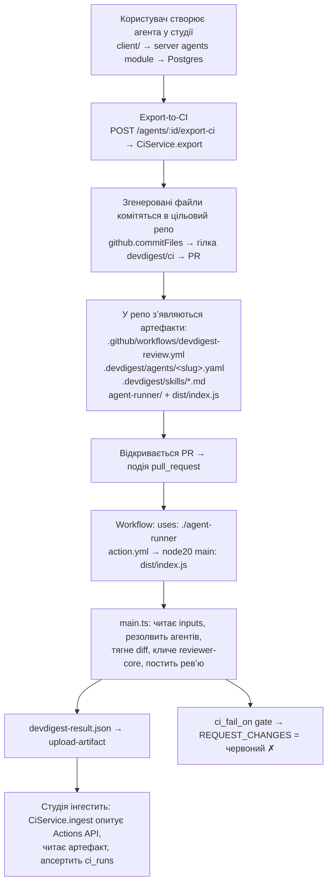

# DevDigest: повний шлях агента — від студії до запуску в CI

Цей документ описує **весь життєвий цикл** ревʼю-агента DevDigest: як він
створюється в застосунку (студії), як публікується в цільовий репозиторій, що
саме комітиться, як це запускається GitHub Actions на кожному PR, і як результат
повертається назад у студію. Окремо пояснено, **чому `agent-runner/dist/` має
бути закоміченим** — це не випадковість і не недогляд.

## Учасники (пакети монорепо)

| Пакет | Роль |
|---|---|
| `client/` | Студія (Next.js) — UI, де користувач створює й редагує агентів |
| `server/` (`@devdigest/api`) | Fastify API — зберігає агентів, робить **export-to-CI**, інгестить результати |
| `server/src/vendor/shared` (`@devdigest/shared`) | Спільні Zod-контракти (зокрема `AgentManifest`) — одна схема для студії і раннера |
| `reviewer-core/` (`@devdigest/reviewer-core`) | Чистий движок ревʼю: diff → LLM → grounded findings. Без БД/GitHub/FS |
| `agent-runner/` | GitHub Action — IO-обгортка, що запускає движок у CI й постить ревʼю |

> Ключова ідея: `AgentManifest` (Zod-схема в `@devdigest/shared`) — це **єдиний
> контракт**, яким студія ПИШЕ маніфест, а раннер його ЧИТАЄ. Формати не можуть
> розійтися, бо схема одна.

## Огляд потоку



---

## Етап 1 — Створення агента у студії

Користувач у `client/` (розділ `agents/`, `ConfigTab` + `CreateAgentModal`)
задає поля агента:

- `name`, `provider` (напр. `openrouter`), `model`,
- `system_prompt` (статичне системне повідомлення),
- `skills` (набір скілів, тіла яких додаються під системний промт),
- `strategy` (`auto` / `single-pass` / `map-reduce`),
- `ci_fail_on` (політика гейта: коли ревʼю має **блокувати** PR).

Сервер (модуль `server/src/modules/agents/`) зберігає це в Postgres через
Drizzle (`AgentsRepository`). Скіли зберігаються окремо і повʼязуються з агентом
(many-to-many) — `skillIdsForAgent` / `linkedSkills`.

Збережений запис агента 1:1 лягає на форму `AgentManifest`
(`server/src/vendor/shared/contracts/eval-ci.ts`):

```ts
export const AgentManifest = z.object({
  name: z.string().min(1),
  provider: Provider.default('openrouter'),
  model: z.string().min(1),
  system_prompt: z.string(),
  // Толерує і відсутній ключ, і явний null (YAML `skills:` без значення → null,
  // що .default([]) НЕ ловить) — нормалізуємо в порожній масив.
  skills: z.array(z.string()).nullish().transform((v) => v ?? []),
  strategy: z.enum(['auto', 'single-pass', 'map-reduce']).default('auto'),
  ci_fail_on: CiFailOn.default('critical'),
});
```

---

## Етап 2 — Export-to-CI (публікація)

Коли користувач натискає «опублікувати», студія викликає `POST
/agents/:id/export-ci`, який потрапляє в `CiService.export`
(`server/src/modules/ci/service.ts`).

### 2.1 Генерація файлів — `generateFiles`

Сервіс матеріалізує агента в набір файлів (`CiFile[]`):

| Файл | Що це |
|---|---|
| `.github/workflows/devdigest-review.yml` | Воркфлоу GitHub Actions (метод `workflowYaml`) |
| `.devdigest/agents/<slug>.yaml` | Маніфест агента (метод `agentYaml`) |
| `.devdigest/skills/<slug>.md` | По файлу на кожен скіл (`# Назва` + тіло) |
| `.devdigest/memory.jsonl` | Порожній файл памʼяті (заготовка) |

`agentYaml` серіалізує саме ті поля, що їх читає раннер; `skills` пишуться як
**слаги** (не тіла) — тіла лежать поруч у `.devdigest/skills/<slug>.md` і
резолвляться раннером:

```ts
private agentYaml(agent) {
  return [
    `name: ${agent.name}`,
    `provider: ${agent.provider}`,
    `model: ${agent.model}`,
    `strategy: ${agent.strategy}`,
    `ci_fail_on: ${agent.ciFailOn}`,
    'system_prompt: |',
    ...agent.systemPrompt.split('\n').map((l) => `  ${l}`),
    'skills:',
    ...agent.skills.map((s) => `  - ${slugify(s.name)}`),
    '',
  ].join('\n');
}
```

`workflowYaml` для таргета `gha` генерує саме той воркфлоу, що описаний в Етапі 4
(`uses: ./agent-runner`, потрібні секрети, upload-artifact).

### 2.2 Коміт у цільовий репозиторій

Якщо `action === 'open_pr'`, сервіс комітить усі згенеровані файли **одним
атомарним комітом** у гілку `devdigest/ci` і відкриває (або переюзує) PR:

```ts
await github.commitFiles(repo, {
  branch, base: input.base, message: EXPORT_PR_TITLE,
  files: files.map((f) => ({ path: f.path, contents: f.contents })),
});
```

`commitFiles` (адаптер `server/src/adapters/github/octokit.ts`) реалізований
через Git Data API: `getRef → getCommit → createTree → createCommit →
updateRef/createRef`.

> ⚠️ **Права токена.** `createTree`/`createCommit` — це **запис**. Fine-grained
> PAT мусить мати **Contents: Read and write** (і **Pull requests: Read and
> write**, щоб відкрити PR). Помилка `Resource not accessible by personal access
> token` на endpoint `git/trees` означає саме брак write-доступу до Contents.

Нарешті сервіс апсертить рядок `ci_installations` (агент↔репо), щоб повторна
публікація не плодила дублікатів, і повертає `{ installation, files, pr_url }`.

---

## Етап 3 — Що тепер лежить у репозиторії

Після злиття export-PR цільовий репозиторій містить:

```
.github/workflows/devdigest-review.yml   # запускає ревʼю на кожному PR
.devdigest/
  agents/<slug>.yaml                      # маніфест агента (AgentManifest)
  skills/<slug>.md                        # тіла скілів (резолвляться по слагу)
  memory.jsonl
agent-runner/                             # сам GitHub Action
  action.yml                              # інтерфейс action
  dist/index.js                           # ЗІБРАНИЙ бандл (запускається as-is)
```

> У цьому монорепо `agent-runner/` живе поруч і викликається локально через
> `uses: ./agent-runner`. У зовнішньому сценарії (див.
> `specs/ai-pr-reviewer.md`) його підключають як `owner/repo/agent-runner@ref`.

---

## Етап 4 — Запуск у CI

### 4.1 Воркфлоу

`.github/workflows/devdigest-review.yml`:

```yaml
on:
  pull_request:
    types: [opened, synchronize, reopened]
permissions:
  contents: read
  pull-requests: write          # потрібно, щоб постити ревʼю
jobs:
  review:
    runs-on: ubuntu-latest
    steps:
      - uses: actions/checkout@v4
      - uses: ./agent-runner    # ← запускає action (НЕ збирає його)
        with: { all: 'true', post: github-review }
        env:
          OPENROUTER_API_KEY: ${{ secrets.OPENROUTER_API_KEY }}
          GITHUB_TOKEN: ${{ secrets.GITHUB_TOKEN }}
      - uses: actions/upload-artifact@v4
        if: always()
        with: { name: devdigest-result, path: devdigest-result.json, if-no-files-found: ignore }
```

### 4.2 Action

`agent-runner/action.yml`:

```yaml
runs:
  using: 'node20'
  main: 'dist/index.js'   # ← GitHub запускає ЦЕЙ файл напряму
```

### 4.3 Entrypoint — `agent-runner/src/main.ts` (→ зібрано в `dist/index.js`)

Порядок виконання:

1. **Читає env**: `GITHUB_TOKEN`, `OPENROUTER_API_KEY`, `GITHUB_REPOSITORY` —
   якщо чогось немає, падає з явним повідомленням.
2. **Дістає номер PR** із `GITHUB_EVENT_PATH` (`pull_request.number`).
3. **Резолвить агентів** (`resolveAgentSlugs`): `all: true` → глобить
   `.devdigest/agents/*.yaml`; інакше — заданий `agent`/`agents`.
4. Для кожного агента:
   - `loadAgent(<slug>.yaml, skillsDir)` (`manifest.ts`) — читає YAML,
     **валідує через `AgentManifest.parse`** (саме тут падало, коли `skills`
     був `null` — тепер схема це толерує), і резолвить тіла скілів із
     `.devdigest/skills/<slug>.md`. Відсутні скіли не ховаються — йдуть у
     `missingSkills` і логуються як warning.
   - `reviewAndPost(...)` (`review-pr.ts`) — оркестрація одного ревʼю.
5. **Агрегує** все в `devdigest-result.json` (`buildArtifact`) і пише файл.
6. **Гейт**: якщо хоч один агент дав `REQUEST_CHANGES` → `core.setFailed(...)`
   (червоний ✗). Артефакт уже записаний, а `upload-artifact` має `if: always()`.

### 4.4 Одне ревʼю — `reviewAndPost` + `reviewer-core`

```
getChangedFiles (diff через patches, БЕЗ клону репо)
   → reviewPullRequest (reviewer-core): prompt assembly + prompt-injection
     hardening + LLM-виклик + ОБОВʼЯЗКОВИЙ grounding (кожен finding мусить
     цитувати реальний файл:рядок із diff)
   → toReviewPayload: будує markdown-тіло + inline-коментарі + GitHub-подію
   → createReview: постить ревʼю через octokit
```

> **Подія ревʼю детермінована.** `APPROVE` / `COMMENT` / `REQUEST_CHANGES`
> рахується НЕ з self-reported verdict моделі, а механічно — із severity
> findings + політики `ci_fail_on` (`reviewer-core/src/output/to-review.ts`):
>
> ```ts
> const FAIL_ON_MIN_RANK = { never: Infinity, critical: 3, warning: 2, any: 1 };
> // немає findings → APPROVE; гейт спрацював → REQUEST_CHANGES; інакше → COMMENT
> ```

---

## Етап 5 — Зворотний звʼязок у студію (ingestion)

Вебхуків немає — модель **local-first**. `CiService.ingest`
(`server/src/modules/ci/service.ts`) періодично:

1. опитує GitHub **Actions API** по кожній `ci_installations`
   (PAT `Actions: Read`),
2. для завершених ранів читає артефакт `devdigest-result.json`,
3. **апсертить `ci_runs`** (ідемпотентно по `github_url`).

Студія потім показує статус, кількість findings і вартість кожного рану.

---

## Чому `agent-runner/dist/` МАЄ бути закоміченим

Це найважливіший і найменш очевидний момент.

### JS GitHub Action запускається «as-is»

Коли крок воркфлоу використовує `uses:` для **JS-action**, GitHub бере
`action.yml` → `runs.main: dist/index.js` і **просто виконує цей файл**
(`node dist/index.js`). Він **не** робить `pnpm install`, **не** збирає, нічого
не транспілює. Це справедливо для обох форм:

- локально — `uses: ./agent-runner` (з чекаутнутого репо),
- зовнішньо — `uses: owner/repo/agent-runner@ref` (GitHub клонує твій репо на
  цьому ref і запускає твій закомічений `dist/index.js`).

**Висновок:** немає жодного моменту, де CI «збирає» action. Тому єдиний спосіб,
щоб `uses:` працював — зібраний `dist/` мусить лежати в репі **заздалегідь**.
Розмір тут ні до чого: навіть якщо бандл маленький, його ніхто не збере на льоту.

### Чому весь код вміщується в один файл

`agent-runner` збирається через **ncc**:

```jsonc
// agent-runner/package.json
"package": "ncc build src/main.ts -o dist --source-map --no-source-map-register",
"build":   "tsc --noEmit -p tsconfig.json && npm run package"
```

`@devdigest/shared` і `@devdigest/reviewer-core` підключені як **TypeScript-сирці**
через tsconfig-path-аліаси (вони самі ніколи не емітять JS). ncc **інлайнить**
усе це в `dist/index.js`. Тобто бандл самодостатній — у рантаймі action нічого
не доставляється з npm.

### Як це відбито в `.gitignore`

Глобальний `dist/` ігнорується (щоб не трекати `server/dist`, `client` тощо), але
`agent-runner/dist` повертається винятком:

```gitignore
dist/
# agent-runner ships as a JS GitHub Action — its bundled dist/ MUST be committed
# (GitHub runs action.yml `main: dist/index.js` as-is, with no build step).
!agent-runner/dist/
!agent-runner/dist/**
build/
```

Перевірити можна так:

```bash
git check-ignore -v agent-runner/dist/index.js   # → нічого (НЕ ігнорується)
git check-ignore -v server/dist/foo.js           # → ігнорується (як і має бути)
```

### Ризик дрейфу та як його уникати

Оскільки `dist/` — це закомічений артефакт, він може **розійтися** із сирцями.
Будь-яка зміна в `agent-runner/src/**` **або** у спільній схемі
(`@devdigest/shared`, напр. `AgentManifest`) вимагає перезбірки бандла:

```bash
pnpm --filter @devdigest/agent-runner run package   # ncc → оновлює dist/index.js
git add agent-runner/dist
git commit -m "chore: rebuild agent-runner bundle"
```

> Інакше CI крутитиме **старий** бандл, у якому твоєї правки немає (саме так
> сталося з фіксом `skills: null` — спершу довелося перезібрати `dist`, щоб фікс
> потрапив у CI).

**Рекомендація:** додати в CI окрему джобу **check-dist** — вона перезбирає
бандл і **валить білд**, якщо закомічений `dist` відрізняється від щойно
зібраного. Це стандартний патерн для JS-actions і повністю прибирає ризик
«забув перезібрати».

---

## Чеклист «зробив зміну — що далі»

- [ ] Змінив `agent-runner/src/**` або `@devdigest/shared` / `@devdigest/reviewer-core`?
      → `pnpm --filter @devdigest/agent-runner run package` і закоміть `dist/`.
- [ ] Змінив схему `AgentManifest`? → перевір, що студійний `agentYaml`
      (Етап 2) усе ще пише сумісний формат.
- [ ] Налаштовуєш репо вперше? → додай Actions-секрет `OPENROUTER_API_KEY`
      (`GITHUB_TOKEN` дає GitHub автоматично).
- [ ] Робиш export-to-CI з PAT? → переконайся, що токен має **Contents: R/W** і
      **Pull requests: R/W**.

---

## Довідник файлів

| Шлях | Призначення |
|---|---|
| `server/src/modules/ci/service.ts` | Export-to-CI (генерація файлів, коміт, PR) + інгест ранів |
| `server/src/vendor/shared/contracts/eval-ci.ts` | `AgentManifest` та інші CI-контракти |
| `server/src/adapters/github/octokit.ts` | `commitFiles` (Git Data API), `createReview`, тощо |
| `.github/workflows/devdigest-review.yml` | Воркфлоу, що запускає ревʼю на PR |
| `agent-runner/action.yml` | Інтерфейс action (`main: dist/index.js`) |
| `agent-runner/src/main.ts` | Entrypoint раннера |
| `agent-runner/src/manifest.ts` | `loadAgent` — парс маніфесту + резолв скілів |
| `agent-runner/src/review-pr.ts` | `reviewAndPost` — оркестрація одного ревʼю |
| `reviewer-core/src/index.ts` | Публічний API движка |
| `reviewer-core/src/output/to-review.ts` | Детермінований event + `ci_fail_on` гейт |
