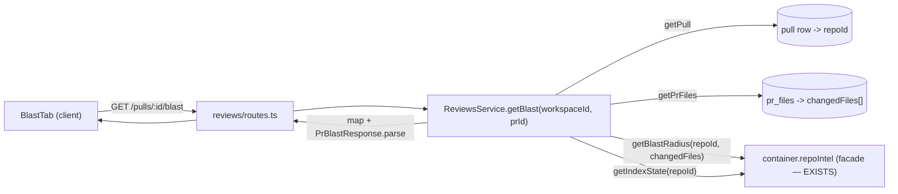

# Development Plan: PR "Blast Radius" tab

> Status: DRAFT for review. Produced by the `planner` agent, 2026-07-06.
> Decisions locked (2026-07-06):
> - **callers shape:** grouped by symbol (`downstream[]`).
> - **T4 (LLM one-paragraph explain):** deferred — NOT in this work, separate follow-up.
> - **"Prior PRs touching these files" accordion:** IN scope now — added as **T5**.

## Goal & success criteria

A reviewer opens a PR detail page, clicks a new **Blast** tab, and sees an impact map
read from the pre-built repo-intel index: changed symbols, who calls them (callers with
file + line), affected HTTP endpoints (GET/POST chips) and crons, plus counts. When the
index is missing/partial the tab shows an honest badge with an explanation, never an
empty/broken screen. No analysis runs at view time — the tab is a pure read over the
existing `RepoIntel.getBlastRadius` facade.

Observable "done":
- `GET /pulls/:id/blast` returns a validated `PrBlastResponse` (changed symbols,
  per-symbol callers, endpoints, crons, index status/degraded flag). Free/deterministic,
  no LLM, no token spend.
- The Blast tab renders those layers, groups callers under each changed symbol, links
  caller files to code, and shows a degraded/partial badge sourced from the index state.
- `server pnpm typecheck && pnpm test` and `client pnpm typecheck && pnpm test` pass.
- The two `brief.ts` contract copies remain byte-for-byte identical.

## Key correction to the original brief

- **The compute already exists.** `RepoIntel.getBlastRadius(repoId, changedFiles)` is
  fully implemented in `server/src/modules/repo-intel/service.ts` (persistent path +
  degraded fallback). **Do not rebuild it.** The gap is the HTTP route + the client tab.
- **The `dev_digest_get_blast_radius` MCP tool is a STUB** (`{ status: 'not_implemented' }`),
  not a live exposure. Promoting it to a real HTTP call is a separate follow-up.
- **The route belongs in the `reviews` module, not `pulls`.** `pulls` has no service layer
  (hits `container.db` directly); `reviews` already owns the sibling PR routes
  (`/pulls/:id/intent`, `/pulls/:id/smart-diff`) and the `getPull`/`getPrFiles` helpers.
- **`:id` = PR uuid.** `getPull(workspaceId, prId)` → `pull.repoId`;
  `getPrFiles(prId)` → `changedFiles = files.map(f => f.path)`. Persisted-only, no GitHub
  call — consistent with `getSmartDiff`.

## Affected modules & boundaries

- **server/ `reviews` module** — new `GET /pulls/:id/blast` route + `getBlast` service
  method + a thin `blast/` mapper (facade `BlastResult` → contract shape). Reads the index
  only via `container.repoIntel` (facade), never `container.codeIndex` or the DB index
  tables directly.
- **shared contract** (`server/src/vendor/shared/contracts/brief.ts`) — new
  `PrBlastResponse` schema, **mirrored** to `client/src/vendor/shared/contracts/brief.ts`.
- **client/** — new `useBlast` hook (`src/lib/hooks/blast.ts`), new `BlastTab` component
  folder, page + header wiring, i18n keys.
- **Out of scope / not touched:** `repo-intel` service/facade (compute already exists),
  `src/db/migrations/*`, the DI container, the `mcp` package.

## Relevant engineering insights

- **Shared contracts are a manual, unenforced mirror** — any edit to
  `server/src/vendor/shared/contracts/*.ts` must be copied byte-for-byte to the identical
  client path, or client `tsc` silently accepts stale types. (root `INSIGHTS.md`
  2026-06-29; `FEATURE_MODELS` drift 2026-07-06)
- **The `pulls` module has no service/repository layer** — so the blast route belongs in
  **reviews**, which has `ReviewsRepository.getPull`/`getPrFiles`. (server `INSIGHTS.md`
  2026-07-06)
- **The reviews module declares NO route-level `response` schemas by convention** —
  fidelity is guaranteed by handler return types + a **service-level `Schema.parse(...)`**
  before returning (e.g. `getSmartDiff` → `SmartDiff.parse`). Do **not** add
  `response: { 200: … }`; validate with `PrBlastResponse.parse(...)` in the service.
  (server `INSIGHTS.md` 2026-07-06)
- **repo-intel degraded contract:** object methods carry inline `degraded?`/`reason`;
  `getIndexState()` always returns an observable `status`
  ('full'|'partial'|'degraded'|'failed') even with no data. Drive the badge from
  `getBlastRadius().degraded` **and** `getIndexState().status`.
  (`server/src/modules/repo-intel/types.ts` header)
- **Client `icons.tsx` is an explicit allowlist** — the Tree/Graph toggle and cron/endpoint
  chip icons must be added before use (compiles but renders nothing otherwise).
  (client `INSIGHTS.md` 2026-07-01)
- **Client mutation error toasts are global**; **tests use `fireEvent`, not `user-event`**
  (not installed). (client `CLAUDE.md` + `INSIGHTS.md` 2026-07-01)

## Architecture & approach

Contract shape: reuse the sub-schemas already in `brief.ts` (`ChangedSymbol`,
`BlastCaller`, `DownstreamImpact`) and add a `PrBlastResponse` envelope that carries the
**index status + degraded flag** (which the existing `BlastRadius` schema lacks). The
mapper groups the facade's flat `callers` by `viaSymbol` into `downstream[]`, attributes
endpoints/crons from `factsByFile`, and unions crons into a flat `impacted_crons`. The
`summary` string stays empty on GET (reserved for the optional LLM task).

## Tasks (parallelizable)

### T1 — Shared contract: `PrBlastResponse` (+ mirror)
- **Module:** shared (`server/.../contracts/brief.ts` → mirror `client/.../contracts/brief.ts`)
- **Objective:** Add an HTTP response schema for the blast endpoint. **callers shape =
  grouped by symbol** (locked) — and this already matches what `brief.ts` ships:
  `ChangedSymbol`, `BlastCaller` (`{ name, file, line }`), `DownstreamImpact`
  (`{ symbol, callers, endpoints_affected, crons_affected }`), and the `BlastRadius`
  envelope (`{ changed_symbols, downstream, summary }`) ALL EXIST. So T1 does **not**
  redefine them — it adds a wrapping envelope:
  `PrBlastResponse = BlastRadius.extend({ impacted_endpoints: z.array(z.string()), impacted_crons: z.array(z.string()), index_status: z.enum(['full','partial','degraded','failed']), degraded: z.boolean(), reason: z.string().nullish() })`.
  `impacted_endpoints`/`impacted_crons` are the flat UNION across all
  `downstream[].endpoints_affected`/`crons_affected` (for the card counts); the per-symbol
  `endpoints_affected`/`crons_affected` drive the expandable rows.
- **Out of scope:** Don't change `PrBrief` composition, `BlastRadius`, or other contracts.
- **Skills:** `zod`, `typescript-expert`
- **Gotcha:** the two `brief.ts` files must end byte-for-byte identical —
  `diff server/.../brief.ts client/.../brief.ts` must be empty.
- **Depends on:** none
- **Verify:** server `pnpm typecheck`; client `pnpm typecheck`; `diff` empty.

### T2 — Server route + `getBlast` service + `blast/` mapper
- **Module:** server (reviews)
- **Files:** `reviews/routes.ts` (add `GET /pulls/:id/blast`), `reviews/service.ts`
  (add `getBlast(workspaceId, prId)`), new `reviews/blast/map.ts`, new
  `server/test/reviews-blast.test.ts` (mock `container.repoIntel.getBlastRadius`/`getIndexState`).
- **Objective:** Mirror `getSmartDiff`: `getPull` → 404 if missing; `getPrFiles` →
  `changedFiles`; call `getBlastRadius(pull.repoId, changedFiles)` + `getIndexState(pull.repoId)`;
  map to `PrBlastResponse` (group callers by `viaSymbol`, attribute endpoints/crons via
  `factsByFile`, union crons, set `index_status`/`degraded`/`reason`); `PrBlastResponse.parse`
  before returning.
- **Out of scope:** no migration; no direct `container.codeIndex`; no `repo-intel` edits;
  no LLM (`summary: ''`); no route-level `response` schema.
- **Skills:** `fastify-best-practices`, `drizzle-orm-patterns`, `zod`, `typescript-expert`,
  `security`, `architecture-patterns`, `engineering-insights`
- **Gotcha:** route in **reviews**, not pulls. Confirm the reviews service holds a
  `container`/`repoIntel` handle; thread it in if not.
- **Depends on:** T1
- **Verify:** server `pnpm typecheck && pnpm test`

### T3 — Client `useBlast` hook + `BlastTab` UI + page/header wiring + i18n
- **Module:** client
- **Files:** new `src/lib/hooks/blast.ts` (`useBlast(prId)`), `src/lib/hooks/index.ts`
  (export), new `.../pulls/[number]/_components/BlastTab/` (`BlastTab.tsx` + `styles.ts`
  + `index.ts` + `BlastTab.test.tsx`), `.../pulls/[number]/page.tsx` (render tab),
  `.../PrDetailHeader/*` (add "Blast" tab), `src/vendor/ui/icons.tsx` (missing icons),
  `src/i18n/messages/<locale>/*.json` (new `blast.*` keys, all locales).
- **Objective:** Render the layered map: "BLAST RADIUS" card with counts
  (symbols / callers / endpoints / cron), Tree/Graph toggle (Graph may start as a
  placeholder), per-symbol expandable caller lists (file + line, click → code /
  GitHub deep-link), endpoint chips colored by method (parse `"METHOD /path"` prefix),
  cron chip. Degraded/partial badge from `index_status` + `degraded` + `reason`.
- **Out of scope:** no ad-hoc `fetch` (use `api.ts` + hook); no new UI primitives outside
  `src/vendor/ui`; the "Prior PRs touching these files" accordion is **T5** (separate task,
  same component); no LLM summary UI beyond rendering the (possibly empty) `summary`.
- **Skills:** `next-best-practices`, `react-best-practices`, `react-testing-library`,
  `zod`, `typescript-expert`, `security`, `engineering-insights`
- **Gotcha:** add icons to the `icons.tsx` allowlist first; tests use `fireEvent`
  (no `user-event`); translation keys in every locale.
- **Depends on:** T1
- **Verify:** client `pnpm typecheck && pnpm test`

### T4 — (DEFERRED — separate follow-up, NOT in this work) One-paragraph LLM explanation
- **Module:** server (reviews) + a small client control
- **Files:** `reviews/blast/explain.ts` (cheap-model call → one paragraph from the computed
  `PrBlastResponse`), `POST /pulls/:id/blast/explain` route (rate-limited like
  `intent/recompute`), client button + mutation hook that fills `summary`.
- **Objective:** The only token spend in the feature. GET stays free/deterministic; the
  paragraph is an explicit on-demand action, mirroring the intent recompute pattern.
- **Out of scope:** don't run the LLM inside `GET /pulls/:id/blast`; no base-contract change
  beyond the existing `summary` field.
- **Skills:** server: `fastify-best-practices`, `zod`, `typescript-expert`, `security`,
  `architecture-patterns`, `engineering-insights`; client: `next-best-practices`,
  `react-best-practices`, `zod`, `typescript-expert`
- **Gotcha:** cheap-model, single call — no second LLM validation pass. Wrap any untrusted
  PR text via the reviewer-core untrusted-wrapping pattern.
- **Depends on:** T2, T3
- **Verify:** server + client `pnpm typecheck && pnpm test`

### T5 — "Prior PRs touching these files" (backend endpoint + UI accordion)
- **Module:** server (reviews) + client (BlastTab)
- **Files:** contract — **reuse the existing `PrHistory`/`PrHistoryItem` schemas already in
  `brief.ts`** (`PrHistoryItem = { pr_number, title, merged_at, author, files_overlap, notes }`);
  no new schema unless a field is missing, but if you touch `brief.ts` still **mirror** to
  client; server —
  `reviews/routes.ts` (add `GET /pulls/:id/blast/prior-prs`, or fold into the blast payload),
  `reviews/service.ts` (`getPriorPrs(workspaceId, prId)`), test; client — extend
  `BlastTab` with the collapsible "Prior PRs touching these files" accordion + a hook
  (or extend `useBlast`).
- **Objective:** Given the PR's `changedFiles`, return **merged** PRs whose persisted
  `pr_files` overlap those paths (exclude the current PR), most-recent first, capped (e.g. 10).
  Render as the collapsible accordion in the mockup, each row linking to that PR.
- **Query approach:** join `pr_files` on path ∈ `changedFiles` → distinct `pr_id` of PRs in
  the same repo (exclude the current PR), ordered by `updated_at`/`opened_at` desc.
  **Verified schema note:** `pull_requests` has a `status` column (default `'needs_review'`)
  and **no `merged_at` column** — there is no persisted merge timestamp. So either (a) map
  the contract's `merged_at` from `updated_at` and filter `status = 'merged'` IF that status
  value is actually written on merge (confirm via the polling/import path), or (b) drop the
  "merged" restriction and title it "other PRs touching these files", populating
  `merged_at` from `updated_at`. Decide in T1/T5 kickoff. `files_overlap` = the intersection
  of that PR's `pr_files.path` with `changedFiles`.
- **Out of scope:** no new index/migration unless a missing column forces it (flag first,
  don't add silently); no LLM.
- **Skills:** server: `fastify-best-practices`, `drizzle-orm-patterns`, `zod`,
  `typescript-expert`, `security`, `engineering-insights`; client: `react-best-practices`,
  `react-testing-library`, `zod`, `typescript-expert`.
- **Gotcha:** contract mirror again (byte-for-byte). Decide endpoint vs. folding into the
  blast payload in T1 so shapes agree. Cap results — an unbounded overlap query on a busy
  repo is a footgun.
- **Depends on:** T1 (contract), T3 (the component to hang the accordion on)
- **Verify:** server `pnpm typecheck && pnpm test`; client `pnpm typecheck && pnpm test`

### T6 — MCP: promote `dev_digest_get_blast_radius` from stub to live
- **Module:** `mcp` package (`mcp/src/tools/get-blast-radius.ts`)
- **Files:** the blast-radius tool handler (currently returns
  `{ status: 'not_implemented' }`), plus its test; whatever shared HTTP client the other
  live MCP tools (`get_findings`, `get_conventions`) already use to reach the API.
- **Objective:** Replace the stub with a real call to the new `GET /pulls/:id/blast`
  endpoint, mapping the tool's human-readable inputs (repo `owner/name`, PR number) to the
  API the same way the other 4 read-only tools do, and returning the `PrBlastResponse`
  (respecting the response-size cap TODO already noted for `get_findings`).
- **Out of scope:** no new compute in the MCP layer (it's a thin client); don't change the
  tool's name/signature; keep it free/read-only (no LLM).
- **Skills:** `typescript-expert`, `zod`, `security`, `engineering-insights`.
- **Gotcha:** the tool takes human-readable ids (repo = `owner/name`, pr = number) — it must
  resolve those to the API's PR uuid path exactly like the sibling tools, not assume a uuid.
  Mind the `get_findings` response-size cap TODO (`e1950b8`) — apply the same cap here.
- **Depends on:** T2 (the endpoint must exist and be stable)
- **Verify:** `mcp` typecheck + test; manual: call the tool against a seeded PR and confirm
  a real map (not `not_implemented`) comes back.

## Parallelization map

- **T1 first** (contract, blocks everything). Fold BOTH the blast shape (grouped
  `downstream[]`) and the T5 prior-PRs shape into T1 so every downstream task agrees.
- After T1, **T2 (server) and T3 (client) run fully in parallel** — disjoint modules/files.
- **T5** after T1 + T3 (backend query can start alongside T2; UI accordion needs T3's
  `BlastTab` to exist — sequence the client half after T3, or land T5 as a follow-on to the
  same component author).
- **T6** after T2 (needs a stable endpoint). Independent of the client tasks.
- **T4** deferred (separate follow-up, not this work).
- T3 is one task (not split) because page/header edits import `BlastTab`; splitting would
  create a broken-import ordering dependency for zero conflict benefit.

## End-to-end verification

1. server `pnpm typecheck && pnpm test`; client `pnpm typecheck && pnpm test`.
2. `diff server/src/vendor/shared/contracts/brief.ts client/src/vendor/shared/contracts/brief.ts` → empty.
3. Manual: boot server (3001) + client (3000), open a seeded PR, click **Blast**.
   Indexed repo → counts + changed symbols + expandable callers + endpoint chips render,
   caller click navigates to code. Unindexed/partial repo → degraded badge with
   explanation, no crash.

## Risks / open questions

- **RESOLVED — callers shape:** grouped by symbol (`downstream[]`). Matches the existing
  `DownstreamImpact`/`BlastRadius` schemas; T1 only adds the envelope.
- **RESOLVED — T4 (LLM one-paragraph explain):** deferred, separate follow-up, not this work.
- **RESOLVED — "Prior PRs touching these files":** in scope now as **T5** (backend endpoint
  + UI accordion), reusing the existing `PrHistory` schema.
- **RESOLVED — MCP integration:** in scope now as **T6** (promote the stub tool to a live
  call against `GET /pulls/:id/blast`).
- **OPEN — merged-state for T5:** no `merged_at`/merge column on `pull_requests` (only
  `status`). Pick (a) filter `status = 'merged'` + map `merged_at` from `updated_at`, or
  (b) "other PRs touching these files" with no merge filter — decide at T5 kickoff.
- **`pr_files` population dependency:** `changedFiles` come from persisted `pr_files`, which
  `GET /pulls/:id` (detail) refreshes. If detail was never loaded, blast returns
  empty/degraded rather than wrong data. Acceptable; confirm in manual verification.
- **Reviews `service` container access:** T2 assumes the reviews service can reach
  `container.repoIntel`. The intent path uses the LLM adapter so a handle almost certainly
  exists — implementer confirms and threads `repoIntel` through if needed.
- **MCP id resolution (T6):** the tool takes `owner/name` + PR number; it must resolve that
  to the API's PR uuid path the same way the live sibling tools (`get_findings`,
  `get_conventions`) do — confirm that resolution helper exists before T6.
