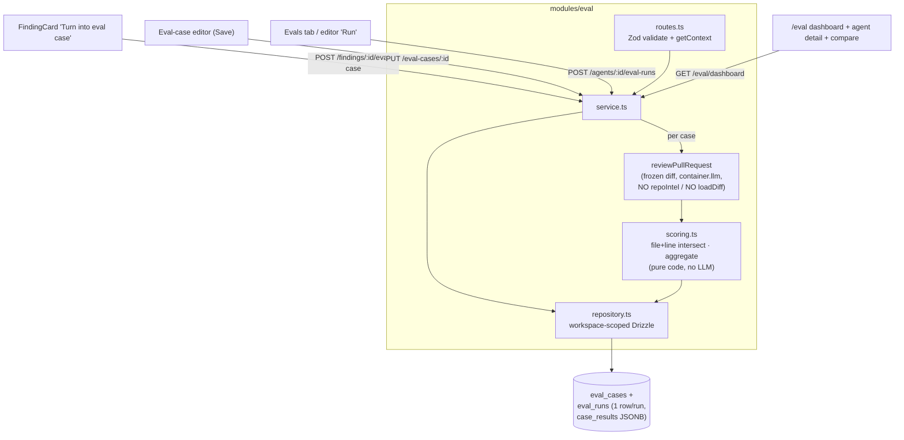

# Implementation Plan: Eval Pipeline

Spec: SPEC-2026-07-10-eval-pipeline (Status: ready; D1 + D4 confirmed by coordinator)

## Execution mode

**Multi-agent (parallel)** — chosen by the requester. Tasks are grouped into 3 waves with
disjoint file sets so implementers never write the same file concurrently.

## Goal & success criteria

"Done" means a reviewer-tuner can:
1. Click "Turn into eval case" on an accepted/dismissed finding on the PR-detail FindingCard and
   get a pre-filled eval-case editor (must_find from accepted, must_not_flag from dismissed).
2. See an agent's whole eval set + aggregate metric cards in the Agent editor's **Evals** tab.
3. `POST /agents/:id/eval-runs` runs the agent's current config over every case's **frozen**
   `input_diff` (via `parseUnifiedDiff`, no live PR fetch, no repo-intel), producing **one**
   `eval_runs` row with aggregate recall/precision/citation_accuracy, `traces_passed/total`,
   summed cost/duration, and a `case_results` JSONB — scored purely in code.
4. Open the **Eval Dashboard** (`/eval`, new `SKILLS LAB` nav item): agent cards, agent-detail
   trend + recent-runs, and compare exactly two runs from persisted rows (no re-run).
5. See "recent evals" on PR-detail and on the Eval Dashboard itself (the home surface for eval health).

Observable acceptance = all 25 EARS ACs verified by the tests named per task, plus:
targeted `diff` of the **eval** contract blocks (client↔server) is identical (AC-23); no
`FEATURE_MODELS` change (AC-24); onion boundary intact (AC-25).

## Requirements review & recommendations

- **Verified feasible:** the scaffold matches the spec's premise exactly — `eval_runs` is currently
  one-row-per-case (`case_id` notNull FK, `pass`, `actual_output`, per-case scalars) and reshapes
  cleanly to per-run; `eval_cases` only needs `source_finding_id`; `reviewPullRequest` already
  returns `grounding`/`dropped`/`costUsd`, so citation_accuracy and cost need **no** reviewer-core
  change; `parseUnifiedDiff` + `diffFromPrFiles` already assemble a `UnifiedDiff` from `pr_files`;
  `activeKeyFor` already routes `/eval`. No `FEATURE_MODELS` entry is pre-staged (correct — none needed).
- **No reviewer-core edit:** the file+line-range matching predicate is re-implemented as pure server
  code (spec: "identical semantics to the grounding gate"); citation_accuracy reuses the existing
  `groundingSummary`/`ReviewOutcome.grounding`. reviewer-core stays untouched — do not add a task for it.
- **No `container.ts` edit:** the `agents` module builds its own repo from `container.db` inside the
  service; the eval service mirrors that, so the DI container file is **not** modified (avoids a
  shared-file conflict). The service reaches the LLM only via `container.llm(provider)`.
- **Recommendation — split the migration into two additive `db:generate` passes.** Reshaping
  `eval_runs` both **adds** columns (`owner_id`, `owner_kind`, `owner_version`, `traces_passed`,
  `traces_total`, `case_results`) and **drops** columns (`case_id`, `pass`, `actual_output`) in one
  edit. `drizzle-kit generate` is interactive and **hangs a non-interactive shell** on an
  add+drop-in-one-diff ambiguity (server INSIGHTS 2026-07-02). Do it as: (1) add all new columns,
  keep the old ones, `pnpm db:generate` (pure `ADD COLUMN`, no prompt); (2) remove the old columns,
  `pnpm db:generate` again (pure `DROP COLUMN`, no prompt). Two small migrations beat fighting the TTY prompt.
- **Contract mirror scope (coordinator-resolved):** T2 mirrors **only the eval contract blocks**
  byte-for-byte. The client mirrors of `knowledge.ts`/`eval-ci.ts` already diverge from server in
  **non-eval** regions (client is missing the `AgentManifest`/`AgentVersion*` blocks and the
  `'openrouter'` enum) — that pre-existing drift is **out of scope**; do not touch it. AC-23's verify
  is therefore a **targeted** check that the eval symbols are identical client↔server, not a whole-file
  `diff` (which can't exit 0 while the unrelated drift stands). See T2.
- **Clarified (D1/D4):** both open decisions were confirmed in the spec — two tables only,
  `eval_run` = one row per whole-set run with `case_results` JSONB (no `eval_batches`); recall
  excludes must_not_flag/expected-0 cases from its denominator and is `null` when the set has no
  must_find region. No `AskUserQuestion` needed for scope.

## Affected modules & boundaries

- **shared contracts** (`server/src/vendor/shared/contracts/{knowledge,eval-ci}.ts` + eval-scoped
  client mirror) — reshaped `EvalRun`/`EvalRunRecord`, new `EvalCaseResult`, `source_finding_id` on
  `EvalCase`, `EvalDashboard`/`EvalTrendPoint` metric nullability, new `EvalCompare`.
- **server** (`server/src/db/schema/eval.ts`, new `server/src/modules/eval/`) — schema reshape +
  route→service→repository behind the onion boundary; reuses `reviewPullRequest`, `parseUnifiedDiff`,
  `diffFromPrFiles`, `findingContext`. No `container.ts` change; no `reviewer-core` change.
- **client** (`lib/hooks/eval.ts`, shared `components/eval/`, FindingCard, AgentEditor Evals tab, new
  `app/eval/` page, `vendor/ui/nav.ts` + `icons.tsx`, PR-detail recent-evals).
- **Boundaries touched:** shared-contract mirror (eval symbols only), server DI (via `container.llm`),
  reviewer-core public surface (consumed read-only, not changed), client `api.ts`/hook convention.

## Relevant engineering insights

- **Migration add+drop hangs `db:generate`** (server INSIGHTS 2026-07-02) — split the `eval_runs`
  reshape into an additive pass then a drop pass. Shapes **T1**.
- **Contract mirror is manual & byte-for-byte; `tsc` won't catch a miss** (root INSIGHTS 2026-06-29).
  Shapes **T2** and is the AC-23 constraint on every eval contract edit.
- **`FEATURE_MODELS` is a 3-copy registry — do not edit for eval** (root INSIGHTS 2026-07-06 / spec
  AC-24). Constrains T2/T3.
- **Pre-staged features ship unwired; grep before re-deriving** (root INSIGHTS 2026-07-08) — the
  `eval_cases`/`eval_runs` tables + contracts exist; reshape, don't recreate. Shapes T1/T2/T3.
- **Client runtime (value) import from the `@devdigest/shared` barrel breaks the webpack build**
  (client INSIGHTS 2026-07-08) — the editor's Zod `safeParse` of `expected_output` is a **value**
  import; import it from the subpath `@devdigest/shared/contracts/eval-ci` (or `/knowledge`), never
  the bare barrel. `import type` stays fine. Shapes **T4**.
- **`AgentEditor` tabs with own layout use `s.tabBody`, not `s.body`** (client INSIGHTS 2026-07-01) —
  the Evals tab has its own header/list/footer, so render it under `s.tabBody`. Shapes **T6**.
- **`icons.tsx` is an explicit allowlist** (client INSIGHTS 2026-07-01) — add any new Lucide icon
  there before use. Shapes **T6/T7/T8**.
- **Don't mock a TanStack Query hook with `() => ({ data: [] })` — it can OOM the test worker**
  (client INSIGHTS 2026-07-01) — use the documented mock shape. Shapes all client test work.
- **`reviews`/`agents` use route→service→repository; `pulls` does NOT (routes hit `container.db`).**
  Follow the `agents` module anatomy for `eval/`, not `pulls`. Shapes **T3** (AC-25).
- **`ReviewOutcome` carries `costUsd`** directly — sum it per case; a provider with no usage yields a
  `null` cost (spec edge case → UI shows "—"). Shapes T3.

## Architecture & approach

New server module `modules/eval/` (onion: route → service → repository; adapters only via
`container`). Case creation freezes the input from `pr_files`; a run replays the **frozen**
`input_diff` through the exact live pipeline with repo-intel/live-fetch stripped, then scores in
pure code and persists one aggregate run row.

### Canonical shapes (both T1 and T2 must match these exactly)

- **`eval_cases`** adds `source_finding_id uuid null` → FK `findings(id)` `onDelete: 'set null'`.
- **`eval_runs`** (reshaped, one row per run):
  `id`, `owner_id uuid`, `owner_kind text('agent'|'skill')`, `owner_version int`,
  `ran_at timestamptz default now()`, `recall double null`, `precision double null`,
  `citation_accuracy double null`, `traces_passed int`, `traces_total int`,
  `case_results jsonb`, `duration_ms int`, `cost_usd double null`.
  Drop: `case_id`, `pass`, `actual_output`.
- **`EvalCaseResult`** (one entry in `case_results` and the contract array):
  `{ case_id, name, pass, expected, got, recall (nullable), precision (nullable),
  cost_usd (nullable), duration_ms, actual }`.
- **`expected_output`** = `{ must_find: Region[], must_not_flag: Region[] }`, `Region =
  { file, start_line, end_line }` (must_find also `severity`, `category`, `title`).

## Tasks

### T1 — Reshape eval schema + additive migrations
- **Module:** server
- **Traces to:** AC-8 (per-run row + `case_results`), AC-3 (`source_finding_id`); enables AC-7/AC-15/AC-16.
- **Files to create/modify:** `server/src/db/schema/eval.ts`; generated `server/src/db/migrations/*`
  (two new files via `pnpm db:generate`, do not hand-edit).
- **Objective:** Add `eval_cases.source_finding_id` (uuid null, FK→`findings`, `onDelete:'set null'`).
  Reshape `eval_runs` to the canonical per-run shape above. Generate migrations in **two additive
  passes**: pass 1 add all new columns (keep old), `pnpm db:generate`; pass 2 remove `case_id`/`pass`/
  `actual_output`, `pnpm db:generate`. Keep `eval` exports in the schema barrel intact.
- **Out of scope:** No `eval_batches` table, no `batch_id`. No data backfill (scaffold tables are
  empty). No contract edits (T2 owns those). No `container.ts`.
- **Skills to apply:** `drizzle-orm-patterns`, `postgresql-table-design`, `typescript-expert`, `engineering-insights`.
- **Insights/gotchas to respect:** add+drop in one diff hangs `db:generate` → two passes. `owner_id`
  has **no** FK to agents (polymorphic owner; spec "agent deleted" edge case). Migrations are
  generated, never hand-written; `src/db/migrations/*` otherwise off-limits.
- **Depends on:** none.
- **Verify:** `cd server && pnpm typecheck` (schema types compile); confirm exactly two new migration
  files with pure ADD then pure DROP (no interactive prompt fired).

### T2 — Reshape eval shared contracts + eval-scoped byte-for-byte client mirror
- **Module:** shared
- **Traces to:** AC-23 (eval-block mirror), AC-24 (no FEATURE_MODELS), and the contract shapes
  AC-8/AC-15..AC-19 rely on.
- **Files to create/modify:** `server/src/vendor/shared/contracts/knowledge.ts`,
  `server/src/vendor/shared/contracts/eval-ci.ts`, and the **same eval blocks** under
  `client/src/vendor/shared/contracts/`.
- **Objective:** Add `source_finding_id: z.string().nullish()` to `EvalCase`. Add `EvalCaseResult`
  (canonical shape above). Reshape `EvalRun` (make `recall`/`precision`/`citation_accuracy`
  nullable per D4; replace `per_trace` with `case_results: EvalCaseResult[]`; keep
  `traces_passed`/`traces_total`). Reshape `EvalRunRecord` to per-run: `{ id, owner_id, owner_kind,
  owner_version, ran_at, recall?, precision?, citation_accuracy?, traces_passed, traces_total,
  case_results, duration_ms, cost_usd }` (drop `case_id`/`pass`/`actual_output`). Adjust
  `EvalRunResult` to `{ run_id, result: EvalRun }`. Make `EvalDashboard`/`EvalTrendPoint` metric
  fields nullable where D4 requires and ensure the dashboard carries the per-agent card list + `alert`.
  Add a new `EvalCompare` schema `{ a: EvalRunRecord, b: EvalRunRecord, delta: { recall, precision,
  citation_accuracy, pass_count } }`. **Mirror each eval-contract edit byte-for-byte** into the client
  copy — the reshaped `EvalRun`/`EvalRunRecord`, `EvalCaseResult`, `EvalCase`, `EvalDashboard`/
  `EvalTrendPoint`, `EvalRunResult`, `EvalCompare`.
- **Out of scope:** **Do not touch the pre-existing non-eval drift** between the client and server
  mirrors (the missing `AgentManifest`/`AgentVersion*` blocks, the `'openrouter'` enum) — those
  foreign contracts are out of scope; leave them exactly as they are on both sides. Scope the mirror
  strictly to the eval symbols listed above. No `FEATURE_MODELS`/`platform.ts` change (AC-24). No
  `Ci*`/`Compose*`/`Conformance*` contract changes. No server/client logic.
- **Skills to apply:** `zod`, `typescript-expert`.
- **Insights/gotchas to respect:** manual mirror, `tsc` won't catch a miss; the **eval blocks** must
  be byte-for-byte identical client↔server. Do not touch `platform.ts` (3-copy registry) or the
  unrelated non-eval drift.
- **Depends on:** none (coordinate the `EvalCaseResult`/run shape with T1 via the canonical shapes above).
- **Verify:** **targeted** eval-symbol identity, not a whole-file diff (the unrelated non-eval drift
  makes a whole-file diff non-zero by design). For each eval symbol
  (`EvalCase`, `EvalCaseResult`, `EvalRun`, `EvalRunRecord`, `EvalRunResult`, `EvalDashboard`,
  `EvalTrendPoint`, `EvalCompare`), extract its `export const … ` block from both the server and
  client copy of the file and `diff` the two blocks — each must be identical (exit 0). `cd server &&
  pnpm typecheck` and `cd client && pnpm typecheck` green; `git diff --stat` shows no `platform.ts`
  (either copy), no `lib/feature-models.ts`, and no change to the non-eval contract blocks.

### T3 — Server `modules/eval/`: create-from-finding, batch/single run, scoring, dashboard
- **Module:** server
- **Traces to:** AC-3, AC-4, AC-7, AC-8, AC-9, AC-10, AC-11, AC-12, AC-13, AC-14, AC-19 (alert
  compute), AC-21 (single-case run endpoint), AC-25.
- **Files to create/modify:** new `server/src/modules/eval/{routes.ts,service.ts,repository.ts,
  scoring.ts,constants.ts,helpers.ts}`; register the plugin in `server/src/app.ts`. Tests:
  `server/src/modules/eval/scoring.test.ts` (unit), `server/src/modules/eval/*.it.test.ts` (integration).
- **Objective:**
  - **Repository** (workspace-scoped Drizzle only, no adapter access): CRUD for `eval_cases`
    (list-by-agent, get, create, update, delete, find-by-`source_finding_id` for de-dupe), insert an
    `eval_runs` row, list runs by owner, dashboard reads (latest run per agent, trend, recent runs).
  - **Service** (takes `Container`, builds repo from `container.db`): 
    - *create from finding* — resolve `findingContext(findingId)`; **400** if `review.agent_id` is
      null (AC-4); freeze `input_diff` via `diffFromPrFiles`/`parseUnifiedDiff` so a hunk intersects
      the finding's lines; set `input_meta {pr_number,pr_title,head_sha}`, `owner_kind:'agent'`,
      `owner_id = review.agent_id`, `source_finding_id`; pre-fill `expected_output` (accepted →
      must_find row incl. severity/category/title; dismissed → must_not_flag region). De-dupe: if a
      case with that `source_finding_id` exists, return it (AC edge case).
    - *run* — for each case parse the **stored** `input_diff` with `parseUnifiedDiff`, call
      `reviewPullRequest({ systemPrompt, model, provider→container.llm, strategy, skills, diff })`.
      **Never** call `container.repoIntel` or `loadDiff` and never fetch the live PR (AC-7). Malformed
      diff (0 files) fails that case closed. Per-case LLM failure records failure in `case_results`
      and the run still completes (AC edge cases).
    - *scoring* (`scoring.ts`, pure, no LLM — AC-9): matching predicate = same file AND inclusive
      `[start,end]` ranges intersect. Per case: `matched_must_find`, `violated`, `pass ⇔ all must_find
      matched && no must_not_flag violated`. Aggregate: recall = Σmatched/Σmust_find over cases with
      ≥1 must_find (else `null`, D4); precision = TP/(TP+FP) (`null` if TP+FP=0); citation_accuracy =
      Σkept/Σ(kept+dropped) from each case's `ReviewOutcome.grounding`/`groundingSummary` (0/0 case
      contributes 0 to both — AC-10); `traces_passed/total`.
    - persist exactly **one** `eval_runs` row (owner_version = agent's current `version`, summed
      `cost_usd` from `ReviewOutcome.costUsd` (null-safe) and `duration_ms`, `case_results` JSONB) and
      return `EvalRunResult` (AC-8). Empty set → 400/empty (no row). Log the structured per-run line.
    - *dashboard* — compute `EvalDashboard` (current + delta vs previous run, trend, recent runs,
      `alert` when latest precision < previous — AC-19); hide orphan sets whose owner agent is missing
      (spec edge case), don't 500.
  - **Routes** (Zod validate + `getContext` for workspace scoping, deny-by-default; literal segments
    before parameterized): `POST /findings/:findingId/eval-case`, `GET /agents/:id/eval-cases`,
    `PUT /eval-cases/:id`, `DELETE /eval-cases/:id`, `POST /eval-cases/:id/run` (single-case, AC-21),
    `POST /agents/:id/eval-runs` (batch), `GET /eval/dashboard` (+ `?agentId=` for detail),
    `GET /agents/:id/eval-runs` (history/compare source).
- **Out of scope:** No schema edits (T1) or contract edits (T2). No `container.ts` change. No
  reviewer-core edit. No `FEATURE_MODELS`. SSE live progress is optional (structured log line is the
  required observability); do not block the task on streaming.
- **Skills to apply:** `server-architecture`, `fastify-best-practices`, `drizzle-orm-patterns`,
  `zod`, `typescript-expert`, `security`, `architecture-patterns`, `engineering-insights`.
- **Insights/gotchas to respect:** follow the `agents` module anatomy (not `pulls`); repository imports
  only `db/schema` + `db/client`; workspace scoping only via `getContext` (the "missing membership
  check" class is a known false positive); untrusted `input_diff`/findings stay data — rely on
  reviewer-core `wrapUntrusted`, never execute; `owner_id` has no agent FK (orphan handling).
- **Depends on:** T1, T2.
- **Verify:** `cd server && pnpm typecheck && pnpm test` (runs `scoring.test.ts` unit cases for
  AC-9..AC-14 and `*.it.test.ts` for AC-3/AC-4/AC-7/AC-8 with a stubbed `LLMProvider`; assert
  determinism across two runs and that the executor never calls `repoIntel`/`loadDiff`).

### T4 — Client data layer + shared eval-case editor + shared metric atoms
- **Module:** client
- **Traces to:** AC-20, AC-21 (editor + run-on-save), and provides the hooks/components T5–T8 consume.
- **Files to create/modify:** `client/src/lib/hooks/eval.ts` (+ `hooks/index.ts` barrel); additions
  to `client/src/lib/api.ts` only if a new helper is required (prefer existing `api.*`); new shared
  `client/src/components/eval/EvalCaseEditor/` (Modal-based editor) and any shared metric-card/
  status-icon atoms under `client/src/components/eval/`. Tests: `EvalCaseEditor.test.tsx`.
- **Objective:** TanStack Query hooks matching the `agents.ts` pattern for every T3 endpoint
  (`useAgentEvalCases`, `useCreateEvalCaseFromFinding`, `useUpdateEvalCase`, `useDeleteEvalCase`,
  `useRunEvalCase`, `useRunAgentEvals`, `useEvalDashboard`, `useAgentEvalRuns`). Build the shared
  **EvalCaseEditor** modal: required non-empty Name (Save disabled when empty); Input tabs Diff /
  Files / PR meta (Diff read-only, **escaped**); Expected-output JSON editor with "+ Finding
  skeleton" insert and a live valid/invalid indicator using Zod **`safeParse`** against the
  `expected_output` shape (Save disabled on invalid JSON — AC-20); a "Run on save" toggle that on save
  calls the single-case run and renders "expected N finding(s), got M · <duration> · <cost>" with a
  pass/fail marker, no navigation (AC-21). Provide shared status-icon (green check / red cross / empty
  circle, each with a **text label** for a11y) and metric-card atoms (em-dash placeholder when no run).
- **Out of scope:** Do not modify FindingCard, AgentEditor, the `/eval` page, nav, or PR-detail (T5–T8
  own those). Never `eval`/execute the JSON. No new `vendor/ui` primitive (reuse `Modal`, `Textarea`,
  `Toggle`, `Tabs`, charts).
- **Skills to apply:** `next-best-practices`, `react-best-practices`, `react-testing-library`, `zod`,
  `typescript-expert`, `security`, `engineering-insights`.
- **Insights/gotchas to respect:** import the runtime Zod schema for `safeParse` from the **subpath**
  `@devdigest/shared/contracts/eval-ci` (or `/knowledge`), **not** the bare barrel (webpack build
  break); `import type` for pure types. Diff view escaped, never HTML. In tests use `fireEvent` (no
  `user-event`), wrap in `NextIntlClientProvider`, and don't mock query hooks with `() => ({data:[]})`.
- **Depends on:** T2 (contracts); integrates with T3's endpoints (documented above — may be authored
  in parallel with T3, verified against mocked endpoints).
- **Verify:** `cd client && pnpm typecheck && pnpm test` (AC-20 name/JSON validation + AC-21 run-on-save
  result strip via a mocked run endpoint).

### T5 — FindingCard "Turn into eval case" action
- **Module:** client
- **Traces to:** AC-1, AC-2.
- **Files to create/modify:** `client/src/app/repos/[repoId]/pulls/[number]/_components/FindingCard/`
  (`FindingCard.tsx` + `FindingCard.test.tsx`, and its styles if needed).
- **Objective:** In the `s.actions` row, render a "Turn into eval case" action **only** when the
  finding is accepted or dismissed. On click, open the shared `EvalCaseEditor` (T4) pre-filled:
  accepted → one `must_find` row `{file,start_line,end_line,severity,category,title}`, `must_not_flag`
  empty; dismissed → one `must_not_flag` region, `must_find` empty. Wire the create-from-finding hook
  (T4) so save persists with `source_finding_id`; a re-click opens the existing case (de-dupe handled server-side).
- **Out of scope:** Do not build the editor itself (T4) or touch other pages. No server changes.
- **Skills to apply:** `react-best-practices`, `react-testing-library`, `next-best-practices`, `typescript-expert`, `engineering-insights`.
- **Insights/gotchas to respect:** `fireEvent` only; guard the handler on `isPending`; the action must
  be hidden (not just disabled) for a finding that is neither accepted nor dismissed.
- **Depends on:** T4.
- **Verify:** `cd client && pnpm typecheck && pnpm test` (AC-1: accepted → one must_find row matching
  file/lines, must_not_flag empty; AC-2: dismissed → one must_not_flag region, must_find empty).

### T6 — Agent editor Evals tab
- **Module:** client
- **Traces to:** AC-5, AC-6.
- **Files to create/modify:** `client/src/app/agents/[id]/_components/AgentEditor/AgentEditor.tsx`,
  `.../AgentEditor/constants.ts` (append the `evals` tab), new `.../AgentEditor/_components/EvalsTab/`
  (+ test); `client/src/i18n/messages/<locale>/agents.json` (label key, all locales).
- **Objective:** Add an "Evals" tab (rendered under `s.tabBody`). List every case owned by the agent
  with status icon (pass/fail/never-run, text-labeled), name, "expected N finding(s), got M" (or
  "never run") from the latest `eval_runs` row's `case_results`, a severity·category badge (or `[]`
  for a must_not_flag/clean case), and run/edit/delete actions (reuse T4 hooks + editor). Show the
  aggregate cards RECALL / PRECISION / CITATION ACCURACY / TRACES PASSED and an "Eval cases X/Y
  passing" header sourced from the latest run; render em-dash when the agent has no run. Empty set →
  empty state with "New eval case".
- **Out of scope:** Do not build the editor (T4) or the `/eval` page (T7). Keep `ConfigTab` behavior unchanged.
- **Skills to apply:** `next-best-practices`, `react-best-practices`, `react-testing-library`, `typescript-expert`, `engineering-insights`.
- **Insights/gotchas to respect:** use `s.tabBody` (own header/list/footer layout); add any new icon
  to `icons.tsx` first; `Badge` is nowrap — don't use it for sentence-length content; test mock-hook
  shape caveat.
- **Depends on:** T4.
- **Verify:** `cd client && pnpm typecheck && pnpm test` (AC-5: three distinct status icons + correct
  expected/got incl. "never run"; AC-6: no-run → four "—" cards; a 17/20 run → "TRACES PASSED 17/20").

### T7 — Eval Dashboard page (`/eval`): list · agent detail · compare (home surface for eval health)
- **Module:** client
- **Traces to:** AC-15, AC-16, AC-17, AC-18, AC-19, AC-22 (dashboard recent-evals block).
- **Files to create/modify:** new `client/src/app/eval/` (`page.tsx` + `_components/*` for the agent
  card grid, agent-detail view, recent-runs table, compare view + tests); `icons.tsx` if new icons.
- **Objective:** Dashboard listing each agent as a card (RECALL/PRECISION/CITATION %, `Sparkline`,
  "Last run vN · <date> · P/T pass") + a "RECENT EVAL RUNS · ALL AGENTS" table (one row per run,
  built with layout primitives — there is **no** `Table` primitive). This all-agents recent-runs
  block is the "recent evals" home surface that satisfies AC-22's dashboard half; when there are no
  runs it shows the empty-state prompt (not a zeroed chart). Agent-detail view: metric cards with
  delta vs previous run + sparkline, a `LineChart` METRIC TREND over `EvalTrendPoint[]`, and a RECENT
  RUNS table with a selectable `Checkbox` per row, VERSION link, per-metric `BarRow`, PASS `P/T`,
  COST. Enable "Compare" only when exactly two runs are selected (disabled for <2 or >2 — AC-17);
  Compare view shows the two runs' recall/precision/citation/pass-count side by side with per-metric
  delta from the persisted rows (no re-run POST — AC-18). Render `EvalDashboard.alert` banner when the
  latest precision dropped, otherwise nothing (AC-19).
- **Out of scope:** Do not add the nav item (T8) or touch FindingCard/AgentEditor. No re-run on compare.
- **Skills to apply:** `next-best-practices`, `react-best-practices`, `react-testing-library`, `typescript-expert`, `engineering-insights`.
- **Insights/gotchas to respect:** charts/mermaid are client-only (`"use client"`); reuse
  `vendor/ui/charts` (`Sparkline`, `LineChart`, `MetricCard`, `BarRow`); checkboxes + metric bars need
  accessible names (a11y); test mock-hook shape caveat; `fireEvent` only.
- **Depends on:** T4.
- **Verify:** `cd client && pnpm typecheck && pnpm test` (AC-15 two agent cards + recent-runs table;
  AC-16 detail cards/trend/runs table; AC-17 compare enable/disable on 1/2/3 selected; AC-18 side-by-side
  + delta with no network POST; AC-19 alert banner on negative precision delta, none otherwise;
  AC-22 dashboard renders the recent-evals block, empty-state when no run).

### T8 — Nav item + recent-evals on PR-detail
- **Module:** client
- **Traces to:** AC-15 (nav entry), AC-22 (PR-detail recent-evals).
- **Files to create/modify:** `client/src/vendor/ui/nav.ts` (add `{ key:"eval", href:"/eval", … }` to
  the `SKILLS LAB` group), `client/src/vendor/ui/icons.tsx` (nav/eval icon if missing);
  `client/src/app/repos/[repoId]/pulls/[number]/page.tsx` (PR-detail recent-evals section);
  new shared `client/src/components/eval/RecentEvals/` if a reusable section is warranted (+ tests).
- **Objective:** Add the "Eval Dashboard" nav item under `SKILLS LAB` (`activeKeyFor` already handles
  `/eval`). Add a "recent evals" summary (latest run metrics per relevant agent, linking to `/eval`)
  to **PR-detail**; when no eval run exists, render an **empty-state** prompt to create the first eval
  case — never a zeroed chart (AC-22). **No separate Overview page is created** — the app root is a
  redirector and the Eval Dashboard (T7) is the eval home surface that carries the cross-agent recent-evals.
- **Out of scope:** Do not modify FindingCard (T5), AgentEditor (T6), or the `/eval` page (T7). Do not
  create or wire a standalone Overview page. Editing `nav.ts`/`icons.tsx` in `vendor/ui` is permitted
  here (the icon allowlist requires it).
- **Skills to apply:** `next-best-practices`, `react-best-practices`, `react-testing-library`, `typescript-expert`, `engineering-insights`.
- **Insights/gotchas to respect:** add the icon to the `icons.tsx` allowlist before use; empty-state,
  not a zeroed chart; `fireEvent` only.
- **Depends on:** T4.
- **Verify:** `cd client && pnpm typecheck && pnpm test` (AC-22 on PR-detail: no-run → empty-state;
  runs → latest metrics + link to `/eval`; nav renders the Eval Dashboard item).

## Execution map

- **Wave 1 (parallel, disjoint files):** T1 (`db/schema/eval.ts` + migrations) ∥ T2 (shared contracts
  + eval-scoped client mirror). Both are foundational; they share no files. The `EvalCaseResult`/run
  shape is fixed by "Canonical shapes" so the two stay aligned.
- **Wave 2 (parallel, disjoint trees):** T3 (server `modules/eval/` + `app.ts`) ∥ T4 (client
  `lib/hooks` + `components/eval/`). Server vs client trees — no shared files. Both depend on Wave 1.
  T4 is authored against T3's documented endpoints (verified with mocked endpoints).
- **Wave 3 (parallel, disjoint files):** T5 (FindingCard) ∥ T6 (AgentEditor Evals tab) ∥ T7 (`app/eval/`
  page) ∥ T8 (nav + PR-detail recent-evals). Each touches a distinct file tree; all consume T4's hooks +
  shared editor/atoms. i18n edits are confined to each task's own namespace files.

3 waves, 8 tasks.

## Shared-contract changes

Yes — T2 edits `server/src/vendor/shared/contracts/{knowledge,eval-ci}.ts` (reshaped `EvalRun`/
`EvalRunRecord`, new `EvalCaseResult`/`EvalCompare`, `source_finding_id` on `EvalCase`, dashboard
metric nullability) and mirrors **each eval-contract block** byte-for-byte into
`client/src/vendor/shared/contracts/{knowledge,eval-ci}.ts`. Scope is eval symbols only — the
pre-existing non-eval drift between the two mirrors is left untouched (coordinator-resolved).
Mirror verification is the **targeted** per-eval-symbol `diff` in T2's Verify (AC-23). No
`platform.ts`/`FEATURE_MODELS` change (AC-24).

## End-to-end verification

1. `cd server && pnpm typecheck && pnpm test`; `cd client && pnpm typecheck && pnpm test` — all green.
2. Per-eval-symbol `diff` (client↔server) is identical for every eval contract; `git diff` shows no
   change to either `platform.ts` or `client/src/lib/feature-models.ts`, and no change to the non-eval
   contract blocks (AC-23/AC-24).
3. Boundary check (AC-25): run `architecture-reviewer` (or inspect) over `server/src/modules/eval/` —
   route→service→repository→adapter direction holds; the repository imports only `db/schema` + `db/client`.
4. Behavioral: create a case from an accepted finding → `POST /agents/:id/eval-runs` → exactly one
   `eval_runs` row with `case_results.length === set size`, `owner_version === agent.version`, metrics
   matching hand-computed values; the `/eval` dashboard renders the run, its recent-evals block, and
   compare works on two runs.

## Risks / open questions

- **SSE/live batch progress is a spec SHOULD, deferred.** T3 delivers the required structured per-run
  log line; streaming per-case progress (reusing `container.runBus`) is left out to bound scope and
  can be a follow-up. Confirm this is acceptable for v1.
- **Single-case run endpoint for AC-21** (`POST /eval-cases/:id/run`) is introduced by this plan; it is
  implied by AC-21 ("run that single case") but not named as a separate route in the spec. Confirmed
  as the minimal way to satisfy run-on-save without a whole-set run.

_(Resolved by coordinator: (1) contract-mirror scope is eval blocks only — the non-eval drift in the
client mirrors is left untouched, and AC-23 is verified by a targeted per-eval-symbol diff, not a
whole-file diff; (2) AC-22 "Overview" surface is the Eval Dashboard itself (T7) + PR-detail (T8) — no
standalone Overview page is created.)_
