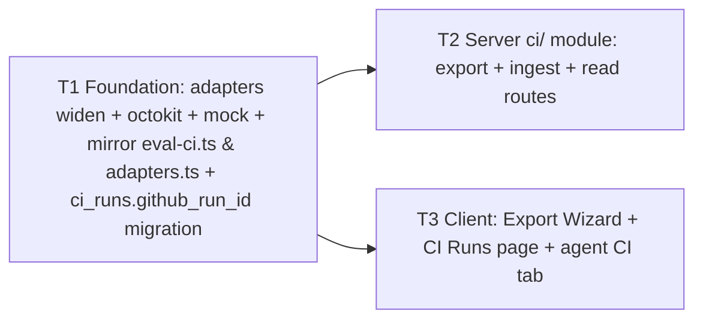

# Implementation Plan: Export to CI

Spec: SPEC-2026-07-13-export-to-ci (Status: approved)

## Execution mode

**Multi-agent (parallel)** — as mandated by the requester. 3 tasks total: one foundation wave, then two parallel waves over disjoint file sets (server vs client). The server task (T2) merges "export" and "ingest" because both live in the same `server/src/modules/ci/` files (`routes.ts` / `service.ts` / `repository.ts`) — splitting them would force two implementers to edit the same files, which violates disjoint-file partitioning. Merging to 3 is the clean shape here (the requester explicitly allowed "merge to 3 if cleaner").

## Goal & success criteria

"Done" means, observably:
- `POST /agents/:id/export-ci` builds a `CiFile[]` bundle (manifest YAML + enabled marker-stripped skills + empty `.devdigest/memory.jsonl` + runner `index.js` + `.github/workflows/devdigest-review.yml`), and for `action='open_pr'` makes **one** `commitFiles` to a `devdigest/ci` branch (never base) and opens-or-reuses a PR; for `action='files'` returns the bundle with `pr_url=null` and zero GitHub writes.
- The emitted manifest round-trips: `AgentManifest.safeParse` (studio) and `agent-runner`'s `loadAgentManifest` (reader) both succeed and deep-equal on the same bytes.
- An export persists/upserts a `ci_installations` row (one per agent+repo); a refresh pull-ingests `devdigest-review` workflow runs, `CiResultArtifact.safeParse`-gates each, dedupes on the GitHub run id, maps status, and skips-with-log on invalid artifacts.
- The client exposes: a 4-step Export Wizard (accessible modal), a CI Runs page, and an agent CI tab with a "Fail CI on" selector.
- No secret **value** is ever accepted, embedded, committed, persisted, or logged. No `FEATURE_MODELS` edit. Both `eval-ci.ts` and `adapters.ts` are byte-for-byte identical between `server/src/vendor/shared/` and `client/src/vendor/shared/`.

## Requirements review & recommendations

- **Verified feasible.** The scaffold is present: contracts in `server/src/vendor/shared/contracts/eval-ci.ts` (`AgentManifest`, `CiExportInput`, `CiExport`, `CiFile`, `CiRun`, `CiResultArtifact`, `CiInstallation`, `CiTarget`, `CiRunStatus`), tables `ci_installations`/`ci_runs` (`server/src/db/schema/ci.ts`, exported via `server/src/db/schema.ts`), `agents.ci_fail_on`. The `agent-runner` package reads the manifest (`loadAgentManifest`) and writes `CiResultArtifact` (`buildResultArtifact`, `RUNNER_VERSION='1'`). Do **not** re-derive any of these (server INSIGHTS 2026-07-08).
- **Clarified (vetted defaults supplied by requester — recorded, not re-litigated):**
  1. **Non-GHA targets** (`circle|jenkins|cli`): GHA is wired end-to-end (self-contained workflow + open-PR + ingest); non-GHA emits a template bundle usable only via the `action='files'` (zip) path; ingest stays GHA-Actions-specific.
  2. **`ci_runs` dedupe key:** add an additive `ci_runs.github_run_id` (text) column; upsert on it.
  3. **CI-tab workflow version:** display the ingested runner `version` from the latest `ci_run`; `"—"` when no run yet (no schema change beyond `github_run_id`).
  4. **Ingest scheduling:** on-refresh only for v1; a background poll via the `polling` module is a deferred fast-follow (out of scope).
- **Findings that changed the plan (from research):**
  - **The client vendored contracts are ALREADY drifted, not merely missing the new methods.** `diff` of both `eval-ci.ts` and `adapters.ts` (server vs client) exits 1 today: the client `eval-ci.ts` is missing the entire `AgentManifest`/`AgentManifestInput` block, the `CiFailOn` import, and `'openrouter'`; the client `adapters.ts` is missing `CommitFile`/`CommitFilesPayload`, `commitFiles()`/`findOpenPr()`, `sessionId`, `'openrouter'`, `sync()`/`diffNameOnly()`. T1 must bring **both files** to byte-for-byte parity (full mirror), not append. The client cannot preview/type the exported manifest until `AgentManifest` is mirrored.
  - **The `Modal` primitive (`client/src/vendor/ui/kit/Modal.tsx`) has `role="dialog"`+`aria-modal` and backdrop-close, but NO Escape handler and NO focus trap.** AC-12 requires both — T3 must build focus-trap + Escape on top of `Modal` (no reusable trap exists in `vendor/ui`). A step-indicator (`client/src/vendor/ui/ExportWizardSteps.tsx`) already exists and should drive the wizard steps.
  - **No per-agent memory store exists.** There is no agent memory table/column and no `.devdigest/memory.jsonl` source anywhere. Per AC-6 the file is emitted **empty** always — this is the only supported behavior for v1, not a placeholder to wire.
  - **The `agent-runner` ncc bundle is not built and is gitignored** (`agent-runner/dist/` absent, `dist/` in `.gitignore`). Runner-bundle provenance is a decision (below) — it is a build-prerequisite, not a contract change.
- **Recommendations (HOW only):**
  - **Runner-bundle provenance (decision):** keep the bundle builder a **pure** function that takes the runner bundle string as a parameter; isolate the single filesystem read in a tiny `ci/runner-bundle.ts` resolver that reads `agent-runner/dist/index.js`. Document a prerequisite `cd agent-runner && pnpm build` (produces the gitignored `dist/index.js`); if the bundle is missing at export time, throw a clear 500 ("runner bundle not built — run agent-runner build"). Tests inject a stub bundle string, so they never need a real ncc build. A checked-in bundle artifact is a viable follow-up but is out of scope. This keeps AC-33 purity intact and AC-5 satisfiable.
  - **`post_as` → workflow env (agent-runner open question):** `AgentManifest` has no `post_as` field; the runner reads `DEVDIGEST_POST_AS`. The generated workflow (T2 `workflow.ts`) must set `DEVDIGEST_POST_AS` from `CiExportInput.post_as`, alongside `OPENROUTER_API_KEY`/`GITHUB_TOKEN`/`GITHUB_REPOSITORY`/`PR_NUMBER` — secrets by **name only**.
  - **Slug uniqueness (edge case):** derive the manifest slug from the agent name but guarantee per-agent uniqueness (e.g. append a short agent-id suffix) so two similarly-named agents can't collide on `.devdigest/agents/<slug>.yaml`; the runner expects exactly one manifest per bundle.

## Affected modules & boundaries

- **`server/src/vendor/shared/adapters.ts`** — widen `GitHubClient` (add workflow-run listing + artifact download). Mirror to `client/src/vendor/shared/adapters.ts` (T1).
- **`server/src/vendor/shared/contracts/eval-ci.ts`** — no server-side edit needed (already complete); **mirror** to the client copy to erase existing drift (T1).
- **`server/src/adapters/github/octokit.ts`** + **`server/src/adapters/mocks.ts`** — implement the two new methods (T1).
- **`server/src/db/schema/ci.ts`** + a new generated migration — additive `ci_runs.github_run_id` (T1).
- **`server/src/modules/ci/`** (new module) + registration in `server/src/modules/index.ts` — export + ingest + read routes (T2), reached through the DI container only (AC-33).
- **`client/src/app/ci/`** (new CI Runs page), **`client/src/app/agents/[id]/`** (new CI tab across `constants.ts` + `page.tsx` `VALID_TABS` + `AgentEditor.tsx`), **`client/src/lib/api.ts`** + **`client/src/lib/hooks/ci.ts`**, i18n messages (T3).
- **Do NOT touch:** Multi-Agent Review service, PR feed, `agent-runner` internals, `FEATURE_MODELS` (any of its 3 copies).

## Relevant engineering insights

- **Manual byte-for-byte mirror, no sync build (2026-06-29 / 2026-07-06, repo INSIGHTS).** `client/src/vendor/shared/` is a hand-copy of `server/src/vendor/shared/`; `tsc` will not catch a missed mirror. The client is currently drifted — T1 must make both files diff-clean. Shapes T1 and AC-32/AC-19.
- **`pnpm db:generate` hangs on a mixed add/drop diff (2026-07-02, server INSIGHTS).** `drizzle-kit generate` prompts interactively (needs a real TTY) when a diff both adds and drops similarly-named columns. Keep the migration **purely additive** (`ADD COLUMN github_run_id` + a `CREATE INDEX`) — unambiguous, never prompts. Shapes T1.
- **No multi-user auth; `workspaceId` only from `getContext()` (2026-07-02, server INSIGHTS).** Every route derives `workspaceId` from `getContext(req)`, never from user input. Installations/runs are workspace-scoped this way. Shapes T2 routes; pre-empts false-positive IDOR findings from architecture-reviewer.
- **`getEnabledAgentSkills` + `stripUntrustedMarkers`; strip-on-enable = trust (2026-07-07, server INSIGHTS).** Load enabled skills via the join (`enabled=true`, ordered), run each body through `stripUntrustedMarkers` before it leaves trusted territory. Never ship a marker-wrapped or non-enabled body. Shapes T2 bundle (AC-3).
- **Features ship PRE-STAGED; don't re-derive, don't edit the `FEATURE_MODELS` registry (2026-07-08 / 2026-07-06, repo INSIGHTS).** Contracts + tables already exist; `FEATURE_MODELS` has 3 synchronized copies and must not be touched (AC-34). Shapes all tasks.
- **Adding an AgentEditor tab needs THREE files (2026-07-10, client INSIGHTS).** `TABS` in `constants.ts`, `VALID_TABS` in `page.tsx:15`, and the conditional render + import in `AgentEditor.tsx` — plus an i18n key per locale. Use `s.tabBody` (not `s.body`, which bakes in `padding:28`). Shapes T3.
- **Stable mock references in client tests (2026-07-01, client INSIGHTS).** A query-hook mock whose `data` feeds a `useEffect` dep must return a module-scoped stable reference, or the Vitest worker can OOM/hang. Shapes T3 tests.

## Architecture & approach

New server module `server/src/modules/ci/` following Onion + the Fastify-plugin registry convention (`server/src/modules/index.ts` → `app.ts` registration loop):

- **Route layer** (`routes.ts`): Zod-validates `CiExportInput`, derives `workspaceId` from `getContext(req)`, delegates to `CiService`. Adds `POST /agents/:id/export-ci`, `GET /agents/:id/ci-installations`, `GET /ci-runs` (and/or `GET /agents/:id/ci-runs`), and `POST /ci-runs/refresh` (ingest trigger).
- **Service layer** (`service.ts`): `constructor(container)`. `export()` orchestrates: build bundle → (open_pr) `commitFiles` + `findOpenPr`/`openPullRequest` via `container.github` → upsert installation via repository. `ingest()` orchestrates: for each installation, `container.github.listWorkflowRuns` → `downloadArtifact` → `CiResultArtifact.safeParse` → status-map → upsert `ci_runs` on `github_run_id`. Reaches adapters only through the DI container.
- **Pure leaf serializers** (no I/O — AC-33): `manifest.ts` (`agentYaml(agent, skills)` → validated YAML string), `workflow.ts` (`.github/workflows/devdigest-review.yml` string from triggers/post_as/target), `bundle.ts` (`buildBundle(...)` → `CiFile[]`, taking the runner bundle string as a param), `constants.ts` (paths, branch name `devdigest/ci`, secret names). `runner-bundle.ts` isolates the one filesystem read of `agent-runner/dist/index.js`.
- **Repository** (`repository.ts`): `constructor(db)`; direct Drizzle on `ci_installations` / `ci_runs`, workspace-scoped through the agent join.

Client: a `ci.ts` hooks module + `api.ts` methods feed a CI Runs page (`app/ci/`), an agent CI tab, and the Export Wizard modal (built on `Modal` + `ExportWizardSteps`, with a focus-trap/Escape wrapper for AC-12). `ci_fail_on` reuses the existing `useUpdateAgent` mutation (it is already in `UpdateAgentInput.patch`).

## Tasks

### T1 — Shared foundation: adapter widening, mock, and contract/adapter mirror + additive migration
- **Module:** server + shared (with the client mirror)
- **Traces to:** AC-19, AC-32; enables AC-20/21/22 (ingest) and AC-2/AC-25/AC-28 (client typing)
- **Files to create/modify:**
  - `server/src/vendor/shared/adapters.ts` — add to `GitHubClient`: `listWorkflowRuns(repo, workflowFile)` (returns run id, status/conclusion, PR number if available, and the run's public html_url) and `downloadArtifact(repo, runId, artifactName)` (returns the artifact's `devdigest-result.json` contents as a string, or null when absent). Define any small supporting interfaces (e.g. `WorkflowRun`) alongside the existing GitHub payload interfaces.
  - `server/src/adapters/github/octokit.ts` — implement both via `octokit.rest.actions.*` (list workflow runs for the `devdigest-review` workflow file; list run artifacts, download the `devdigest-result` zip, extract the JSON). Follow the existing `withRetry`/`withTimeout` wrapping used by the other methods. Never read/log secret values (AC-24).
  - `server/src/adapters/mocks.ts` — implement the two methods on `MockGitHubClient` using the established "opts-driven return + push into a public array" pattern, so tests can feed canned workflow runs/artifacts (including malformed and in-progress cases).
  - `server/src/db/schema/ci.ts` — add `githubRunId: text('github_run_id')` to `ciRuns` (purely additive); add a unique index suitable as the upsert conflict target (e.g. on `github_run_id`).
  - Run `cd server && pnpm db:generate` to emit ONE additive migration under `server/src/db/migrations/` (pure `ADD COLUMN` + `CREATE INDEX` — will not prompt; do NOT hand-edit migration SQL).
  - `client/src/vendor/shared/adapters.ts` — overwrite to be **byte-for-byte identical** to the server copy (erases the existing drift AND adds the new methods).
  - `client/src/vendor/shared/contracts/eval-ci.ts` — overwrite to be **byte-for-byte identical** to the server copy (adds the missing `AgentManifest` block, `CiFailOn` import, `'openrouter'`). No server-side edit to `eval-ci.ts` is needed — it is already complete.
- **Objective:** Give the ingest path its adapter surface, dedupe key, and mock; erase the pre-existing client contract/adapter drift so T2/T3 typecheck.
- **Out of scope:** No `ci/` module code; no route wiring; no client UI; no `FEATURE_MODELS` edit; do not modify `agent-runner`.
- **Skills to apply:** `drizzle-orm-patterns`, `postgresql-table-design`, `zod`, `typescript-expert`, `architecture-patterns`, `security`, `engineering-insights`.
- **Insights/gotchas to respect:** keep the migration purely additive (2026-07-02 — mixed add/drop hangs `db:generate`); the client copies are a manual mirror with no sync build and are currently drifted — make BOTH `diff`s exit 0 (2026-06-29 / 2026-07-06); the new octokit method must not read or log any token/secret value (AC-24).
- **Depends on:** none (Wave 1).
- **Verify:**
  - `cd server && pnpm typecheck && pnpm test`
  - `cd client && pnpm typecheck`
  - From repo root: `diff server/src/vendor/shared/adapters.ts client/src/vendor/shared/adapters.ts` (exit 0) and `diff server/src/vendor/shared/contracts/eval-ci.ts client/src/vendor/shared/contracts/eval-ci.ts` (exit 0)
  - `cd agent-runner && npm run typecheck` (sanity: shared-contract changes didn't break the runner)

### T2 — Server `ci/` module: export bundle, atomic PR, installation persistence, pull-ingest, read routes
- **Module:** server
- **Traces to:** AC-1, AC-2, AC-3, AC-4, AC-5, AC-6, AC-13, AC-14, AC-15, AC-16, AC-17, AC-18, AC-20, AC-21, AC-22, AC-23, AC-24, AC-30 (server half), AC-31, AC-33, AC-34
- **Files to create/modify:**
  - `server/src/modules/ci/manifest.ts` — pure `agentYaml(agent, enabledSkillSlugs)`: serialize `name`, `provider`, `model`, `system_prompt`, `skills` (enabled slugs), `strategy`, `ci_fail_on` to YAML; self-check with `AgentManifest.safeParse`; derive a per-agent-unique slug.
  - `server/src/modules/ci/workflow.ts` — pure generator for `.github/workflows/devdigest-review.yml`: `on: pull_request` with the chosen triggers; a job that runs `node .devdigest/runner/index.js`; env `OPENROUTER_API_KEY`/`GITHUB_TOKEN`/`GITHUB_REPOSITORY`/`PR_NUMBER`/`DEVDIGEST_POST_AS` — secrets by NAME only (`${{ secrets.* }}`); no `uses: devdigest/review-action@` as the review mechanism (AC-4).
  - `server/src/modules/ci/bundle.ts` — pure `buildBundle({ manifestYaml, skills, runnerBundle, workflowYaml, ... })` → `CiFile[]`: manifest at `.devdigest/agents/<slug>.yaml`; one `.devdigest/skills/<slug>.md` per enabled skill (body already marker-stripped); `.devdigest/memory.jsonl` **empty**; `.devdigest/runner/index.js` with `editable=false`; the workflow with `editable=true`.
  - `server/src/modules/ci/runner-bundle.ts` — isolate the single read of `agent-runner/dist/index.js`; throw a clear error if absent.
  - `server/src/modules/ci/constants.ts` — branch `devdigest/ci`, workflow filename `devdigest-review.yml`, bundle paths, expected secret names.
  - `server/src/modules/ci/repository.ts` — `constructor(db)`; installation upsert on `(agent_id, repo)` and reads; `ci_runs` upsert on `github_run_id` and reads (workspace-scoped via the agent join).
  - `server/src/modules/ci/service.ts` — `constructor(container)`; `export()` (load agent + `getEnabledAgentSkills` → `stripUntrustedMarkers` → build bundle → open_pr path: one `commitFiles(repo,{branch:'devdigest/ci',base,files})` then `findOpenPr`→`openPullRequest`; files path: no GitHub write; persist installation; return `CiExport`) and `ingest()` (per installation: `listWorkflowRuns` → skip already-ingested `github_run_id` → `downloadArtifact` → `CiResultArtifact.safeParse` → status-map → upsert; skip+log invalid). Parse `"owner/name"` into `RepoRef` with a small local helper (none exists).
  - `server/src/modules/ci/routes.ts` — `POST /agents/:id/export-ci` (`CiExportInput`→`CiExport`), `GET /agents/:id/ci-installations` (→`CiInstallation[]`), `GET /ci-runs` and/or `GET /agents/:id/ci-runs` (→`CiRun[]`), `POST /ci-runs/refresh` (ingest). All derive `workspaceId` from `getContext(req)`. Emit the structured export/ingest log lines from the spec's Observability section (no secret values).
  - `server/src/modules/index.ts` — one import + one registry entry for `ci`.
- **Objective:** Serialize an agent into a validated manifest bundle, commit it as one reviewable PR to `devdigest/ci` (or return files), persist/upsert the installation, and pull-ingest `devdigest-review` results into `ci_runs` with safeParse-gating, dedupe, and status mapping.
- **Out of scope:** No client code; no `agent-runner` edits; no `FEATURE_MODELS` change; do not commit to the base branch; do not add a background poll (deferred); non-GHA targets only need the `action='files'` template path (no first-class non-GHA ingest).
- **Skills to apply:** `fastify-best-practices`, `drizzle-orm-patterns`, `postgresql-table-design`, `zod`, `typescript-expert`, `security`, `architecture-patterns`, `engineering-insights`.
- **Insights/gotchas to respect:** adapters ONLY via `container.github`/`container.db` — never `new OctokitGitHubClient()` (AC-33); `workspaceId` only from `getContext()` (2026-07-02); enabled-only + `stripUntrustedMarkers` before a skill body enters the bundle (2026-07-07); `.devdigest/memory.jsonl` is always empty (no memory store exists); manifest/workflow/rows/logs carry secret NAMES only, never values (AC-24/AC-31); the runner bundle is read via `runner-bundle.ts` (build prerequisite: `cd agent-runner && pnpm build`); keep `manifest.ts`/`workflow.ts`/`bundle.ts` pure (data in → string/`CiFile[]` out); do not edit `FEATURE_MODELS` (AC-34); slug must be unique per agent to avoid manifest-path collision.
- **Depends on:** T1 (new `GitHubClient` methods + `ci_runs.github_run_id` column).
- **Verify:**
  - `cd server && pnpm typecheck && pnpm test` (add unit tests for `manifest`/`workflow`/`bundle` purity + AC-2 round-trip through `agent-runner`'s `loadAgentManifest`; a `MockGitHubClient` test for AC-13/14/15/16; ingest tests for AC-20/21/22/23 including `[valid, invalid, valid]` → 2 rows; integration `*.it.test.ts` for AC-1/17/18 — run with the testcontainers env vars from server INSIGHTS 2026-07-08).
  - `git diff --stat` shows no change under `server/src/vendor/shared/contracts/platform.ts` or `client/src/lib/feature-models.ts` (AC-34).

### T3 — Client: Export Wizard, CI Runs page, agent CI tab
- **Module:** client
- **Traces to:** AC-7, AC-8, AC-9, AC-10, AC-11, AC-12, AC-25, AC-26, AC-27, AC-28, AC-29, AC-30 (client half), AC-31 (no secret input)
- **Files to create/modify:**
  - `client/src/lib/api.ts` — add the CI endpoints (export POST, installations GET, ci-runs GET, refresh POST).
  - `client/src/lib/hooks/ci.ts` — `useExportCi` (mutation), `useCiInstallations(agentId)`, `useCiRuns(...)`, `useRefreshCiRuns` (mutation); shared query-key prefix + one `invalidateCiQueries()` helper (mirror `hooks/eval.ts`). Reuse the existing `useUpdateAgent` for `ci_fail_on` (already in `UpdateAgentInput.patch`) — do not add a new mutation for it.
  - Export Wizard: a new `_components/ExportWizard/` under the agent CI tab folder. 4 steps (Target → Preview → Configure → Install) driven by `ExportWizardSteps` from `@devdigest/ui`, rendered in a `Modal`. Build a **focus-trap + Escape-to-close** wrapper (the `Modal` primitive has neither) and ensure `role="dialog"` + accessible name (AC-12). Target maps to `CiExportInput.target` (GHA default/recommended); Preview lists all files and renders the workflow in an editable textarea whose edits flow into the export request, non-editable files read-only (AC-8); Configure sets `triggers` (default `[opened, synchronize, reopened]`) + `post_as` (github_review flagged as the only blocking verdict) and shows the two expected secrets as **display-only** with NO secret input (AC-9/AC-10); Install offers open_pr (recommended) vs files (zip download), firing `useExportCi` (AC-11).
  - Agent CI tab: add `"ci"` to `TABS` (`client/src/app/agents/[id]/_components/AgentEditor/constants.ts`), to `VALID_TABS` (`client/src/app/agents/[id]/page.tsx:15`), and a conditional render + import in `AgentEditor.tsx`; new `_components/CiTab/` showing per-repo installations (repo + status + workflow version = latest `ci_run.version`, `"—"` if none — AC-28), the agent's `ci_runs` history, an **Add to CI** button opening the wizard, and a "Fail CI on" selector bound to `agents.ci_fail_on` persisted via `useUpdateAgent` (AC-29/AC-30). Use `s.tabBody`.
  - CI Runs page: `client/src/app/ci/page.tsx` (thin `Suspense`) + `_components/CiRunsView/` (mirror `app/eval/`). Row per `CiRun`: PR number, repo, agent, status (text label, not color-only), findings, cost, duration, anchor to `github_url` (AC-25); empty-state CTA linking to the wizard when zero runs (AC-26); em-dash for null `cost_usd`/`duration_s` (AC-27); tolerate a null `ci_installation_id` (AC-25 / deleted-installation edge case).
  - i18n: add the new tab/label/wizard/page keys to every locale under `client/src/i18n/messages/`.
- **Objective:** Ship the three client surfaces so a user can add an agent to CI, review the generated files, install (PR or zip), and see installations + run history + the CI Runs page.
- **Out of scope:** No server code; no contract edits (T1 owns the mirror); do not add a new mutation for `ci_fail_on`; do not touch the PR feed or Multi-Agent Review UI.
- **Skills to apply:** `next-best-practices`, `react-best-practices`, `react-testing-library`, `zod`, `typescript-expert`, `security`, `engineering-insights`.
- **Insights/gotchas to respect:** a new tab needs all THREE of `constants.ts` + `page.tsx` `VALID_TABS` + `AgentEditor.tsx`, plus i18n keys (2026-07-10); use `s.tabBody`, not `s.body` (2026-07-01); the `Modal` primitive lacks Escape + focus-trap — build them for AC-12; use `fireEvent` (not `user-event`, not installed) and stable module-scoped mock references to avoid Vitest OOM (2026-07-01); never render any input bound to a secret value (AC-10/AC-31).
- **Depends on:** T1 (mirrored `eval-ci.ts` provides `AgentManifest`/`Ci*` types the UI imports). Server routes (T2) are the runtime backend, but T3 can be built and unit-tested against mocked hooks in parallel with T2.
- **Verify:**
  - `cd client && pnpm typecheck && pnpm test` (RTL tests for AC-7..12, AC-25..30, mocking the `ci`/`agents` hooks).

## Execution map

- **Wave 1 (sequential prerequisite): T1.** It widens the `GitHubClient` interface, adds the mock, adds the `ci_runs.github_run_id` column, and — critically — makes both `client/src/vendor/shared` files byte-for-byte match the server. T2 won't typecheck without the adapter methods + column; T3 won't typecheck without the mirrored `AgentManifest`/`Ci*` contracts.
- **Wave 2 (parallel, disjoint file sets): T2 ∥ T3.** T2 is entirely under `server/` (new `ci/` module + one line in `modules/index.ts`); T3 is entirely under `client/`. No shared files, so they run concurrently. Both depend only on T1.
- **Why not 4 tasks:** splitting the server into export vs ingest would force both implementers to edit `server/src/modules/ci/routes.ts`, `service.ts`, and `repository.ts` — not disjoint. Merging into T2 is the clean parallel shape.

## Shared-contract changes

- **`server/src/vendor/shared/adapters.ts`** gains `listWorkflowRuns` + `downloadArtifact` on `GitHubClient` (+ any supporting interface). **Mirror sub-task (T1):** overwrite `client/src/vendor/shared/adapters.ts` byte-for-byte.
- **`server/src/vendor/shared/contracts/eval-ci.ts`** is unchanged server-side but the **client copy is drifted**. **Mirror sub-task (T1):** overwrite `client/src/vendor/shared/contracts/eval-ci.ts` byte-for-byte (adds `AgentManifest`, `CiFailOn` import, `'openrouter'`).
- Both mirrors are gated by `diff … exit 0` in T1's Verify (AC-19, AC-32).
- **No `FEATURE_MODELS` change** in any of its three copies (`platform.ts` server, its client vendored mirror, `client/src/lib/feature-models.ts`) — AC-34.

## End-to-end verification

After all three tasks land (run by plan-verifier from exit codes):
1. `cd server && pnpm typecheck && pnpm test` — green (unit + `*.it.test.ts` with the testcontainers env vars from server INSIGHTS 2026-07-08).
2. `cd client && pnpm typecheck && pnpm test` — green.
3. `cd agent-runner && npm run typecheck` — green (shared-contract parity).
4. `diff server/src/vendor/shared/adapters.ts client/src/vendor/shared/adapters.ts` and `diff server/src/vendor/shared/contracts/eval-ci.ts client/src/vendor/shared/contracts/eval-ci.ts` — both exit 0.
5. `git diff` shows no change to any `FEATURE_MODELS` copy.
6. The AC-2 round-trip test (studio `AgentManifest.safeParse` == `agent-runner` `loadAgentManifest`, deep-equal) and the AC-21 `[valid, invalid, valid]` → 2-rows ingest test both pass — these are the two contract/parity linchpins.
7. `architecture-reviewer` confirms: route→service→adapter direction in `ci/`, adapters only via the DI container (no `new OctokitGitHubClient()`), and pure `manifest`/`workflow`/`bundle` builders (AC-33).

## Risks / open questions

- **Runner-bundle provenance (decided, defensible, flagged):** `agent-runner/dist/index.js` is gitignored and unbuilt. The plan reads it at export time via an isolated resolver with a build prerequisite (`cd agent-runner && pnpm build`) and a clear 500 when missing; tests inject a stub. If the team prefers a checked-in bundle artifact or an export-time build shell-out, that changes T2's `runner-bundle.ts` only — not the contracts or the decomposition. Not blocking.
- **Non-GHA fidelity (per confirmed default):** `circle|jenkins|cli` emit a template bundle usable only via `action='files'`; open-PR + ingest remain GHA-specific. If first-class non-GHA generation is later required, it is additive to `workflow.ts` and does not alter the module boundaries.
- **`github_run_id` uniqueness scope:** the plan uses `github_run_id` as the upsert conflict target. GitHub run ids are unique per repo; if a future multi-repo edge makes a bare-column unique index too strict or too loose, switch the unique index to `(ci_installation_id, github_run_id)` — an additive index change in T1, no contract impact.
- **Background-poll ingest** is explicitly deferred to a fast-follow via the `polling` module (confirmed default) — not in this plan.
