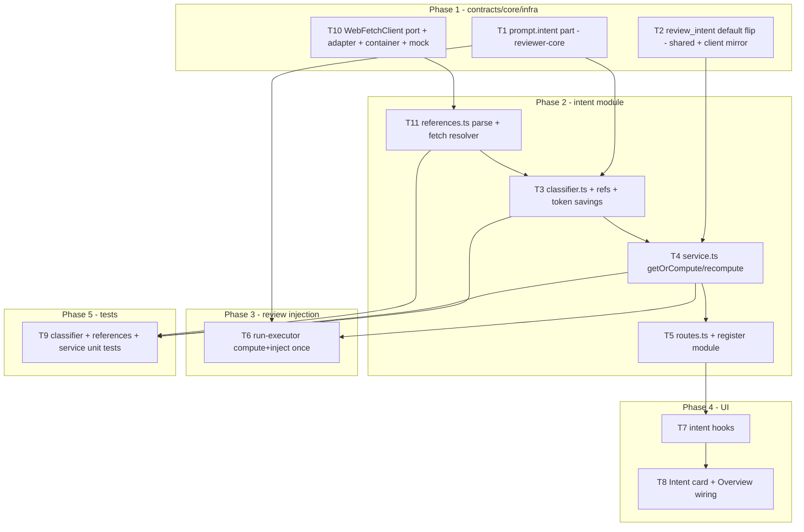

# Development Plan: Intent Layer

## Overview
Add a cheap-model "Intent Layer" that derives a PR's purpose and scope (`{ intent, in_scope, out_of_scope }`) from PR title/body + linked issue + changed-file hunk headers (no change bodies), stores it per-PR, injects it into the review prompt with a scope-discipline rule, and surfaces it as an Intent card on the PR Overview tab. The classifier uses the existing `Intent` Zod schema, the existing `pr_intent` table (no migration), and the `review_intent` feature-model slot — whose default flips to `deepseek/deepseek-v4-flash`. The call logs the token savings of header-only input vs. full-diff input.

## Requirements
- R1: An intent classifier in a new `intent` server module that calls `llm.completeStructured` with the `Intent` schema. Input = PR title + body + linked issue (title+body) + changed files WITH hunk `@@` headers but WITHOUT added/removed code lines.
- R2: The classifier logs the estimated token delta (full-diff tokens vs header-only tokens) it saved.
- R3: Intent is stored per-PR via the existing `upsertIntent`/`getIntent`; recompute is supported on demand.
- R4: A synchronous (conventions-style) route to compute/recompute intent, plus lazy auto-compute when the Overview loads if none is stored.
- R5: Review runs compute intent once (if missing/stale), store it, and inject an `intent` block into each agent prompt via `wrapUntrusted`, with the rule: "do not comment outside the intent scope; if a serious problem is out of scope, produce ONE signal finding, not twenty."
- R6: An Intent card on the PR Overview tab: summary quote, IN SCOPE (green check) list, OUT OF SCOPE (x) list, and a Recompute button with loading state.
- R7: The `review_intent` FEATURE_MODELS default becomes `deepseek/deepseek-v4-flash` (OpenRouter), still user-overridable in Settings.
- R8: Server unit tests (hermetic, LLM stubbed) cover the classifier input shaping, token-savings logging, and the service compute/recompute path. All four packages typecheck.
- R9: **Graceful degradation on sparse input.** A linked issue and a PR body are OPTIONAL enrichers, never preconditions. When the PR body is empty/missing AND no linked issue is found, the classifier must still produce a best-effort intent inferred from the always-present signals (PR title + changed-file paths + hunk `@@` headers). It must NOT error, return an empty/blank intent, or skip the call. When a spec/issue/link IS present, it is folded in to sharpen the result. The system prompt must instruct the model to infer intent from whatever signal exists and to lean on file paths + hunk headers when prose is absent.
- R10: **Reference resolution — plans & specs MUST be folded in.** When the PR body contains either an inline plan/spec (already captured via `body`) OR a reference to one, the referenced content MUST be fetched best-effort and added to the classifier input (wrapped as untrusted). Three reference kinds are supported:
  - **(a) Repo-relative file paths** (e.g. `docs/plans/foo.md`, `specs/bar.md`, markdown links to `*.md`/`*.txt` in the repo) → read from the local clone via `container.git.readFile(repoRef, path)`. Guard against path traversal (`..`, absolute, outside repo). Best-effort if the clone is absent.
  - **(b) GitHub issue/PR references** — bare `#N`, `closes/fixes/resolves #N`, and full `github.com/<owner>/<repo>/(issues|pull)/<N>` URLs → fetch via `getIssue` / `getPullRequest`. Resolve ALL matches (not just the first), de-duplicated, capped in count.
  - **(c) External http(s) URLs** (Google Docs, Notion, arbitrary pages) → fetch via a NEW guarded `WebFetchClient` adapter (extracted from the existing `safeFetchSkillUrl` SSRF logic). HTTPS-only, private-IP blocked, timeout + size cap, `text/*` only.
  All fetched reference content is wrapped via `wrapUntrusted('spec:<source>', content)` before inclusion. A total reference-content size budget caps how much is injected (so references don't erase the token savings); truncation is logged. Reference resolution NEVER fails the intent computation — every fetch is best-effort with try/catch.

## Affected modules & contracts
- **server** — new `modules/intent/` (classifier, **reference resolver**, service, routes, repository-thin reuse); register in `modules/index.ts`; integrate compute+inject in `modules/reviews/run-executor.ts`; flip `review_intent` default in shared contract. New guarded **`WebFetchClient` adapter** (port + concrete + container slot + mock + optional config flag) for external-URL references.
- **reviewer-core** — `assemblePrompt` gains an `intent?` prompt part; `ReviewInput` gains an `intent?` field threaded into `assemblePrompt`.
- **client** — new Intent card component on Overview tab; new `lib/hooks/intent.ts`; flip mirrored `review_intent` default; pass `prId` into `OverviewTab`.
- **Contracts:**
  - No NEW shared contract file. Reuse `Intent` (`brief.ts`) and `PrIntentRecord` (`review-api.ts`).
  - **CHANGE to existing shared contract (explicit callout):** `FEATURE_MODELS[review_intent].defaultModel`/`defaultProvider` in `server/src/vendor/shared/contracts/platform.ts`. This is a default-value edit only (no shape change). It MUST be mirrored in `client/src/lib/utils/featureModels.ts`. No other package consumes the value at runtime.
  - **ADDITIVE to existing shared contract (explicit callout):** a new `WebFetchClient` interface added to `server/src/vendor/shared/adapters.ts` (server-only port; the client never imports it). Additive — no existing type changes shape. No client mirror needed (client `vendor/shared` does not consume adapter ports).

## Architecture changes
- New backend module `server/src/modules/intent/`:
  - `classifier.ts` (application-pure helper, mirrors `conventions/extractor.ts`): builds the header-only prompt PLUS a wrapped "references" block from pre-resolved reference content, calls injected `llm.completeStructured({ schema: Intent })`, returns `{ intent, tokenSavings }`. No DB, no GitHub, no fetching — receives resolved inputs + injected `llm`. (onion: infrastructure-adjacent pure helper, same layer as `extractor.ts`.)
  - `references.ts` (application helper): given the PR body + `repoRef` + injected `{ git, github, webFetch }`, parses references and fetches them best-effort. Returns `ResolvedReference[]` = `{ kind: 'repo-file'|'github'|'url', source: string, content: string }`. Pure parsing is unit-testable; fetching is via injected ports (mockable). Applies path-traversal guards (repo-file), count caps (github), SSRF guards (url, delegated to `WebFetchClient`), and a total size budget with logged truncation.
  - `service.ts` (application layer): orchestrates — load PR + repo (via `ReviewRepository`), load `UnifiedDiff` (via `diff-loader.loadDiff`), resolve linked issue + references (via `references.ts` using `container.git`/`container.github()`/`container.webFetch`), resolve feature model (`resolveFeatureModel(..., 'review_intent')`), call classifier, `upsertIntent`, return `PrIntentRecord`. `getOrCompute` returns stored intent or computes+stores lazily.
  - `routes.ts` (presentation layer): thin Fastify plugin, Zod params/response, `getContext` for workspace.
- New adapter `server/src/adapters/http/web-fetch.ts` implementing a new `WebFetchClient` port (`adapters.ts`): wraps the SSRF-safe fetch logic currently inline in `skills/routes.ts:safeFetchSkillUrl` (HTTPS-only, private-IP block, 10s timeout, `text/*` content-type, ~100KB cap). Wired as a lazy container getter (`container.webFetch`) with a `ContainerOverrides.webFetch` slot + `MockWebFetchClient`. Optional `EXTERNAL_FETCH_ENABLED` config flag (default true) to disable external-URL fetching org-wide; repo-file and github references are unaffected by the flag.
- `run-executor.ts` (`executeRuns`, after diff load ~line 123, before the agent loop ~127): compute intent once if missing, store it, pass the `intent` string into each `reviewPullRequest` call. Out-of-scope rule lives only in the injected intent block text (no Finding schema field).
- `reviewer-core/src/prompt.ts`: add `intent?: string` to `PromptParts`; render an `## Intent` section between Callers and Diff, `wrapUntrusted('intent', ...)`. `reviewer-core/src/review/run.ts`: add `intent?` to `ReviewInput`, include in `promptParts`.
- Client RSC boundary: `OverviewTab` is already `"use client"`; the Intent card is a client component using a TanStack Query hook + mutation.

## Phased tasks

### Phase 1 — Contracts & core prompt seam

- **T1**
  - **Action:** Add `intent?: string` to `PromptParts` (after `callers`, before `diff`). In `assemblePrompt`, push an `## Intent` section between the Callers section and the `## Diff to review` push, wrapped via `wrapUntrusted('intent', parts.intent)`, only when `parts.intent?.trim()` is non-empty (omit-when-empty, no behavior change otherwise). Add `intent` to the returned `PromptAssembly` if `PromptAssembly` carries arbitrary fields; if `PromptAssembly` is a fixed shape, do NOT add it there (verify against `@devdigest/shared` `PromptAssembly`) — keep the trace unchanged.
  - **Module:** reviewer-core
  - **Type:** core
  - **Skills to use:** zod (none needed; just types), typescript-expert
  - **Owned paths:** `reviewer-core/src/prompt.ts`
  - **Depends-on:** none
  - **Risk:** low
  - **Known gotchas:** reviewer-core never emits JS (`npm run build` = `tsc --noEmit`); `wrapUntrusted` already strips `</untrusted>`. The INJECTION_GUARD already names "derived intent/scope" as untrusted — do not duplicate that text. Do not bypass `groundFindings`.
  - **Acceptance:** `cd reviewer-core && npm run typecheck` passes; existing `npm test` still green; a prompt assembled with `intent: ''` or omitted produces byte-identical output to before (covered by T9 / existing prompt tests).

- **T2**
  - **Action:** Change `FEATURE_MODELS` entry `review_intent` in `server/src/vendor/shared/contracts/platform.ts` to `defaultProvider: 'openrouter'`, `defaultModel: 'deepseek/deepseek-v4-flash'`. Mirror the exact same change in `client/src/lib/utils/featureModels.ts`. Update the entry's `description` only if it currently misstates behavior (optional).
  - **Module:** server (+ client mirror)
  - **Type:** backend
  - **Skills to use:** zod, onion-architecture (contract-as-domain), engineering-insights
  - **Owned paths:** `server/src/vendor/shared/contracts/platform.ts`, `client/src/lib/utils/featureModels.ts`
  - **Depends-on:** none
  - **Risk:** medium
  - **Known gotchas:** This is a shared-contract value edit — explicit callout per project rule. The client imports only TYPES from `@devdigest/shared`; it mirrors the registry manually, so BOTH files must change together or the Settings UI shows a stale default. `deepseek/deepseek-v4-flash` is already in the pricing table (`server/src/adapters/llm/pricing.ts`), so cost is computable.
  - **Acceptance:** `cd server && pnpm typecheck` and `cd client && pnpm typecheck` pass; `resolveFeatureModel(container, ws, 'review_intent')` with no override returns `{ provider: 'openrouter', model: 'deepseek/deepseek-v4-flash' }` (asserted in T9); server and client registries are identical for `review_intent`.

- **T10**
  - **Action:** Extract a guarded outbound-HTTP capability into a proper adapter. (1) Add `export interface WebFetchClient { fetch(url: string): Promise<string>; }` to `server/src/vendor/shared/adapters.ts` (additive). (2) Create `server/src/adapters/http/web-fetch.ts` implementing it by lifting the SSRF logic from `skills/routes.ts:safeFetchSkillUrl`: HTTPS-only, reject private/loopback/link-local IP hostnames (`/^(localhost|127\.|0\.|10\.|192\.168\.|172\.(1[6-9]|2\d|3[01])\.|169\.254\.)/`), `AbortSignal.timeout(10_000)`, require `Content-Type` starting `text/`, cap body at ~100KB, throw `ValidationError` on violation. (3) Add a lazy `webFetch` getter to `container.ts` (mirrors the `git` getter) + a `ContainerOverrides.webFetch` slot. (4) Add `MockWebFetchClient` to `server/src/adapters/mocks.ts`. (5) Optional: add `EXTERNAL_FETCH_ENABLED` boolean to `EnvSchema`/`AppConfig` (default true), following the `EMBEDDINGS_ENABLED` pattern. (6) Refactor `skills/routes.ts` to call `container.webFetch.fetch` instead of the inline helper (keeps one implementation; verify skills tests stay green).
  - **Module:** server
  - **Type:** backend
  - **Skills to use:** onion-architecture (new port + adapter + container slot), fastify-best-practices, security (SSRF defense), zod
  - **Owned paths:** `server/src/adapters/http/web-fetch.ts`, `server/src/vendor/shared/adapters.ts`, `server/src/platform/container.ts`, `server/src/adapters/mocks.ts`, `server/src/platform/config.ts`, `server/src/modules/skills/routes.ts`
  - **Depends-on:** none
  - **Known gotchas:** `adapters.ts` is a shared-contract file — additive interface only, no shape change to existing types (explicit callout). `ValidationError` is the existing error type used by `safeFetchSkillUrl`. Keep the SSRF guard logic byte-identical to the audited original; do not weaken it. DNS-rebinding is a known residual gap (hostname check, not resolved-IP check) — same posture as today; note it, don't expand scope. The skills route refactor must preserve current behavior (same error messages/limits) or its tests break.
  - **Risk:** medium
  - **Acceptance:** `cd server && pnpm typecheck` passes; existing skills tests stay green; unit test asserts the adapter rejects `http://`, private-IP hosts, non-text content, and oversized bodies, and returns text for a mocked allowed URL; `container.webFetch` is overridable in tests.

### Phase 2 — Intent module (references + classifier + service + routes)

- **T11**
  - **Action:** Create `references.ts`. Export a pure parser `parseReferences(body: string | null, repo: { owner: string; name: string }): ParsedRef[]` (`{ kind: 'repo-file'|'github'|'url', raw: string, path?: string, issueNumber?: number, url?: string }`) and an async resolver `resolveReferences(refs: ParsedRef[], deps: { repoRef; git: GitClient; github: GitHubClient | null; webFetch: WebFetchClient | null; logger?: Logger; budgetBytes?: number }): Promise<ResolvedReference[]>` (`{ kind, source, content }`).
    - **Parsing:** repo-file = markdown links or bare tokens matching repo-root-relative paths ending in `.md`/`.txt`/`.mdx` under known doc dirs (e.g. `docs/`, `specs/`, `plans/`) — must be relative, must NOT contain `..` or start with `/`. github = bare `#N`, `closes/fixes/resolves #N`, and full `https://github.com/<owner>/<repo>/(issues|pull)/<N>` URLs. url = any other `https?://` link. De-duplicate; cap counts (e.g. ≤5 github refs, ≤3 urls, ≤5 files).
    - **Resolving (each best-effort, try/catch → skip on error):** repo-file → `git.readFile(repoRef, path)` (re-validate no traversal post-parse); github → if URL targets the same repo use it, else build a `RepoRef` from the URL's owner/repo; call `github.getIssue` (fallback `getPullRequest` on 404) — skip if `github` is null; url → `webFetch.fetch(url)` — skip if `webFetch` is null or `EXTERNAL_FETCH_ENABLED` is false.
    - **Budget:** accumulate content up to `budgetBytes` (default ~12KB total across all refs); truncate the last item with a `…[truncated]` marker and `logger.info` the truncation. Each resolved item's `content` is later wrapped by the classifier via `wrapUntrusted('spec:<source>', content)`.
  - **Module:** server
  - **Type:** backend
  - **Skills to use:** onion-architecture (parsing pure; fetching via injected ports), security (path-traversal + SSRF + untrusted content), zod, typescript-expert
  - **Owned paths:** `server/src/modules/intent/references.ts`
  - **Depends-on:** T10 (`WebFetchClient`)
  - **Known gotchas:** Import `GitClient`/`GitHubClient`/`WebFetchClient`/`RepoRef` from `@devdigest/shared`. `git.readFile` reads the working tree (at head after `sync`); if the clone is absent it throws — catch and skip (best-effort). `container.github()` is async and throws with no PAT — the caller passes `null` when unavailable. Do NOT fetch the same repo's own changed files as "references" (avoid pulling the diff back in). Never let a reference fetch throw out of `resolveReferences`.
  - **Risk:** medium
  - **Acceptance:** Unit test (T9): parser extracts repo-file/github/url kinds and rejects `../` and absolute paths; resolver reads a repo file via `MockGitClient`, an issue via `MockGitHubClient`, and a URL via `MockWebFetchClient`; a failing fetch is skipped (others still returned); total content respects `budgetBytes` and logs truncation; `webFetch: null` skips url refs without throwing.

- **T3**
  - **Action:** Create `classifier.ts`. Export `classifyIntent(opts: { title: string; body: string | null; issue?: { title: string; body: string | null } | null; references?: ResolvedReference[]; diff: UnifiedDiff; llm: LLMProvider; model: string; logger?: Logger })`. Build the LLM user message from: PR title, PR body, linked-issue title+body, a "## Referenced plans/specs" block where each resolved reference is wrapped via `wrapUntrusted('spec:' + ref.source, ref.content)`, and a per-file "changed files" block listing each `file` with its hunk headers reconstructed as `@@ -oldStart,oldLines +newStart,newLines @@` from `diff.files[].hunks` (DiffHunk: `oldStart/oldLines/newStart/newLines`) — NO added/removed code lines. The system instruction states the content is data only and that referenced plans/specs are the strongest scope signal when present. Call `llm.completeStructured({ model, schema: Intent, schemaName: 'Intent', messages, temperature: 0.1 })`. **Sparse-input handling (R9):** `body`, `issue`, and `references` are optional — render their sections only when present, but ALWAYS render the PR title + changed-files (paths + hunk headers) block. The system prompt must tell the model: "Some PRs have no description, linked issue, or referenced spec. In that case, infer the intent and scope from the title, the changed file paths, and the hunk headers alone — produce a best-effort intent, never an empty one. When a description/issue/plan IS present, prioritize it to sharpen scope." Do not early-return or throw when these are absent. Compute token savings: estimate `fullDiffTokens` from `diff.raw.length` and `headerOnlyTokens` from the built message length using a chars/4 heuristic helper `estimateTokens(s) = Math.ceil(s.length / 4)`; log `{ prTitle, fullDiffTokens, headerOnlyTokens, refsBytes, savedTokens, savedPct }` via the injected logger at info level. Return `{ intent: result.data, savedTokens, fullDiffTokens, headerOnlyTokens }`.
  - **Module:** server
  - **Type:** backend
  - **Skills to use:** zod (schema reuse + `completeStructured`), onion-architecture (pure helper, injected llm — no DB/GitHub/fetch here), security (wrap referenced content as untrusted), typescript-expert
  - **Owned paths:** `server/src/modules/intent/classifier.ts`
  - **Depends-on:** T1 (prompt seam), T11 (`ResolvedReference` type + resolver output shape)
  - **Known gotchas:** Import `Intent`, `UnifiedDiff`, `LLMProvider` from `@devdigest/shared`; import `wrapUntrusted` from `server/src/platform/prompt.ts` (re-export of reviewer-core). `DiffHunk` lives in `vendor/shared/adapters.ts`. Never read `process.env`; never `new` an LLM provider — `llm` is injected. The chars/4 token estimate is a deliberate heuristic — label it as estimate in the log. Note: references ADD input tokens; the savings metric still compares header-only-input vs full-diff-input, and the log includes `refsBytes` so the trade-off is visible.
  - **Risk:** medium
  - **Acceptance:** Unit test (T9) with `MockLLMProvider` asserts: (a) the user message contains `@@` hunk headers and the file paths, (b) it does NOT contain added/removed code body lines from `diff.raw`, (c) `savedTokens > 0` when the full diff is larger than headers, (d) the logger received one info call containing `saved`, (e) **(R9)** with `body: null`, `issue: null`, `references: []` the call still fires with title + files + hunks and returns a valid non-empty `Intent`, (f) **(R10)** when a `ResolvedReference` is passed, the message contains its content inside a `<untrusted source="spec:...">` block.

- **T4**
  - **Action:** Create `service.ts` exporting `class IntentService { constructor(container) }`. Methods: `getOrCompute(workspaceId, prId): Promise<PrIntentRecord>` — return stored via `repo.getIntent(prId)` mapped to `PrIntentRecord` if present, else compute; `recompute(workspaceId, prId): Promise<PrIntentRecord>` — always compute + upsert; `computeForRun(workspaceId, pull, repoRow, diff): Promise<Intent>` — compute reusing a pre-loaded `UnifiedDiff` (for T6, avoids double diff-load) + upsert. Shared `compute(workspaceId, prId, preloadedDiff?)` orchestration: load `pull = repo.getPull(workspaceId, prId)` (404 `NotFoundError` if missing), `repoRow = repo.getRepo(pull.repoId)`, `diff = preloadedDiff ?? await loadDiff(...)`, build `repoRef = { owner: repoRow.owner, name: repoRow.name }`, resolve GitHub client best-effort (`github = await container.github().catch(() => null)`), resolve the linked issue (first `closes/fixes #N`) AND the broader reference set via `resolveReferences(parseReferences(pull.body, repoRef), { repoRef, git: container.git, github, webFetch: config.EXTERNAL_FETCH_ENABLED ? container.webFetch : null, logger })`, `{ provider, model } = await resolveFeatureModel(container, workspaceId, 'review_intent')`, `llm = await container.llm(provider)`, call `classifyIntent({ ..., references })`, `repo.upsertIntent(prId, intent)`, return `{ ...intent, pr_id: prId }`. Reuse `ReviewRepository` (do NOT create a new repo class — `getPull/getRepo/getIntent/upsertIntent` already exist). Best-effort everywhere: missing PAT/clone/URL skips that reference, never fails compute.
  - **Module:** server
  - **Type:** backend
  - **Skills to use:** onion-architecture (service orchestrates repo + adapters, no SQL here), fastify-best-practices (error types), zod, security (treat PR/issue/diff/references as untrusted data downstream)
  - **Owned paths:** `server/src/modules/intent/service.ts`
  - **Depends-on:** T2 (default model), T3 (classifier), T11 (references resolver)
  - **Known gotchas:** `loadDiff` already falls back to `pr_files` reconstruction when git/clone is unavailable, so the classifier works offline. `container.github()` is async and throws when no PAT — use `.catch(() => null)` and pass `null` down. `resolveFeatureModel` returns the `review_intent` default from T2. Map DB `Intent` → `PrIntentRecord` by adding `pr_id`. `computeForRun` lives here (single-owner) so T6 only consumes it.
  - **Risk:** medium
  - **Acceptance:** Unit test (T9) with mocks asserts: `getOrCompute` returns stored intent without calling the LLM when `getIntent` resolves; `recompute` calls the LLM and `upsertIntent` even when one is stored; missing PR throws `NotFoundError`; offline GitHub still yields an intent; a `docs/plans/x.md` reference in the body is read via `MockGitClient` and passed to the classifier as a reference; `computeForRun` does not call `loadDiff` when given a diff.

- **T5**
  - **Action:** Create `routes.ts` (Fastify plugin) with:
    - `GET /pulls/:id/intent` → `getContext` → `new IntentService(container).getOrCompute(workspaceId, id)` → returns `PrIntentRecord` (lazy compute-if-absent supports R4 auto-compute on Overview load).
    - `POST /pulls/:id/intent/recompute` → `recompute(...)`, `reply.status(200)` → `PrIntentRecord`.
    Declare `params` = `z.object({ id: z.string().uuid() })`. Add `intent` import + entry to `server/src/modules/index.ts` registry.
  - **Module:** server
  - **Type:** backend
  - **Skills to use:** fastify-best-practices (thin routes, `withTypeProvider<ZodTypeProvider>`, declared schemas), onion-architecture (route → one service call → reply), zod
  - **Owned paths:** `server/src/modules/intent/routes.ts`, `server/src/modules/index.ts`
  - **Depends-on:** T4
  - **Known gotchas:** Follow the conventions module exactly: `app.withTypeProvider<ZodTypeProvider>()`, `getContext(app.container, req)`. `modules/index.ts` is the single registration point — add one import + one key, touch nothing else. Rate-limit the recompute route modestly (LLM call) like `pulls/:id/review` (`config: { rateLimit: { max: 10, timeWindow: '1 minute' } }`).
  - **Risk:** low
  - **Acceptance:** `cd server && pnpm typecheck` passes; an `app.inject` style integration is optional, but a hermetic route test (if added) returns 200 with `{ intent, in_scope, out_of_scope, pr_id }`. The module appears in `modules/index.ts`.

### Phase 3 — Review-run injection

- **T6**
  - **Action:** In `run-executor.ts` `executeRuns`, after the diff is loaded (~line 123) and before the per-agent loop (~line 127): compute intent once for the PR. Prefer `repo.getIntent(pull.id)`; if absent, build it inline using the `intent` module's classifier path. To avoid cross-module coupling in the executor, instantiate `new IntentService(this.container)` and call a new method `computeForRun(workspaceId, pull, repoRow, diff)` that reuses the already-loaded `diff` (add this method to `IntentService` under T4's file — but since T4 is owned separately, expose it there; see note). Store via `upsertIntent`, log via `runLog.info`. Render the intent into a single string block (e.g. `Intent: <intent>\nIn scope:\n- ...\nOut of scope:\n- ...\nRule: Do not comment outside this scope. If you spot a serious problem that is OUT OF SCOPE, emit exactly ONE signal finding for it — not many.`). Pass `intent: <string>` into each `reviewPullRequest(...)` call in `runOneAgent` (thread it via a parameter or an instance field set in `executeRuns`).
    - **Coupling note for the planner→implementer:** to keep owned paths non-overlapping, `IntentService.computeForRun(workspaceId, pull, repoRow, diff)` (which takes a pre-loaded `UnifiedDiff` to avoid double-loading) is added in **T4** (same file `service.ts`). T6 only consumes it. This makes T6 depend on T4 and keeps `service.ts` single-owner.
  - **Module:** server
  - **Type:** backend
  - **Skills to use:** onion-architecture (executor stays orchestration; classifier stays pure), security (intent block is untrusted → reviewer-core wraps it via T1), fastify-best-practices (logging via RunLogger)
  - **Owned paths:** `server/src/modules/reviews/run-executor.ts`
  - **Depends-on:** T1 (prompt `intent` part), T4 (`IntentService.computeForRun`)
  - **Known gotchas:** Compute intent ONCE per `executeRuns`, not per agent (cost). The `reviewPullRequest` call site is in `runOneAgent`; the cleanest thread is an instance field (e.g. `this.currentIntentBlock`) set in `executeRuns` before the loop, read in `runOneAgent`, then cleared — or add an `intentBlock` parameter to `runOneAgent`. Never inject the intent into the system prompt directly; pass it as `reviewPullRequest({ ..., intent })` so reviewer-core wraps it with `wrapUntrusted` (T1). Intent failure must NOT fail the review run — wrap in try/catch and proceed without the block (best-effort, like callers/repoMap enrichment).
  - **Risk:** medium
  - **Acceptance:** `cd server && pnpm typecheck` passes; `cd server && pnpm exec vitest run --exclude '**/*.it.test.ts'` stays green; with intent present, the assembled prompt (visible in the run trace `prompt_assembly.user`) contains the `## Intent` section and the ONE-signal-finding rule; a forced intent-compute error still completes the review run (no thrown error).

### Phase 4 — UI Intent card

- **T7**
  - **Action:** Create `client/src/lib/hooks/intent.ts` with:
    - `useIntent(prId)` — `useQuery({ queryKey: ['intent', prId], queryFn: () => api.get<PrIntentRecord>(\`/pulls/${prId}/intent\`), enabled: prId != null })` (the GET lazily computes server-side per R4).
    - `useRecomputeIntent(prId)` — `useMutation({ mutationFn: () => api.post<PrIntentRecord>(\`/pulls/${prId}/intent/recompute\`), onSuccess: (data) => qc.setQueryData(['intent', prId], data) })`.
    Import `PrIntentRecord` type from `@devdigest/shared`.
  - **Module:** client
  - **Type:** ui
  - **Skills to use:** react-best-practices (data fetching in hooks), next-best-practices, frontend-architecture (hooks live in `lib/hooks/`), typescript-expert
  - **Owned paths:** `client/src/lib/hooks/intent.ts`
  - **Depends-on:** T5
  - **Known gotchas:** `@devdigest/shared` resolves via TS alias to `server/src/vendor/shared`; import only TYPES. API client `api.get`/`api.post` are in `client/src/lib/api.ts`. `fetch` is globally mocked in vitest.
  - **Risk:** low
  - **Acceptance:** `cd client && pnpm typecheck` passes; hook query key is `['intent', prId]`; recompute mutation updates the cached intent on success.

- **T8**
  - **Action:** Create `client/src/app/repos/[repoId]/pulls/[number]/_components/OverviewTab/IntentCard.tsx` (`"use client"`). Render a `Card` with a `SectionLabel` "INTENT" header whose `right` slot is a `Button loading={recompute.isPending}` labeled via `useTranslations` ("Recompute"). Body: the `intent` summary rendered as a quote; an IN SCOPE list with a green check icon per item; an OUT OF SCOPE list with an x icon per item. Handle loading (`useIntent` `isLoading` → Skeleton), empty (no items), and error states. All strings via `useTranslations`; add the keys to the client i18n messages file. Wire it into `OverviewTab`: add a `prId: string | null` prop to `OverviewTab`, render `<IntentCard prId={prId} />` when `prId`, and pass `prId={prId}` from `page.tsx` (`<OverviewTab prBody={pr.body} prId={prId} />`). Use a two-column-friendly layout (card alongside/under the description per existing `s` styles).
  - **Module:** client
  - **Type:** ui
  - **Skills to use:** react-best-practices (presentational card, derive don't store, icon-only button needs aria-label), next-best-practices, frontend-architecture (colocated in OverviewTab folder), react-testing-library (for T9 client coverage if added)
  - **Owned paths:** `client/src/app/repos/[repoId]/pulls/[number]/_components/OverviewTab/IntentCard.tsx`, `client/src/app/repos/[repoId]/pulls/[number]/_components/OverviewTab/OverviewTab.tsx`, `client/src/app/repos/[repoId]/pulls/[number]/page.tsx`, and the client i18n messages file (e.g. `client/messages/en.json` — implementer confirms exact path via `next-intl` config)
  - **Depends-on:** T7
  - **Known gotchas:** No hardcoded English in JSX — `useTranslations` only (client CLAUDE.md). `Card`/`SectionLabel` come from `@devdigest/ui`; `SectionLabel` supports a `right` slot (see RunReviewDropdown usage of `Button loading`). Icon-only/loading buttons need an `aria-label`. `OverviewTab` already is `"use client"`. The Overview GET triggers server-side lazy compute, so the first load may take a moment — show the loading state.
  - **Risk:** medium
  - **Acceptance:** `cd client && pnpm typecheck` passes; `cd client && pnpm test` green; rendering the card with a stored intent shows the summary, each in_scope item with a check, each out_of_scope item with an x, and a Recompute button that enters a loading state while the mutation is pending; no untranslated literal strings.

### Phase 5 — Tests

- **T9**
  - **Action:** Add hermetic server unit tests (LLM stubbed via `MockLLMProvider`, GitHub via `MockGitHubClient`, git via `MockGitClient`, web via `MockWebFetchClient` from `src/adapters/mocks.ts`):
    - `server/src/modules/intent/classifier.test.ts` — asserts header-only input shaping (T3 acceptance a–f incl. sparse R9 and wrapped-reference R10) and the token-savings log (spy on a fake logger).
    - `server/src/modules/intent/references.test.ts` — asserts parser kinds + traversal/absolute rejection; resolver reads repo-file (`MockGitClient`), issue (`MockGitHubClient`), URL (`MockWebFetchClient`); failing fetch skipped; size budget + truncation log; `webFetch: null` skips URLs (T11 acceptance).
    - `server/src/adapters/http/web-fetch.test.ts` — asserts SSRF guards (rejects `http://`, private-IP host, non-text, oversized) and returns text for an allowed mock (T10 acceptance).
    - `server/src/modules/intent/service.test.ts` — asserts `getOrCompute` cache-hit (no LLM call), `recompute` always recomputes + upserts, `NotFoundError` on missing PR, offline-GitHub still yields intent, a `docs/plans/x.md` body reference is folded in, `computeForRun` skips `loadDiff`. Use container overrides (mock `llm`/`github`/`git`/`webFetch`); stub the repo/db via the established unit-test approach (or a thin fake `ReviewRepository`).
    - Add/extend a reviewer-core prompt test asserting the `## Intent` section appears when `intent` is set and is omitted (identical output) when empty.
  - **Module:** server (+ reviewer-core prompt test)
  - **Type:** backend
  - **Skills to use:** react-testing-library is N/A; use vitest + `src/adapters/mocks.ts`; onion-architecture (test doubles via container), security (assert SSRF/traversal rejections), zod
  - **Owned paths:** `server/src/modules/intent/classifier.test.ts`, `server/src/modules/intent/references.test.ts`, `server/src/adapters/http/web-fetch.test.ts`, `server/src/modules/intent/service.test.ts`, `reviewer-core/src/prompt.intent.test.ts`
  - **Depends-on:** T3, T4, T10, T11 (and T1 for the prompt test)
  - **Known gotchas:** `*.it.test.ts` = integration (real Postgres); these are hermetic unit tests so DO NOT use the `.it.test.ts` suffix. Mock at the port level, never at the network level. `MockLLMProvider` returns a fixture validated against the schema — provide a valid `Intent` fixture. For the web-fetch SSRF test, mock global `fetch` (already mocked in the test setup) — do not hit the network.
  - **Risk:** low
  - **Acceptance:** `cd server && pnpm exec vitest run --exclude '**/*.it.test.ts'` passes including the four new files; `cd reviewer-core && npm test` passes including the new prompt test.

## Testing strategy
- **reviewer-core (hermetic):** `cd reviewer-core && npm test` and `npm run typecheck` — prompt `intent` seam, omit-when-empty parity.
- **server unit (hermetic, LLM/GitHub/git/web stubbed):** `cd server && pnpm exec vitest run --exclude '**/*.it.test.ts'` — classifier input shaping + token-savings log; reference parser/resolver (traversal + SSRF-null + budget); web-fetch adapter SSRF guards; service compute/recompute/cache/offline/reference-folding.
- **server integration (optional):** `cd server && pnpm exec vitest run .it.test` — only if a route-level `.it.test.ts` is added (not required by this plan).
- **client:** `cd client && pnpm test` (IntentCard render + recompute loading) and `cd client && pnpm typecheck`.
- **typecheck (all):** `cd server && pnpm typecheck`, `cd client && pnpm typecheck`, `cd reviewer-core && npm run typecheck`.

## Token-savings logging design (concrete)
- **Where:** inside `classifier.ts` (T3), using the injected pino-compatible `Logger` (the same `Logger` type used in `run-executor.ts`); when called from the review run it is the `RunLogger`, so the saving shows in the run's Live Log.
- **What to measure (heuristic, labeled as estimate):**
  - `fullDiffTokens = estimateTokens(diff.raw)` — the cost if change bodies were included.
  - `headerOnlyTokens = estimateTokens(builtUserMessage)` — the actual classifier input (title + body + issue + hunk headers only).
  - `savedTokens = fullDiffTokens - headerOnlyTokens`; `savedPct = round(savedTokens / fullDiffTokens * 100)`.
  - `estimateTokens(s) = Math.ceil(s.length / 4)` (chars/4 approximation; documented as an estimate, not exact).
- **Log line (info):** `intent: header-only input ~${headerOnlyTokens} tok vs full diff ~${fullDiffTokens} tok → saved ~${savedTokens} (${savedPct}%)` with a structured object `{ prTitle, fullDiffTokens, headerOnlyTokens, savedTokens, savedPct }`.

## Risks & mitigations
- **Shared-contract default drift (server vs client mirror):** the two registries can diverge. → T2 changes both files in one owned-paths set; T9-adjacent assertion checks `resolveFeatureModel` returns the new default.
- **Intent compute slows / breaks the review run:** → compute once per `executeRuns`; wrap in try/catch; on failure proceed without the intent block (best-effort, like callers/repoMap).
- **Lazy GET compute latency on Overview:** the first Overview load triggers a live LLM call. → flash-class model keeps it cheap/fast; UI shows a loading state; result is cached server-side (`pr_intent`) and client-side (query cache).
- **Prompt-injection via PR body / issue / diff headers / fetched references:** intent is derived from author-controlled text, and references pull in even more author-influenced content (repo files, issues, external pages). → two layers of defense: (1) every fetched reference is wrapped via `wrapUntrusted('spec:<source>', ...)` in the classifier input, and the classifier output is constrained to the structured `Intent` schema (can't emit free-form injected instructions); (2) the resulting intent block is again wrapped by `wrapUntrusted('intent', ...)` when injected into the review agent (T1). Never concatenate any of it into a system prompt.
- **SSRF via external-URL references:** a malicious PR body could point the server at internal endpoints. → the `WebFetchClient` adapter (T10) enforces HTTPS-only, blocks private/loopback/link-local hosts, caps time + size, requires `text/*`; optional `EXTERNAL_FETCH_ENABLED=false` disables external fetching entirely. Residual: DNS-rebinding (hostname-based, not resolved-IP) — same posture as the existing skills fetcher; documented, not expanded.
- **Path traversal via repo-file references:** `../../etc/passwd`-style paths. → parser rejects `..`/absolute/out-of-root paths; resolver re-validates before `git.readFile`; reads only from the clone working tree.
- **Lazy GET triggers outbound network on PR open:** opening a PR page now can fetch issues/URLs. → all reference fetches are best-effort and bounded; the flash model + size budget keep it cheap; result is cached in `pr_intent` so it runs once. If this is undesirable, the GET can be made non-fetching and rely on the Recompute button (see Decisions #5).
- **Reference content erases token savings:** a huge plan file could outweigh the saved diff bytes. → total reference budget (~12KB) with logged truncation; the `refsBytes` field in the savings log makes the trade-off visible.
- **Token estimate inaccuracy:** chars/4 is approximate. → explicitly labeled "~" / "estimate" in logs; not used for billing.

## Decisions / edge cases needing confirmation
1. **"Stale" intent definition for recompute-on-run:** the request says "if missing/stale". There is no head-SHA column on `pr_intent`. Default assumption: treat intent as stale only when ABSENT (recompute manually or via the Recompute button otherwise). Confirm whether intent should auto-recompute when `pull.headSha` changes (would require either a new column — a migration, out of current scope — or storing the SHA elsewhere). Flagged as out-of-scope for now.
2. **Map-reduce injection:** when a review uses map-reduce (per-file), the intent block is injected into every per-file chunk prompt (via `promptParts`). Confirm that is desired (it is consistent with how `callers`/`repoMap` already behave).
3. **Issue resolution source:** the plan resolves the linked issue live via `container.github()` + body regex (matching `octokit.resolveLinkedIssue`). Confirm we should NOT instead reuse the `linked_issue` already present on `PrDetail` from `GET /pulls/:id` (that path also hits GitHub live and would couple the intent module to the pulls module). Default: resolve independently in the intent service.
4. **i18n messages file path:** exact `next-intl` messages file location to be confirmed by the implementer from the client config; keys to be added there.
5. **Should the lazy GET trigger external/network fetches, or only the Recompute button?** Confirmed scope = lazy GET resolves all reference types (repo-file/github/url) best-effort on first open. If outbound fetch on mere PR-open is undesirable, an alternative is: GET resolves only local repo-files (no network), and github/url references are fetched only on explicit Recompute and during review runs. Default: fetch all on lazy GET (cached afterwards).
6. **Repo-file reference dirs:** default whitelist of doc roots is `docs/`, `specs/`, `plans/` (plus markdown-link targets). Confirm if other roots (e.g. `rfcs/`, `adr/`) should be recognized.
7. **`EXTERNAL_FETCH_ENABLED` default:** plan defaults it to `true` (external URLs allowed, SSRF-guarded). Confirm whether external fetching should default OFF for safety and be opt-in.

## Red-flags check
- [x] Every requirement maps to a task (R1→T3, R2→T3, R3→T4, R4→T5/T8, R5→T1+T6, R6→T8, R7→T2, R8→T9 + per-task typecheck, R9→T3+T4 graceful degradation + T9(e), R10→T10+T11+T3 references + T9 reference/web-fetch tests)
- [x] Dependencies form a DAG (no cycles) — see Mermaid graph
- [x] Concurrent tasks have non-overlapping Owned paths (T11/T3/T4 sequential via deps; references.ts=T11, classifier.ts=T3, service.ts=T4 single-owners; run-executor single-owner=T6; index.ts owned only by T5; T10 owns the web-fetch adapter + container/adapters.ts/mocks/config/skills-route refactor as one set)
- [x] Every Acceptance is measurable (named test assertions / typecheck commands / observable prompt-trace content)
- [x] Shared-contract edits called out: T2 (default-value edit, client mirror required) and T10 (additive `WebFetchClient` interface, no client mirror) — both in "Affected modules & contracts" and Risks; no existing shape changes
