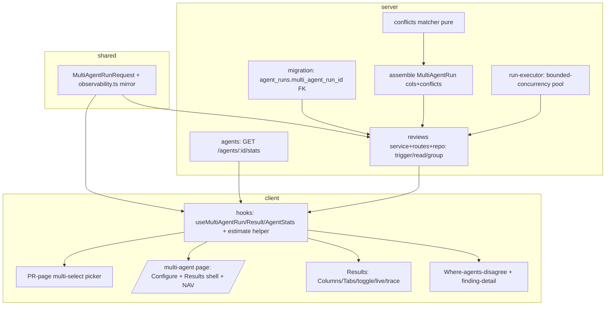

# Implementation Plan: Multi-Agent Review

Spec: SPEC-2026-07-13-multi-agent-review (Status: approved)

## Decisions (resolved)

Три рішення підтверджені користувачем — зафіксовані, не потребують уточнення.

1. **Режим виконання = multi-agent, хвилі ≤5.** Робота чисто партиціонується на непересічні файлові набори (контракти / міграція / матчер / виконавець / stats у Wave 1), тож паралель безпечна й швидша. Серверне ядро (reviews-модуль) йде однією задачею (T6), бо ділить `service.ts`/`routes.ts`/`repository.ts`.
2. **Склад ролей = повний:** `implementer` ×≤5 (усі build-задачі) + `architecture-reviewer` (після виконавця T4 і серверного ядра T6) + `code-review` (сукупний диф) + `test-writer` (крайові кейси матчера AC-19..22 та `.it`-тести груп/stats) + `plan-verifier` (обов'язковий фінал). Деталі — у розділі «Рекомендований склад агентів».
3. **Маршрут результатів = окрема сторінка `/multi-agent`.** Columns/Tabs/disagree рендеряться там же, де Configure run (та сама сторінка переходить Configure → Results за обраним PR + останньою групою `GET /pulls/:id/multi-agent`). Пікер на сторінці PR (AC-1/2) лише тригерить run.

## Execution mode

Multi-agent (паралельно), 4 build-хвилі по ≤5 імплементерів + фінальна верифікаційна хвиля.

## Goal & success criteria

«Done» = користувач на сторінці PR або на `/multi-agent` обирає підмножину агентів, запускає один fan-out (bounded-concurrency N=3–4, ізоляція фейлів), і отримує **один multi-agent run** з: живими per-agent статусами (Columns), Tabs+detail з `confidence`/`suggestion`/діями, блоком «Where agents disagree» (детермінований крос-агентний матчер) і pre-run естімейтом (sum cost / max latency, з маркером неповноти). Атрибуція findings→agent збережена в даних. Всі AC-1..AC-33 покриті й верифіковані `plan-verifier` (typecheck + тести обох модулів зелені).

## Requirements review & recommendations

- **Verified (звірено з кодом):**
  - `run-executor.ts` — послідовний for-цикл `executeRuns()` рядки 139-166, ізоляція фейлу — bare try/catch 157-165; `runId` створюється **до** виконавця в `service.ts:140` (`createAgentRun`), fire-and-forget через `void this.executor.executeRuns(...).catch(...)` (service.ts:123-158, повертає `{runs, reviews:[]}`). AC-16/17/18 реалізовні поверх цього.
  - Контракти `MultiAgentRun`/`AgentColumn`/`Conflict`/`ConflictTake`/`AgentStats` пре-стейджені в `server/src/vendor/shared/contracts/observability.ts`, байт-у-байт ідентичні клієнтському мірору (diff порожній). `MultiAgentRunRequest` **відсутній** — його треба додати (AC-3).
  - `multi_agent_runs` існує (`db/schema/runs.ts:59`: `id`, `workspaceId`, `prId`, `ranAt`), **без FK** на `agent_runs`; `agent_runs` **без** `multi_agent_run_id` і **без** cost-колонки (cost через `estimateCost(model,tokensIn,tokensOut)`, INSIGHTS 2026-06-29). AC-12 міграція потрібна.
  - `RunRequest` (`platform.ts:291`) = `{agentId?, all?}` — підмножини немає (AC-3 обґрунтовано).
  - `activeKeyFor` (`app-shell/helpers.ts:27`) вже має гілку `multi-agent` — фантом без `NAV`-запису й сторінки (AC-5).
  - Клієнт: `useRunEvents(runIds)` → `{events, running}` (reviews.ts:168); `useRunReview` (reviews.ts:124); `useAgents()` → `Agent[]`; `RunTraceDrawer` бере `runId` пропом (не читає `?trace=` сам — параметром керує сторінка); `RunReviewDropdown` монтований у `PrDetailHeader`. Фінди-екшени: `useFindingAction`, `useCreateEvalCaseFromFinding` (eval.ts).
- **Resolved (підтверджено користувачем):**
  - **Результати рендеряться на окремій сторінці `/multi-agent`** — та сама сторінка хостить Configure run і Results (Columns/Tabs/disagree), переходячи Configure → Results за обраним PR + останньою групою. Пікер на сторінці PR лише тригерить run. Це зафіксовано в T9/T10/T11.
- **Recommendations (як, не що):**
  - **`AgentColumn.status` не має `'cancelled'`** (лише `done|failed|running`), а DB-статус рана буває `cancelled`. При збірці `AgentColumn` мапте `cancelled → 'failed'` (і показуйте «errored» — AC-30), щоб не порушити контракт. Позначено в T6.
  - **Валідація agentIds** — через `AgentsRepository.listEnabled(workspaceId)`: перетин запиту з enabled-набором ловить одразу «не в воркспейсі», «неіснуючий» і «disabled» одним запитом (AC-4), і природно 404/400 workspace-scoped.
  - **Естімейт (AC-9)**: `wall-clock = max(avg_latency)` — це «parallel fan-out» зі спеки. Коли обрано агентів більше за ліміт concurrency N, max недооцінює реальний час; це **прийнято за спекою** (не змінюю), лише зафіксовано в Risks.
  - **Матчер — token-normalised, без `RegExp`-компіляції** сирого тексту findings (ReDoS, A05). Порівняння схожості заголовків — через нормалізовані токен-сети (Jaccard/діце), фіксований поріг; жодного `new RegExp(findingText)`.
  - **`multi_agent_run.complete` лог** (Observability спеки) — додати один рядок при завершенні групи в фоновому виконавці.

## Affected modules & boundaries

- **shared** (`server/src/vendor/shared/contracts/observability.ts` + байт-у-байт мірор `client/src/vendor/shared/contracts/observability.ts`) — новий `MultiAgentRunRequest`.
- **server** — `db/schema/runs.ts` + згенерована міграція; `modules/reviews/` (run-executor, service, routes, repository, новий підкаталог `multi-agent/`); `modules/agents/` (stats route/service/repo). Межі: адаптери лише через DI-контейнер; міграції генеруються; `estimateCost` з `adapters/llm/pricing.ts`.
- **client** — `lib/hooks/*`, `lib/api.ts` (через хуки), `vendor/ui/nav.ts` (+ `icons.tsx` за потреби), новий route `app/multi-agent/`, компонент-пікер під `app/repos/[repoId]/pulls/[number]/_components/`, `i18n/messages/*`.
- **reviewer-core** — **не чіпається** (пайплайн/промпт/grounding поза скоупом).

## Relevant engineering insights

- **Мірор контрактів не ловиться `tsc`** — будь-яка зміна `server/.../contracts/*.ts` мусить бути байт-у-байт змірорена в `client/.../contracts/*.ts`; верифікація через `diff` (repo INSIGHTS 2026-06-29). → окрема verify-підзадача в T1.
- **`agent_runs` без `cost_usd`; cost похідний** через `estimateCost`, `null` для невідомих моделей (server INSIGHTS 2026-06-29) → `cost_usd`/`total_cost_usd`/`avg_cost_usd` завжди null-safe; UI ніколи `$NaN`. Впливає на T5, T6, T7, T10.
- **PR має кілька `reviews`-рядків; latest-only ховає findings** (server INSIGHTS 2026-06-30) → при збірці колонок/конфліктів беріть findings, прив'язані до `agent_runs` цієї **групи**, а не «останній review PR». Впливає на T6.
- **Rate-limit вимкнено в тестах**; перевіряйте його через `route config`, не burst-`inject()` (server INSIGHTS 2026-07-08). Впливає на verify T6 (AC про rate-limit).
- **`pnpm db:generate` зависає на interactive rename-vs-create** при змішаному add+drop; тут діф чисто-адитивний (один ADD COLUMN) → prompt не має виникнути, але не змішуйте зі зняттям колонок (server INSIGHTS 2026-07-02). Впливає на T2.
- **Клієнт: рантайм-value-імпорт з бар'єлу `@devdigest/shared` ламає webpack-білд** — константи/схеми імпортуйте через субшлях `@devdigest/shared/contracts/observability`, бар'єл лишайте для `import type` (client INSIGHTS 2026-07-08). Впливає на T7-T11.
- **Клієнт-тести: `fireEvent`, НЕ `user-event`** (client CLAUDE.md); мок query-хука має повертати **стабільну** референс-структуру (client INSIGHTS 2026-07-01, OOM-крах). Впливає на всі client-задачі.
- **`icons.tsx` — явний allowlist**; новий Lucide-іконку додати до реєстру перед вжитком (client INSIGHTS 2026-07-01). Впливає на T8/T9.
- **`.it.test.ts` (testcontainers) реально працює** тут з Colima socket env-оверрайдами (server INSIGHTS 2026-07-08) — це шлях верифікації DB-backed AC (T6, T5, міграція).
- **Пре-стейджені фічі**: не редагуйте пре-стейджені контракти/`FEATURE_MODELS` (тут новий FEATURE_MODELS **не потрібен** — спека це підтверджує) (INSIGHTS 2026-07-08).

## Architecture & approach

Онон-шари сервера зберігаються: route → service → repository → (adapter через DI). Новий підкаталог `server/src/modules/reviews/multi-agent/` тримає чисту логіку (матчер конфліктів + збірка `MultiAgentRun`-відповіді), яку викликає сервіс. Виконавець (`run-executor.ts`) конвертується з for-await на bounded-concurrency пул зі збереженням per-agent ізоляції. Тригер лишається fire-and-forget: створюємо `multi_agent_runs`-рядок і N `agent_runs`-рядків (кожен з `multi_agent_run_id`), одразу повертаємо `run_id`-и, у фоні виконуємо. Клієнт споживає через хуки (`useMultiAgentRun`/`useMultiAgentResult`/`useAgentStats`), живі статуси — з наявного SSE (`useRunEvents`), трейс — reuse `RunTraceDrawer`. Результати (Columns/Tabs/disagree) живуть на тій самій сторінці `/multi-agent`, що й Configure run.

## Tasks

### T1 — Shared contract `MultiAgentRunRequest` + байт-у-байт мірор
- **Module:** shared
- **Traces to:** AC-3 (частково AC-2, AC-13)
- **Files to create/modify:** `server/src/vendor/shared/contracts/observability.ts`, `client/src/vendor/shared/contracts/observability.ts`
- **Objective:** Додати `export const MultiAgentRunRequest = z.object({ agentIds: z.array(z.string()).min(1) })` + `type` до `observability.ts` (де вже живуть решта multi-agent контрактів). Скопіювати зміну **байт-у-байт** у клієнтський мірор.
- **Out of scope:** Не чіпати `MultiAgentRun`/`AgentColumn`/`Conflict`/`ConflictTake`/`AgentStats` шейпи (пре-стейджені); не додавати `FEATURE_MODELS`.
- **Skills to apply:** `zod`, `typescript-expert`
- **Insights/gotchas to respect:** Мірор не ловиться `tsc` (2026-06-29) — по завершенні `diff` двох файлів МУСИТЬ бути порожнім.
- **Depends on:** none
- **Verify:** `diff server/src/vendor/shared/contracts/observability.ts client/src/vendor/shared/contracts/observability.ts` порожній; `cd server && pnpm typecheck`; `cd client && pnpm typecheck`.

### T2 — Міграція: `agent_runs.multi_agent_run_id` (nullable FK, ON DELETE set null)
- **Module:** server
- **Traces to:** AC-12
- **Files to create/modify:** `server/src/db/schema/runs.ts`; згенерований `server/src/db/migrations/*` (через `pnpm db:generate`)
- **Objective:** Додати в `agentRuns` колонку `multiAgentRunId: uuid('multi_agent_run_id').references(() => multiAgentRuns.id, { onDelete: 'set null' })` (nullable). Згенерувати міграцію (`pnpm db:generate`) — **не писати руками**.
- **Out of scope:** Не додавати cost-колонку (cost похідний); не змінювати `multi_agent_runs`-таблицю; не видаляти інші колонки в тому ж діфі (щоб уникнути interactive prompt).
- **Skills to apply:** `drizzle-orm-patterns`, `postgresql-table-design`, `typescript-expert`
- **Insights/gotchas to respect:** Чисто-адитивний ADD COLUMN не має тригерити rename-vs-create prompt (2026-07-02); `agent_runs.prId` типізований `string|null` (2026-06-29) — не сюрприз для цієї задачі, але зважте при використанні.
- **Depends on:** none
- **Verify:** `cd server && pnpm typecheck`; переконатися, що згенеровано один новий `*.sql` з `ADD COLUMN ... REFERENCES multi_agent_runs(id) ON DELETE SET NULL`; `pnpm test` (hermetic) зелений.

### T3 — Детермінований conflict-matcher (pure, token-normalised, без ReDoS)
- **Module:** server
- **Traces to:** AC-19, AC-20, AC-21, AC-22
- **Files to create/modify:** новий `server/src/modules/reviews/multi-agent/conflicts.ts` (+ `server/test/multi-agent-conflicts.test.ts`)
- **Objective:** Чиста функція, що з набору `{ agentId, persona, status, findings[] }` (по done-агентах) обчислює `Conflict[]`: два findings метчаться коли **той самий file** І `[start_line,end_line]` **перетинаються** І title/rationale-схожість вища за фіксований поріг (token-normalised Jaccard/діце над нормалізованими токенами). Метч → один `Conflict` з одним `ConflictTake` на агента; агент, що робив review але не флагнув контендовану локацію → take з `verdict:'ignored'`; дивергентні severity → severity в кожному take.
- **Out of scope:** Жодного `new RegExp(findingText)`; не включати агентів зі `status !== 'done'` (AC-21); не читати з БД (pure); не рендерити UI.
- **Skills to apply:** `typescript-expert`, `zod`, `architecture-patterns`, `security`, `engineering-insights`
- **Insights/gotchas to respect:** Untrusted finding-текст — тільки як дані, token-normalised, ніякої regex-компіляції (спека Non-functional / A05). `AgentColumnFinding` — вужча проєкція; матчеру потрібні `end_line`+`rationale`+`confidence` з повного `Finding`.
- **Depends on:** none (використовує вже-існуючі `Conflict`/`ConflictTake` контракти)
- **Verify:** `cd server && pnpm typecheck && pnpm test` — юніт-кейси: overlapping+similar → 1 Conflict/2 takes; різні файли → окремо; 1 CRITICAL + 2 не-флагнули → takes [CRITICAL, ignored, ignored]; failed-агент відсутній у takes; немає контенду → `[]`.

### T4 — Виконавець: bounded-concurrency пул зі збереженням ізоляції
- **Module:** server
- **Traces to:** AC-16, AC-17 (підтримує AC-18)
- **Files to create/modify:** `server/src/modules/reviews/run-executor.ts` (+ `server/test/run-executor-concurrency.test.ts` або розширення наявного)
- **Objective:** Замінити послідовний `for (const {agent,runId} of jobs)` (139-166) на bounded-concurrency пул з лімітом N (конфіг, дефолт 3–4): стартувати до N одночасно, наступний — щойно звільниться слот. Зберегти per-agent ізоляцію: фейл одного (LLM error/cancel/timeout) не валить інших; failed-ран записується `status='failed'` + error (наявна поведінка 157-165 під новою моделлю).
- **Out of scope:** Не змінювати `runOneAgent` внутрішню логіку/reviewer-core виклик; не змінювати сигнатуру `executeRuns` без потреби (jobs лишаються `{agent,runId}[]`); не чіпати створення `agent_runs` (воно в service).
- **Skills to apply:** `typescript-expert`, `architecture-patterns`, `fastify-best-practices`, `engineering-insights`
- **Insights/gotchas to respect:** Ізоляція вже покладається на те, що `runOneAgent` персистить failure-стан перед rethrow — зберегти цей інваріант; ліміт N також кепить одночасне провайдер-навантаження (спека Decisions).
- **Depends on:** none
- **Verify:** `cd server && pnpm typecheck && pnpm test` — юніт з інструментованими стабами: у жоден момент не більше N in-flight; при M>N пізніші стартують лише після резолву ранніх; один стаб кидає → інші персистять, failed-рядок має `status='failed'`+error.

### T5 — `GET /agents/:id/stats` (мінімальний AgentStats-сабсет)
- **Module:** server
- **Traces to:** AC-11 (живить AC-7/8/9)
- **Files to create/modify:** `server/src/modules/agents/routes.ts`, `server/src/modules/agents/service.ts`, `server/src/modules/agents/repository.ts` (+ `server/test/agents-stats.it.test.ts`)
- **Objective:** Ендпоінт, що агрегує `agent_runs` агента (workspace-scoped через `getContext`) і повертає мінімальний сабсет: `agent_id`, `agent_name`, `runs`, `avg_cost_usd`, `avg_latency_ms`. avg cost — через `estimateCost(model, tokensIn, tokensOut)` по **done**-ранах; avg latency — по `duration_ms` done-ранів; `null` для averages коли `runs=0` (або 0 done-ранів). Валідувати проти `AgentStats` (або нового мінімального response-шейпу, узгодженого з контрактом — не змінюючи `AgentStats`).
- **Out of scope:** НЕ будувати повний AgentStats (accept-rate, trend, findings_by_severity) — окрема спека; не додавати cost-колонку в БД.
- **Skills to apply:** `fastify-best-practices`, `drizzle-orm-patterns`, `postgresql-table-design`, `zod`, `typescript-expert`, `security`, `architecture-patterns`, `engineering-insights`
- **Insights/gotchas to respect:** cost похідний, `null` для невідомих моделей (2026-06-29); avg тільки по done-ранах (edge «тільки failed» → null averages); workspace-scoping через `getContext`, чужий agentId → 404, не leak (A01).
- **Depends on:** T1 (для узгодженості контрактів; сам ендпоінт може стартувати паралельно — контракт `AgentStats` вже існує)
- **Verify:** `cd server && pnpm typecheck && pnpm test` (+ `.it` під Colima env): дві done-рани → правильні averages; zero-run агент → null averages; чужий workspace → 404.

### T6 — Grouping: repo + assemble + trigger-service + routes (серверне ядро)
- **Module:** server
- **Traces to:** AC-2 (endpoint), AC-4, AC-12, AC-13, AC-14, AC-15, AC-18, AC-19..AC-22 (assemble), AC-33, Observability-лог, rate-limit/scoping (Non-functional)
- **Files to create/modify:** `server/src/modules/reviews/routes.ts`, `server/src/modules/reviews/service.ts`, `server/src/modules/reviews/repository.ts` (+ `repository/*.ts`), новий `server/src/modules/reviews/multi-agent/assemble.ts` (+ `server/test/multi-agent.it.test.ts`)
- **Objective:**
  - Repo: `createMultiAgentRun(workspaceId, prId)`; створення `agent_runs` з `multiAgentRunId`; читання останньої групи по `ran_at` (tie-break `id`); читання findings, **обмежених ранами групи** (не latest-review PR).
  - `assemble.ts`: зібрати `MultiAgentRun` (columns + conflicts через T3 matcher + `total_duration_ms` + `total_cost_usd` (sum, null-safe через `estimateCost`) + `agent_count`); мапити DB-`cancelled → AgentColumn.status 'failed'`.
  - Service: `triggerMultiAgentRun(workspaceId, prId, agentIds)` — валідація через `listEnabled` (0 ids / не-в-воркспейсі / disabled → 400 `ValidationError`, **нуль** нових рядків у 3 таблицях); створити групу + N `agent_runs` (linked); fire-and-forget `executeRuns`; повернути по `run_id` на агента одразу (AC-18). Один summary-лог `multi_agent_run.complete` при завершенні групи. Дозволити конкурентні групи (AC-15).
  - Routes: `POST /pulls/:id/multi-agent-run` (body `MultiAgentRunRequest`, `config.rateLimit {max:10,timeWindow:'1 minute'}`, `getContext`-scoping); `GET /pulls/:id/multi-agent` (остання група як `MultiAgentRun` або узгоджена empty/absent-відповідь).
- **Out of scope:** Не чіпати legacy `POST /pulls/:id/review` (лишити функціональним); не змінювати `run-executor` concurrency (це T4); не будувати UI.
- **Skills to apply:** `fastify-best-practices`, `drizzle-orm-patterns`, `postgresql-table-design`, `zod`, `typescript-expert`, `security`, `architecture-patterns`, `engineering-insights`
- **Insights/gotchas to respect:** мульти-`reviews`-рядки → findings по ранах групи (2026-06-30); `AgentColumn.status` без `'cancelled'` → мапити; rate-limit не тестується burst-ом, а через route-config (2026-07-08); адаптери лише через DI; cost null-safe.
- **Depends on:** T1, T2, T3, T4
- **Verify:** `cd server && pnpm typecheck && pnpm test` (+ `.it` під Colima env): 3-агентна рана → 1 `multi_agent_runs` + 3 `agent_runs` з її id (AC-12); response валідується проти `MultiAgentRun` (AC-13); дві групи → read повертає новішу (AC-14); група B до завершення A → обидві, disjoint рани (AC-15); кожен інвалід-body → 400 + незмінні лічильники 3 таблиць (AC-4); trigger-response має `run_id` на агента до персисту reviews (AC-18); rate-limit через route-config; кожен finding-review несе правильний `agent_id`, колонки/takes теговані `agent_id` (AC-33).

### T7 — Клієнтський data-layer: хуки + естімейт-хелпер + i18n
- **Module:** client
- **Traces to:** AC-2 (mutation), AC-7/8 (stats), AC-9/10 (естімейт), AC-13 (read)
- **Files to create/modify:** `client/src/lib/hooks/multi-agent.ts` (новий) або розширення `hooks/reviews.ts` + `hooks/agents.ts`; естімейт-хелпер `client/src/app/multi-agent/_components/.../helpers.ts` (+ `helpers.test.ts`); `client/src/i18n/messages/<locale>/*.json`
- **Objective:** `useMultiAgentRun()` (POST `/pulls/:id/multi-agent-run` з `{agentIds}`), `useMultiAgentResult(prId)` (GET `/pulls/:id/multi-agent`), `useAgentStats(agentId)` (GET `/agents/:id/stats`) — усе через `api` boundary. Чистий естімейт-хелпер: `total cost = sum(avg_cost_usd)`, `wall-clock = max(avg_latency_ms)` по агентах з історією; маркер неповноти коли ≥1 обраний агент без історії. i18n-ключі для всіх нових рядків, дзеркалені по локалях.
- **Out of scope:** Не рендерити компоненти (лише data+pure helper); не робити ad-hoc `fetch` в компонентах.
- **Skills to apply:** `next-best-practices`, `react-best-practices`, `zod`, `typescript-expert`, `security`, `engineering-insights`
- **Insights/gotchas to respect:** рантайм-value-імпорт контрактів — через субшлях `@devdigest/shared/contracts/observability`, не бар'єл (2026-07-08); i18n-ключі мусять мірорити по всіх локалях (client CLAUDE.md).
- **Depends on:** T1 (клієнтський мірор контракту)
- **Verify:** `cd client && pnpm typecheck && pnpm test` — юніт естімейт-хелпера: {A:4s/$0.05, B:8.2s/$0.06, C:no-data} → «≈ 8.2s · $0.11 · parallel fan-out» + маркер «excludes 1 agent» (AC-9/10).

### T8 — Пікер мульти-селект на сторінці PR
- **Module:** client
- **Traces to:** AC-1, AC-2
- **Files to create/modify:** новий `client/src/app/repos/[repoId]/pulls/[number]/_components/MultiAgentPicker/` (component+styles+index+test); монтаж у `.../_components/PrDetailHeader/PrDetailHeader.tsx`
- **Objective:** Дропдаун «Pick agents to run» — по чекбоксу на кожен enabled-агент (`useAgents()` фільтрувати `enabled`), дія «Run multi-agent review (N)» (N=кількість чекнутих), disabled при N=0. Підтвердження → рівно один `useMultiAgentRun().mutate({agentIds})`, БЕЗ фолбека на legacy `POST /pulls/:id/review`. `run_id`-и — назад через наявний `onRunsStarted` ланцюг.
- **Out of scope:** Не видаляти наявний `RunReviewDropdown` (legacy «run one / run all» лишається — back-compat); не будувати Configure-сторінку.
- **Skills to apply:** `next-best-practices`, `react-best-practices`, `react-testing-library`, `zod`, `typescript-expert`, `security`, `engineering-insights`
- **Insights/gotchas to respect:** тести — `fireEvent`, не user-event; мок query-хука — стабільна референс-структура (OOM, 2026-07-01); нова іконка → спершу в `icons.tsx`.
- **Depends on:** T7
- **Verify:** `cd client && pnpm typecheck && pnpm test` — 3 агенти → 3 чекбокси + disabled-кнопка при N=0, «(2)» enabled після двох чеків (AC-1); mocked-fetch: рівно один виклик multi-agent-ендпоінта з `{agentIds:[...]}`, жодного `/review` (AC-2).

### T9 — `/multi-agent` сторінка: Configure run + Results shell + NAV-wiring
- **Module:** client
- **Traces to:** AC-5, AC-6, AC-7, AC-8, AC-9, AC-10 (+ shell для AC-23..30)
- **Files to create/modify:** новий `client/src/app/multi-agent/page.tsx` + `_components/ConfigureRun/`; `client/src/vendor/ui/nav.ts` (запис `multi-agent`); `client/src/vendor/ui/icons.tsx` (за потреби); i18n-ключі
- **Objective:** Сторінка на `/multi-agent` (анатомія як `app/eval/`: thin `page.tsx` + Suspense, `_components/<View>/`), що хостить **і Configure run, і Results** (перехід Configure → Results за обраним PR + останньою групою). Крок 1 — PR-селектор, крок 2 — чек-лист агентів. Додати `NAV`-запис keyed `multi-agent` (знімає фантом). Empty-state «Pick a pull request first» + disabled чек-лист поки PR не обрано. На рядку агента з історією — `~6s · $0.05` (з `useAgentStats`); без історії — «— · no data». Pre-run summary-естімейт через хелпер T7 + маркер неповноти. **Page shell лишає визначений слот під Results-компоненти (T10/T11)** — оформити слот як стабільний контейнер, який T10/T11 наповнюють, щоб уникнути пізніших конфліктів по shell.
- **Out of scope:** Не будувати Columns/Tabs/disagree (T10/T11) — лише слот; не чіпати сторінку PR.
- **Skills to apply:** `next-best-practices`, `react-best-practices`, `react-testing-library`, `zod`, `typescript-expert`, `security`, `engineering-insights`
- **Insights/gotchas to respect:** нова іконка → `icons.tsx` allowlist; тести `fireEvent`; i18n мірор; RSC-за-замовчуванням, `"use client"` лише де стан/ефекти.
- **Depends on:** T7
- **Verify:** `cd client && pnpm typecheck && pnpm test` — навігація на `/multi-agent` рендерить сторінку (не 404), сайдбар підсвічує «Multi-Agent Review» (AC-5); empty-state + non-actionable run при відсутньому PR (AC-6); stub `useAgentStats` 6000/0.05 → «~6s · $0.05» (AC-7); null-stats → «— · no data», без `$`/`s` (AC-8); маркер неповноти при no-data-агенті (AC-10).

### T10 — Результати на `/multi-agent`: Columns + Tabs+detail + toggle + live status + View trace
- **Module:** client
- **Traces to:** AC-23, AC-24, AC-25, AC-26, AC-27, AC-30 (errored header)
- **Files to create/modify:** `client/src/app/multi-agent/_components/AgentColumns/`, `.../AgentTabs/`, `.../ModeToggle/` (+ styles/index/test); монтаж у Results-слот page shell (T9)
- **Objective:** **Columns**: колонка на агента, хедер = ім'я+live-статус+score+duration+cost (`AgentColumn.cost_usd`, null-safe) + «View trace». Live-статус з `useRunEvents` (running→done/failed без reload). «View trace» → наявний `RunTraceDrawer` для `run_id` колонки (as-is), через `?trace=<runId>` param/state сторінки. **Tabs+detail**: таб на агента (persona+finding-count), вибір finding → detail з `confidence`+`suggestion`+action-row (сам action-row з T11). Columns/Tabs toggle без ре-тригера рани. Failed/cancelled агент → «errored» хедер.
- **Out of scope:** Не будувати disagree-блок і не імплементувати самі finding-екшени (T11) — Tabs-detail споживає action-row компонент від T11; не змінювати `RunTraceDrawer`; не редагувати ConfigureRun (лише монтаж у визначений слот shell).
- **Skills to apply:** `next-best-practices`, `react-best-practices`, `react-testing-library`, `zod`, `typescript-expert`, `security`, `engineering-insights`
- **Insights/gotchas to respect:** cost null-safe (ніколи `$NaN`); `AgentColumn.status` без `cancelled` (сервер уже мапить); тести `fireEvent`, стабільний мок SSE; a11y — toggle keyboard-reachable, aria-live на зміну статусу.
- **Depends on:** T7, T9 (Results-слот), T11 (action-row для Tabs-detail)
- **Verify:** `cd client && pnpm typecheck && pnpm test` — 4 `AgentColumn` → 4 хедери зі статусом + «View trace» (AC-23); фейк-стрім running→done міняє текст статусу (AC-24); клік «View trace» ставить `?trace=<runId>`/монтує drawer (AC-25); Tabs-режим, вибір finding → confidence+suggestion+кнопки (AC-26); toggle без нового тригер-запиту (AC-27); один failed → «errored» хедер (AC-30).

### T11 — Where-agents-disagree + Show-only-conflicts + finding-detail actions
- **Module:** client
- **Traces to:** AC-28, AC-29, AC-30, AC-31, AC-32, AC-22 (empty-state)
- **Files to create/modify:** `client/src/app/multi-agent/_components/WhereAgentsDisagree/`, `.../FindingDetailActions/` (+ styles/index/test)
- **Objective:** Блок «Where agents disagree»: рядок на локацію (`file:line`+title), клітинка на агента з його take (severity або «did not flag» для `verdict:'ignored'`) + note. Toggle «Show only conflicts» → лишає локації де ≥1 флагнув і ≥1 ні (або severity дивергують), ховає unanimous. Порожній стан (`conflicts:[]`) — не помилка. Failed-агент відсутній у клітинках (AC-30, консистентно з сервером AC-21). Action-row: reuse `useFindingAction` (Accept/Dismiss) + `useCreateEvalCaseFromFinding` («Turn into eval case»); **Learn** і **Reply to author** — видимі, disabled «coming soon», без backend-виклику.
- **Out of scope:** Не будувати Columns/Tabs shell (T10); не реалізовувати Memory/GitHub-публікацію (тільки disabled-хуки).
- **Skills to apply:** `next-best-practices`, `react-best-practices`, `react-testing-library`, `zod`, `typescript-expert`, `security`, `engineering-insights`
- **Insights/gotchas to respect:** finding-текст untrusted → рендер через санітизований `Markdown`, ніколи raw `dangerouslySetInnerHTML` (A01/A05, client Markdown INSIGHTS); global `MutationCache` вже дає error-toast (не флагати відсутній локальний `onError`); тести `fireEvent`; a11y — toggle labelled/keyboard.
- **Depends on:** T7 (споживається T10)
- **Verify:** `cd client && pnpm typecheck && pnpm test` — `Conflict` з 3 takes → 3 клітинки, одна «did not flag» (AC-28); toggle ховає unanimous (AC-29); один failed → відсутній у клітинках (AC-30); Accept/Dismiss → `useFindingAction`, «Turn into eval case» → eval-хук (AC-31); Learn+Reply disabled, клік не шле fetch (AC-32); порожній `conflicts` → empty-state (AC-22).

## Execution map

Multi-agent, хвилі ≤5 (кожна хвиля — непересічні файлові набори):

- **Wave 1 (5 паралельно):** T1 (shared), T2 (db/migration), T3 (matcher, новий файл), T4 (run-executor), T5 (agents module). Усі disjoint.
- **Wave 2 (2 паралельно, різні модулі):** T6 (серверне ядро reviews — критичний шлях), T7 (клієнтський data-layer). T6 залежить від T1-T4; T7 від T1.
- **Wave 3 (2 паралельно, disjoint):** T8 (PR-picker у pulls/_components), T9 (/multi-agent Configure + Results shell + NAV). Обидва залежать від T7.
- **Wave 4 (2 паралельно, disjoint component-folders):** T10 (Columns/Tabs/toggle/trace), T11 (disagree + finding-detail). Обидва монтуються у Results-слот shell (T9); T10 імпортує action-row з T11 — тому T11 має експортувати стабільний інтерфейс (стартують разом, T10 інтегрує наприкінці). Залежать від T7/T9.
- **Wave 5 (верифікація):** architecture-reviewer (після T4 і T6) + code-review (сукупний диф) → **plan-verifier** (фінал).

## Рекомендований склад агентів (ролі) — підтверджено, повний

- **`implementer` × до 5** — усі build-задачі T1..T11, по одній задачі на агента в межах хвилі. Кожен вантажить skill-набір за тегами задачі, поважає INSIGHTS модуля, самоверифікується `typecheck` + тестами модуля. Це кістяк усіх build-хвиль.
- **`architecture-reviewer`** (read-only) — 2 включення: після **T4** (концесія concurrency не має протекти в reviewer-core/DI-межі) і після **T6** (напрям залежностей route→service→repo, доступ до адаптерів лише через DI, байт-у-байт мірор контракту, findings-по-групі а не latest-review). Найвища віддача саме на серверному ядрі, де межі найкрихкіші.
- **`code-review`** — один прохід по сукупному дифу перед верифікацією: коректність (null-safe cost, мапінг `cancelled`, ReDoS-безпека матчера) + reuse/simplification.
- **`test-writer`** (паралельно з implementer-ами у W1/W2) — розширити крайові кейси матчера (AC-19..22) та інтеграційні тести груп/stats (`.it` під Colima env), там де самоверифікація implementer-а не покриває їх повністю.
- **`plan-verifier`** (обов'язковий фінал, Wave 5) — покриття кожного AC-1..AC-33 проти реального коду + прогін `pnpm typecheck`/`pnpm test` (server + client) з читанням exit-кодів. Крок закладено в план, але **не запускається** мною.

## Shared-contract changes

- **Новий `MultiAgentRunRequest`** у `server/src/vendor/shared/contracts/observability.ts` → **обов'язковий байт-у-байт мірор** у `client/src/vendor/shared/contracts/observability.ts` (T1). Verify: `diff` порожній (repo INSIGHTS 2026-06-29 — `tsc` дрейф не ловить). Решта multi-agent контрактів (`MultiAgentRun`/`AgentColumn`/`Conflict`/`ConflictTake`/`AgentStats`) вже пре-стейджені й мірорені — **не чіпати їх шейпи**.

## End-to-end verification

Після всіх хвиль: seed PR + ≥2 enabled-агенти; через пікер (сторінка PR) або `/multi-agent` тригернути fan-out; переконатися — `POST /pulls/:id/multi-agent-run` створює одну групу + N linked `agent_runs`, повертає `run_id`-и одразу; SSE рухає per-agent статуси до done/failed; `GET /pulls/:id/multi-agent` віддає `MultiAgentRun` (columns з null-safe cost, conflicts з takes/«did not flag»), що рендериться на сторінці `/multi-agent` (Columns/Tabs/disagree); Configure-естімейт = sum cost / max latency + маркер; Accept/Dismiss/eval-case працюють, Learn/Reply disabled. Формально: `plan-verifier` мапить кожен AC-1..33 і ганяє `cd server && pnpm typecheck && pnpm test` + `cd client && pnpm typecheck && pnpm test` (server `.it` — під Colima env-оверрайдами).

## Risks / open questions

- **Естімейт `max(latency)` vs реальний bounded-concurrency.** AC-9 фіксує wall-clock=max («parallel fan-out»), але при обранні агентів більше за ліміт N реальний час > max. Прийнято за спекою; якщо потрібна точність — окремий тюн (не в цьому скоупі).
- **`AgentColumn.status` не має `'cancelled'`** — план мапить `cancelled→'failed'`+«errored» (AC-30). Якщо потрібен окремий стан «cancelled» в UI — це зміна контракту (не в скоупі).
- **Ліміт concurrency N (3–4) — конфіг.** Значення за замовчуванням лишаю на T4; якщо є прод-обмеження провайдера, задати явно.
- **Виконання плану верифікується `plan-verifier` наприкінці (Wave 5), я його не запускаю** — лише відображаю як завершальний етап.
