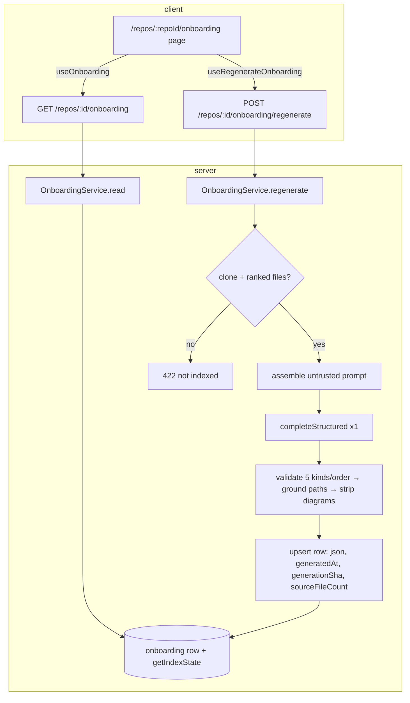

# Implementation Plan: Onboarding Generator

Spec: SPEC-2026-07-08-onboarding-generator

## Execution mode

**Multi-agent (parallel).** The feature partitions cleanly into a **server track** and a **client track** once one shared linchpin — the `OnboardingDoc` read contract — lands. After that gate, the two tracks touch fully disjoint file sets (no shared file between server module code and client page/hooks/nav code), so they run concurrently. The alternative (single-agent) would serialize two independent, substantial bodies of work for no correctness benefit; the only real ordering constraints (contract-first, hook-before-page) are captured as task dependencies rather than a forced single pass.

## Goal & success criteria

A repo-scoped **Onboarding Tour** page at `/repos/:repoId/onboarding` that renders five fixed sections (`architecture`, `critical_paths`, `how_to_run`, `guided_reading`, `first_tasks`) generated by a single, explicit, paid LLM call grounded strictly on the repo index + bounded key-file excerpts, persisted one-row-per-repo, with a read endpoint exposing generation metadata + staleness, and a WORKSPACE nav item. Done = all 24 EARS acceptance criteria pass with the verification commands below green, and the `OnboardingDoc` contract is byte-for-byte mirrored server↔client.

## Requirements review & recommendations

**Verified against the code (all confirmed feasible):**
- The `onboarding` table (`server/src/db/schema/context.ts` — `repoId` PK, `json` jsonb, `generatedAt`), the `Onboarding`/`OnboardingSection`/`OnboardingLink` contracts (`knowledge.ts`, already mirrored to client), the `onboarding.system.md` prompt (with `{{sections}}` + `{{language}}`), and the `FEATURE_MODELS` `onboarding` entry all exist and are currently **unwired** (no caller of `renderPrompt`/`loadPromptTemplate`; no `/onboarding` server route).
- The `conventions` module is a faithful analog: `resolveFeatureModel(container, workspaceId, 'onboarding')` → `container.llm(provider).completeStructured({ model, schema, schemaName, messages, maxRetries })` returning `{ data }`, gated on `getRepoClonePath` + a non-empty ranked file set, containment-checked clone reads.
- `container.repoIntel` exposes `getIndexState(repoId)` → `IndexState { status, filesIndexed, lastIndexedSha, ... }`, `getTopFilesByRank(repoId, n, opts?)` → `string[]`, `getCriticalPaths(repoId)` → `string[][]`, `getFileRank(repoId, paths)` → `FileRankRow[]` (returns only indexed paths — the **grounding oracle** for AC-7).
- Client: hooks call `api.get/post<T>(path)` directly (**no `api.ts` edit** — the spec's "add getOnboarding/regenerateOnboarding to api.ts" is superseded by the real flat-verb pattern); `githubBlobUrl(repoFullName, sha, file, startLine?, endLine?)` exists; `Repo` contract carries `full_name` + `default_branch`; `MermaidDiagram({ chart })` renders `null` on invalid input; the `onboarding-tour` nav key/label + `client/messages/en/onboarding.json` are pre-staged.

**Clarified (auto-mode defaults, no blocking questions):**
- **Open-link ref (AC-17):** use `activeRepo.default_branch` as the blob ref (the spec permits "default branch / generation SHA"). `generation_sha` stays server-only for staleness — this keeps `OnboardingDoc` to exactly the fields the spec enumerates. (If exact-SHA pinning is later wanted, add `generation_sha` to the contract + mirror.)
- **`{{language}}`:** no language setting exists; pass `language: 'English'`. `renderTemplate` leaves unknown placeholders literal, so this var **must** be supplied.
- **i18n:** single locale (`en`) only; `client/messages/en/onboarding.json` is pre-staged. Consume it via `useTranslations("onboarding")` and extend with the missing AC-15/20/22 keys.

**Recommendations (HOW, not WHAT):**
- **Clone-reader containment:** duplicate the pure containment helpers (`resolveClonePath`/`isWithinRoot`/`resolveRealClonePath`/`readCloneFile`) into `onboarding/helpers.ts` rather than importing `conventions/` internals (server CLAUDE.md forbids cross-module internal imports). Because this is a **security boundary** and two copies can drift (see the 2026-07-02 realpath insight — "both negative-control tests must pass"), onboarding **must** ship its own traversal + symlink negative-control tests. A cleaner future refactor is to promote these to `modules/_shared/clone-reader.ts` consumed by both modules; deferred here to keep the task self-contained and avoid touching the working `conventions` feature.
- **Strict-section enforcement (AC-3):** bake the exactly-five-kinds invariant into the LLM structured schema (`z.enum(SECTION_KINDS)` per section + a `superRefine` asserting the set is exactly the five). Because `completeStructured` retries on schema failure (`maxRetries: 2`), a wrong/short/extra-section payload auto-retries then throws — giving AC-3's "re-attempt, then surface a failure rather than persist" for free, with no partial write.
- **how_to_run per-step copy (AC-18):** the `OnboardingSection` contract has no `steps` array (only `body` markdown + `links` + `diagram`), and the spec sanctions **only** adding `OnboardingDoc`. Render `body` markdown and attach a copy-command control to each fenced code block (each block = one step's command). See Risks — this is the one place the contract shape and an AC are in mild tension.

## Affected modules & boundaries

- **shared** (`server/src/vendor/shared/contracts/knowledge.ts` + byte-for-byte client mirror) — new `OnboardingDoc` read contract.
- **server** (`server/src/modules/onboarding/*` new; `modules/index.ts` register; `db/schema/context.ts` + generated migration; `prompts/onboarding.system.md` edit) — DI-container-only adapter access; migrations generated not handwritten.
- **client** (`app/repos/[repoId]/onboarding/*` new page; `lib/hooks/onboarding.ts` new; `vendor/ui/nav.ts`, `components/app-shell/helpers.ts`, `vendor/ui/icons.tsx`; `messages/en/onboarding.json`) — all data via a TanStack hook over `api.ts`; UI from `vendor/ui`.
- **reviewer-core** — untouched (generation uses the server LLM adapter directly, like `conventions`).

## Relevant engineering insights

- **Shared-contract mirror is manual and unchecked by `tsc`** (root INSIGHTS 2026-06-29) — every `knowledge.ts` edit must be mirrored byte-for-byte to `client/src/vendor/shared/contracts/knowledge.ts`. Shapes T1 and its verification.
- **`pnpm db:generate` blocks on an interactive rename prompt** when a diff both adds and drops similar columns (server INSIGHTS 2026-07-02) — keep the migration a pure additive `ADD COLUMN`. Shapes T2.
- **realpath containment needs BOTH a syntactic check AND a `realpath` symlink check** (server INSIGHTS 2026-07-02) — the clone reader must realpath before the final containment compare; both traversal AND symlink negative-control tests must pass. Shapes T3.
- **`FEATURE_MODELS` has three synced copies** (root INSIGHTS 2026-07-06) — this feature does **not** change the `onboarding` entry; do not touch the registry. Constrains T3 (use `resolveFeatureModel`, add nothing).
- **`icons.tsx` is an explicit allowlist** (client INSIGHTS 2026-07-01) — a new nav icon must be added there first. Shapes T5.
- **Guard every mutation-trigger on `isPending`** and **global mutation-error toast is already wired** (client INSIGHTS 2026-07-01) — no local `onError` needed for the toast; disable Generate/Regenerate while pending. Shapes T7 (AC-14, AC-21).
- **`Badge` is `white-space: nowrap`; never use it for sentence-length content** (client INSIGHTS 2026-07-07) — the critical-path "why it matters" and guided-reading rationale are LLM sentences; render as wrapping text (`overflowWrap: "anywhere"`), not Badges. Shapes T7.

## Architecture & approach

Follow the `conventions` module shape end to end: repo-scoped, explicit paid generation over the clone, `resolveFeatureModel`, containment-checked reads, rate-limited route, single cached upserted row. Read is a cached DB read with zero LLM calls.

`stale = row.generationSha !== getIndexState().lastIndexedSha` (null sha ⇒ stale). All repo-derived prompt content is wrapped in `<untrusted>…</untrusted>`; every model-emitted `link.path` is dropped unless present in `getFileRank`; `diagram` is kept only on `architecture`.

## Tasks

### T1 — Shared contract: `OnboardingDoc` + byte-for-byte mirror
- **Module:** shared
- **Traces to:** AC-11 (enables AC-9, AC-10, AC-15, AC-20)
- **Files to create/modify:** `server/src/vendor/shared/contracts/knowledge.ts` (add), `client/src/vendor/shared/contracts/knowledge.ts` (identical mirror)
- **Objective:** Add, directly after the existing `Onboarding` block, a read-response wrapper:
  `OnboardingDoc = z.object({ exists: z.boolean(), indexed: z.boolean(), stale: z.boolean(), sections: z.array(OnboardingSection), generated_at: z.string().nullable(), source_file_count: z.number().int() })` + inferred type. Do not alter `Onboarding`/`OnboardingSection`/`OnboardingLink`. Confirm the `@devdigest/shared` barrel re-exports it (same file that already exports `Onboarding`).
- **Out of scope:** Any change to `OnboardingSection` (no `steps`/enum tightening), any `FEATURE_MODELS`/`platform.ts` edit, adding `generation_sha` to the wrapper.
- **Skills to apply:** `zod`, `typescript-expert`
- **Insights/gotchas to respect:** Manual mirror — the two files must be identical; `tsc` will not catch drift.
- **Depends on:** none
- **Verify:** `diff server/src/vendor/shared/contracts/knowledge.ts client/src/vendor/shared/contracts/knowledge.ts` exits 0; `cd server && pnpm typecheck`; `cd client && pnpm typecheck`.

### T2 — Additive `onboarding` schema migration
- **Module:** server
- **Traces to:** AC-10 (generation_sha), AC-15/AC-9 (source_file_count), AC-5
- **Files to create/modify:** `server/src/db/schema/context.ts` (extend the `onboarding` table), generated `server/src/db/migrations/*.sql` (via `pnpm db:generate`, not handwritten)
- **Objective:** Add two nullable columns to `onboarding`: `generationSha: text('generation_sha')` and `sourceFileCount: integer('source_file_count')` (both nullable; existing rows read as `stale: true`/`0`). Run `pnpm db:generate` to emit the migration. `text`/`integer` are already imported in `context.ts`.
- **Out of scope:** Changing the `repoId` PK / one-row-per-repo shape; adding a cost column; hand-editing migration SQL; touching `symbols`/`references`/`codeChunks`.
- **Skills to apply:** `drizzle-orm-patterns`, `postgresql-table-design`, `typescript-expert`, `engineering-insights`
- **Insights/gotchas to respect:** Keep the diff a pure `ADD COLUMN` — a mixed add+drop triggers the interactive rename prompt that hangs non-interactive shells (server INSIGHTS 2026-07-02). Verify the generated SQL contains only `ALTER TABLE ... ADD COLUMN`.
- **Depends on:** none
- **Verify:** `cd server && pnpm db:generate` produces a pure-additive migration (inspect it); `pnpm typecheck`.

### T3 — Onboarding server module (service + grounding + routes + prompt) with tests
- **Module:** server
- **Traces to:** AC-1, AC-2, AC-3, AC-4, AC-5, AC-6, AC-7, AC-8, AC-9, AC-10, AC-23, AC-24
- **Files to create/modify:** `server/src/modules/onboarding/{constants,helpers,repository,service,routes}.ts` (new); `server/src/modules/index.ts` (register `onboarding`); `server/src/prompts/onboarding.system.md` (edit); tests `server/test/onboarding-generate.it.test.ts`, `server/test/onboarding-read.it.test.ts`, `server/test/onboarding-helpers.test.ts`
- **Objective:**
  - **constants.ts:** `ONBOARDING_SECTION_KINDS = ['architecture','critical_paths','how_to_run','guided_reading','first_tasks'] as const`; `KEY_FILE_CANDIDATES` (README, package.json, pnpm-workspace.yaml, docker-compose.yml, tsconfig.json, etc.); `TOP_FILE_COUNT` (bounded, ~12); a per-file byte cap for excerpts.
  - **helpers.ts:** duplicate `resolveClonePath`/`isWithinRoot`/`resolveRealClonePath`/`readCloneFile` (pure containment reader; comment-reference the conventions original + the realpath insight); `buildOnboardingPrompt(...)` assembling messages: system = `renderPrompt('onboarding.system.md', { sections: <formatted 5 kinds>, language: 'English' })`; user = repo facts (ranked file list, critical paths, key-file excerpts) with **every segment** wrapped via `wrapUntrusted(label, content)` (AC-6). A `RawOnboarding` zod schema: sections array with `kind: z.enum(ONBOARDING_SECTION_KINDS)`, `title`, `body`, `diagram` nullable, `links`, plus `superRefine` asserting the section-kind set is exactly the five (AC-3).
  - **repository.ts:** `getRepoClonePath(workspaceId, repoId)` (workspace-scoped, mirror conventions); `get(repoId)`; `upsert({ repoId, json, generatedAt, generationSha, sourceFileCount })` via `onConflictDoUpdate({ target: onboarding.repoId, set: {...} })` (AC-5 single row).
  - **service.ts (`OnboardingService`):** `read(workspaceId, repoId)` → build `OnboardingDoc` from the row + `getIndexState` (`indexed = filesIndexed > 0`; `stale = row.generationSha !== indexState.lastIndexedSha`; no row ⇒ `{ exists:false, indexed, stale:false, sections:[], generated_at:null, source_file_count:0 }`; AC-9/AC-10). `regenerate(workspaceId, repoId)` → 422 `ValidationError` if no clone OR `getTopFilesByRank` empty (before any LLM call/write, AC-2); else assemble prompt from `getTopFilesByRank` + `getCriticalPaths` + capped key-file excerpts (read via the containment reader), **exactly one** `completeStructured({ schema: RawOnboarding, schemaName: 'Onboarding', maxRetries: 2 })` (AC-1); reorder sections to `ONBOARDING_SECTION_KINDS` order; drop every `link.path` not returned by `getFileRank(repoId, allPaths)` (AC-7); null out `diagram` on every non-`architecture` section (AC-8); upsert; return the read-shaped `OnboardingDoc` (`stale:false`). Emit one log line: repo, resolved provider/model, `source_file_count`, dropped-path count, duration.
  - **routes.ts:** `GET /repos/:id/onboarding` (always 200, AC-9); `POST /repos/:id/onboarding/regenerate` with `config: { rateLimit: { max: 10, timeWindow: '1 minute' } }` (AC-4). Both `getContext(app.container, req)` for `workspaceId`. Register in `modules/index.ts` (import + add to the `modules` object).
  - **prompt edit:** in `onboarding.system.md`, restrict `diagram` to **only** the `architecture` section (remove the `routes_and_apis` allowance) and delete the `routes_and_apis` formatting paragraph; keep the SECURITY `<untrusted>` clause and the architecture-diagram bullet.
  - **tests:** AC-1 (1 call + persisted row), AC-2 (422, 0 calls, no write — `clonePath=null` and indexed-but-no-rank), AC-3 (4-section/wrong-kind payload → no persist + failure; correct 5 → ordered persist), AC-5 (regenerate twice → one row, `generatedAt` advances), AC-6 (every segment `<untrusted>`-wrapped + SECURITY clause present), AC-7 (ghost path dropped, real kept), AC-8 (diagram stripped off non-arch, kept on arch), AC-9 (`exists:false` then populated), AC-10 (`stale` false at SHA A, true after advancing `lastIndexedSha`), AC-23 (read = 0 LLM calls), AC-24 (failed validation leaves prior row byte-identical). Plus containment negative-controls (traversal + symlink). Use `container.overrides.llm[id]` (`MockLLMProvider` with `structuredBySchema`/`structured`, assert `.calls.length`) and `container.overrides.repoIntel` to stub ranked files / index state / `getFileRank`.
- **Out of scope:** Any `reviewer-core` change; any review-pipeline reuse; `FEATURE_MODELS` edits; touching `conventions/` files; per-section regeneration; version history; a `steps` contract field.
- **Skills to apply:** `fastify-best-practices`, `drizzle-orm-patterns`, `postgresql-table-design`, `zod`, `typescript-expert`, `security`, `architecture-patterns`, `engineering-insights`
- **Insights/gotchas to respect:** Reach adapters only via the DI container; realpath-containment with BOTH negative-control tests; do not touch `FEATURE_MODELS`; `renderTemplate` leaves unknown placeholders literal so pass `language`; the reviews-module "no route response schema by convention" (server INSIGHTS 2026-07-06) — matching conventions, input schemas only is fine.
- **Depends on:** T1 (OnboardingDoc return type), T2 (generation_sha/source_file_count columns)
- **Verify:** `cd server && pnpm typecheck && pnpm test` (new `onboarding-*` suites green; `conventions` suites still green).

### T5 — Nav item + active-nav matcher fix + icon
- **Module:** client
- **Traces to:** AC-12
- **Files to create/modify:** `client/src/vendor/ui/nav.ts`, `client/src/components/app-shell/helpers.ts`, `client/src/vendor/ui/icons.tsx`, `client/src/components/app-shell/helpers.test.ts` (or existing shell test)
- **Objective:** Add to the `WORKSPACE` section's `items` a `{ key: "onboarding-tour", label: "Onboarding Tour", icon: "Compass", href: "/repos/:repoId/onboarding", gKey: "o" }` (i18n key `nav.onboarding-tour` already exists; command palette + g-shortcut auto-derive from `NAV`). Add `Compass` to `icons.tsx` (import + `Icon` object). Fix `helpers.ts:29` from `if (pathname.includes("/onboarding")) return "onboarding-tour";` to `if (pathname.startsWith("/repos/") && pathname.includes("/onboarding")) return "onboarding-tour";` so the bare `/onboarding` Add-Repo screen no longer highlights the item.
- **Out of scope:** The page itself, hooks, contracts; any other nav item; the Add-Repo route.
- **Skills to apply:** `next-best-practices`, `react-best-practices`, `react-testing-library`, `typescript-expert`, `engineering-insights`
- **Insights/gotchas to respect:** `icons.tsx` allowlist — add `Compass` before referencing it (client INSIGHTS 2026-07-01); `gKey: "o"` is unused (p/s/a/c/"," taken).
- **Depends on:** none
- **Verify:** `cd client && pnpm typecheck && pnpm test` — a shell test asserts WORKSPACE lists `onboarding-tour` → `/repos/:repoId/onboarding`, `activeKeyFor("/repos/x/onboarding") === "onboarding-tour"`, and `activeKeyFor("/onboarding") !== "onboarding-tour"`.

### T6 — Client data hooks
- **Module:** client
- **Traces to:** AC-14, AC-21, AC-23 (read is a cached query)
- **Files to create/modify:** `client/src/lib/hooks/onboarding.ts` (new), `client/src/lib/hooks/index.ts` (barrel: `export * from "./onboarding"`)
- **Objective:** `useOnboarding(repoId)` = `useQuery({ queryKey: ["onboarding", repoId], queryFn: () => api.get<OnboardingDoc>(\`/repos/${repoId}/onboarding\`), enabled: !!repoId })`. `useRegenerateOnboarding(repoId)` = `useMutation({ mutationFn: () => api.post<OnboardingDoc>(\`/repos/${repoId}/onboarding/regenerate\`), onSuccess: () => qc.invalidateQueries({ queryKey: ["onboarding", repoId] }) })`. Model exactly on `useConventions`/`useExtractConventions`.
- **Out of scope:** Editing `api.ts` (flat-verb pattern — hooks build paths inline); the page; error toasts (global mutation cache already handles them).
- **Skills to apply:** `next-best-practices`, `react-best-practices`, `zod`, `typescript-expert`, `engineering-insights`
- **Insights/gotchas to respect:** Global mutation-error toast is already wired — no local `onError` needed (client INSIGHTS 2026-07-01).
- **Depends on:** T1 (OnboardingDoc type)
- **Verify:** `cd client && pnpm typecheck`.

### T7 — Onboarding Tour page + section components + i18n
- **Module:** client
- **Traces to:** AC-13, AC-14, AC-15, AC-16, AC-17, AC-18, AC-19, AC-20, AC-21, AC-22, AC-23
- **Files to create/modify:** `client/src/app/repos/[repoId]/onboarding/page.tsx` + `_components/*` (e.g. `OnboardingPanel`, a collapsible `SectionCard`, `ArchitectureSection`, `CriticalPathsSection`, `HowToRunSection`, `GuidedReadingSection`, `FirstTasksSection`, `OnboardingHeader`) each with `Component.tsx`/`index.ts`/`styles.ts`/`Component.test.tsx`; extend `client/messages/en/onboarding.json`
- **Objective:** `"use client"` page mirroring `conventions/page.tsx`: `useParams<{ repoId: string }>()`, `useActiveRepo`/`useRepoNotFound`, wrap in `AppShell`, render `OnboardingPanel`. `OnboardingPanel` wires `useOnboarding` + `useRegenerateOnboarding` and branches:
  - loading → `Skeleton`; error → `ErrorState` with retry (AC-21).
  - `indexed === false` → `EmptyState` "index this repo first" (path to resync), **no** Generate button (AC-13).
  - indexed & `exists === false` → `EmptyState` + "Generate onboarding" button → `regenerate`; while pending show a non-dismissible progress indicator and disable the control, guarded on `isPending` so a second click can't fire (AC-14).
  - `exists === true` → title `Onboarding for {repo}`, subtitle `Generated from index of {N} files · last refreshed {relative}`, an "On this page" sub-nav of the five sections, five collapsible section cards (each with a section icon — copy the `ReviewRunAccordion` local-`useState` pattern), header with **Regenerate** + **Share link** (AC-15).
  - `architecture`: render `MermaidDiagram({ chart: diagram })` when present **and** the markdown `body`; null/invalid diagram → body only, no crash (MermaidDiagram returns null on invalid) (AC-16).
  - `critical_paths`: per `link`, show path (`MonoLink`) + "why it matters" (wrapping text, **not** `Badge`) + an **Open** action → `githubBlobUrl(activeRepo.full_name, activeRepo.default_branch, link.path)` `target="_blank"`; omit Open when `full_name` is unavailable (AC-17).
  - `how_to_run`: render `body` markdown as an ordered list; each fenced code block exposes a copy control that copies **that block's** text only via `navigator.clipboard.writeText` (AC-18); empty steps → "insufficient signal" note, not an error.
  - `guided_reading`: ordered list of `links` (path + rationale as wrapping text); `first_tasks`: list (AC-19).
  - `stale === true` → non-blocking hint near the header, cached content still shown (AC-20).
  - Regenerate: success swaps content + timestamp (query invalidation); failure keeps prior content + shows the global toast + an inline retry, never blanks (AC-21); disabled while pending.
  - Share link → copy `${origin}/repos/${repoId}/onboarding` to clipboard + success toast; no network call (AC-22).
  - i18n: consume `useTranslations("onboarding")` from the pre-staged `onboarding.json`; add the missing keys (subtitle with `{count}`/relative time, `onThisPage`, section titles, `stale` hint, `shareLink` + confirmation). Single locale — no cross-locale mirror.
  - tests: component tests for AC-13–AC-22 with `vi.mock("@/lib/hooks/onboarding", ...)` via `vi.hoisted` mutable refs, `fireEvent` (no user-event), and a stubbed `navigator.clipboard.writeText` (no existing pattern — reassign/`vi.spyOn`).
- **Out of scope:** Nav/icon/matcher (T5); hooks (T6); any server call beyond the two hooks; editing shared `Markdown` primitive (attach copy in-feature); a public/unauthenticated share URL.
- **Skills to apply:** `next-best-practices`, `react-best-practices`, `react-testing-library`, `zod`, `typescript-expert`, `security`, `engineering-insights`
- **Insights/gotchas to respect:** Never use `Badge` for the sentence-length "why"/rationale (client INSIGHTS 2026-07-07); guard every mutation-trigger (Generate AND Regenerate) on `isPending` (client INSIGHTS 2026-07-01); global toast is already wired; mermaid is client-only (already gated in `MermaidDiagram`).
- **Depends on:** T1 (OnboardingDoc), T6 (hooks)
- **Verify:** `cd client && pnpm typecheck && pnpm test` (new onboarding component tests green).

## Execution map

- **Phase 0 (gate + independents, concurrent):** **T1** (contract+mirror), **T2** (schema), **T5** (nav) — all touch disjoint files and can start immediately. T1 must complete before any task that imports `OnboardingDoc`.
- **Phase 1 (concurrent after their deps):**
  - Server track: **T3** after T1 + T2.
  - Client track: **T6** after T1, then **T7** after T6 (and T1).
- Concurrency: `{T1, T2, T5}` run together; once T1 lands, **T6** joins; **T3** (server) and **T7** (client) then run in parallel over disjoint file trees (`server/src/modules/onboarding/*` vs `client/src/app/repos/[repoId]/onboarding/*`). No two tasks write the same file (T3 touches `modules/index.ts` server-side; T5 touches `nav.ts`/`helpers.ts`/`icons.tsx` client-side; T6 touches `hooks/*`; T7 touches the page tree + `onboarding.json`).

## Shared-contract changes

- **T1:** add `OnboardingDoc` to `server/src/vendor/shared/contracts/knowledge.ts` → **required mirror sub-task**: identical addition to `client/src/vendor/shared/contracts/knowledge.ts` (verified by `diff ... exits 0`). No other contract touched; `Onboarding`/`OnboardingSection`/`OnboardingLink` and `FEATURE_MODELS`/`platform.ts` remain byte-identical across their copies.

## End-to-end verification

With server + client running against the compose DB (migrated via `cd server && pnpm db:migrate` after T2 — see server INSIGHTS 2026-07-07 on migrating the `devdigest` DB): open `/repos/:repoId/onboarding` for an indexed repo → Generate empty state; click Generate → exactly one paid call, five ordered sections render with a working architecture diagram, critical-path Open links resolving to `github.com/{full_name}/blob/{default_branch}/{path}`, and copy controls on run steps; `GET /repos/:id/onboarding` returns the cached doc with `source_file_count` = index `filesIndexed` and `stale:false`; advance `repo_index_state.lastIndexedSha` → reload shows the stale hint over still-rendered content; a payload with a ghost path / non-arch diagram / missing section confirms drop/strip/reject. Full gate: `cd server && pnpm typecheck && pnpm test` and `cd client && pnpm typecheck && pnpm test` all green; `diff` of the two `knowledge.ts` files exits 0.

## Risks / open questions

- **how_to_run per-step copy (AC-18) vs contract shape:** `OnboardingSection` has no structured `steps` array, and the spec sanctions only the `OnboardingDoc` addition, so per-step copy is derived from fenced code blocks in the `body` markdown. If the model emits commands as inline prose rather than code blocks, copy granularity degrades. Escalation path (not taken by default): add an optional `steps: {command,label}[]` field to `OnboardingSection` (contract change + byte-for-byte mirror + LLM schema/prompt update). Left as the faithful minimal reading; flagged for the implementer.
- **Clone-reader duplication:** the containment helpers are duplicated into `onboarding/helpers.ts` (not shared) to avoid touching the working `conventions` module. Mitigated by mandatory traversal + symlink negative-control tests on the onboarding copy. A later refactor could promote to `modules/_shared/clone-reader.ts`.
- **`{{language}}` = 'English' hardcoded:** no language setting exists today; if per-workspace language is later added, thread it into `resolveFeatureModel`-adjacent config and pass it to `renderPrompt`.
- **Open-link ref uses `default_branch`, not the generation SHA:** line numbers/paths are pinned to the current default branch, not the exact indexed commit. Acceptable per AC-17's "default branch / generation SHA" wording; exact-SHA pinning would require surfacing `generation_sha` in `OnboardingDoc`.
