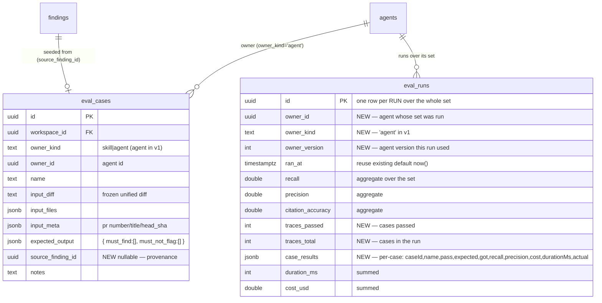

# Spec: Eval Pipeline  |  Spec ID: SPEC-2026-07-10-eval-pipeline  |  Status: ready

Module: cross-cutting (server + client + reviewer-core consumed; shared contracts)

## Problem & why

The reviewer agents (system prompt + model + linked skills) are edited freely in the studio,
but there is **no regression safety net**: changing a prompt or model can silently reintroduce a
false positive or lose a real finding, and nobody notices until it ships in a live review.

We already own a free, high-quality dataset: every finding a user **accepts** is a confirmed true
positive ("the agent *should* catch this"), and every finding a user **dismisses** is a confirmed
false positive ("the agent should *not* have flagged this"). Today those `accepted_at` /
`dismissed_at` decisions (`server/src/db/schema/reviews.ts`) are recorded and then unused for
regression testing.

The Eval Pipeline turns those decisions into **test cases that live in Postgres next to the
findings** and lets a user re-run an agent over a frozen set of cases to get deterministic
**recall / precision / citation_accuracy** metrics — so "old prompt vs new prompt" becomes a
measurable comparison instead of a guess. Scoring is **pure code** (file + line-range
intersection), never an LLM judge, so the numbers are reproducible.

## Goals / Non-goals

Goals
- One-click "Turn into eval case" from a real finding on the PR-detail FindingCard.
- An eval **set** = all cases owned by one agent; viewable in the Agent editor's Evals tab.
- A **batch run** = one execution of an agent over every case in its set, producing per-case
  results plus aggregate recall / precision / citation_accuracy / pass-count / cost / duration.
- An **Eval Dashboard** (new `SKILLS LAB` sidebar item) listing agents with their latest metrics,
  an agent-detail view with a metric trend and recent-runs table, and **compare two runs**.
- Deterministic, code-only scoring; the agent's own model is the variable under test.
- "Recent evals" surfaced on the PR-detail and Overview pages.

Non-goals
- **Skill-owned eval cases.** The scaffold's `eval_cases.owner_kind` supports `skill`, but every
  surface in this spec is agent-scoped; skill evals are deferred (column left intact). See Decisions.
- Replaying a *past* agent version's config against a case (agent_versions snapshot replay). v1
  records the version number a run used and runs the agent's **current** config.
- CI-triggered eval runs, scheduled runs, or gating a merge on eval results (that is the CI/export
  feature, `eval-ci.ts` `Ci*` contracts — out of scope here).
- Editing the `FEATURE_MODELS` registry — eval reuses the agent's own provider/model.
- An LLM-judge or semantic-similarity scoring path.

## Assumptions & dependencies

- Depends on the **pre-staged scaffold** (present, unwired): tables `eval_cases` + `eval_runs`
  (`server/src/db/schema/eval.ts`); contracts `EvalCase`/`EvalRun`/`EvalOwnerKind`/`EvalPerTrace`
  (`knowledge.ts`), `EvalCaseInput`/`EvalRunRecord`/`EvalRunResult`/`EvalTrendPoint`/`EvalDashboard`
  (`eval-ci.ts`) — already mirrored byte-for-byte into `client/src/vendor/shared/contracts/`.
- Depends on finding accept/dismiss (`actOnFinding`, `server/src/modules/reviews/findings.ts`) —
  the decision that determines expectation type.
- Depends on `reviewer-core` `reviewPullRequest` + `groundFindings`/`groundingSummary` running over
  a supplied `UnifiedDiff` with an injected `LLMProvider` (no DB/repo needed) — the eval run reuses
  the exact pipeline a live review uses, so numbers reflect real behavior.
- Depends on the git diff parser adapter (`server/src/adapters/git/diff-parser.ts` `parseUnifiedDiff`)
  to turn a stored `input_diff` string into a `UnifiedDiff`.
- Nav routing for `/eval` is already pre-staged in `activeKeyFor` (`client/src/components/app-shell/helpers.ts:35`).

## User stories

- As a reviewer-tuner, I want to turn an accepted finding into a "must find X here" case with one
  click, so the agent is regression-tested against a confirmed true positive.
- As a reviewer-tuner, I want to turn a dismissed finding into a "must not flag Y here" case, so a
  confirmed false positive can never silently return.
- As a reviewer-tuner, I want to see every case in an agent's set and run them all at once, so I get
  one recall/precision/citation number for the current prompt.
- As a reviewer-tuner, I want to open an agent's run history and compare two runs side by side, so I
  can prove a prompt change improved (or regressed) the metrics before shipping it.
- As a reviewer, I want the latest eval metrics visible on the Eval Dashboard, the Agent editor, the
  PR detail, and the Overview, so regression health is glanceable.

## Data model changes

Only two tables: `eval_cases` + `eval_runs`. The pre-staged `eval_runs` is currently **one row per
case** (`case_id`, per-case `recall`/`precision`/`pass`), which cannot represent a dashboard "run"
(one timestamp, one version, `17/20 pass`, one cost across the whole set, and compare-two-runs picks
two whole runs). Resolve by **reshaping `eval_runs` into one row per run/batch** (Decision D1): it
holds the aggregate metrics + agent version + summed cost/duration, and the **per-case** breakdown
lives in a `case_results` JSONB column on the same row — **not** as separate rows and **not** in a
separate `eval_batches` table.

New/changed columns (all additive; migrations are generated via `pnpm db:generate`, never
hand-written; existing scaffold tables carry no data to migrate):
- `eval_runs` reshaped from per-case to **per-run**: drop the mandatory `case_id`/`pass`
  interpretation, add `owner_id` + `owner_kind` + `owner_version`, `traces_passed`/`traces_total`,
  and a `case_results` JSONB holding the per-case breakdown (caseId, name, pass, expected, got,
  per-case recall/precision, cost, duration, actual findings). Aggregate `recall`/`precision`/
  `citation_accuracy`/`cost_usd`/`duration_ms`/`ran_at` already exist on the scaffold row and are
  reused as the run-level aggregates.
- `eval_cases.source_finding_id` (uuid, nullable, FK → `findings`, `onDelete: 'set null'`) —
  provenance so a case can show which finding it came from and de-dupe re-clicks.
- **No** `eval_batches` table and **no** `batch_id` FK — a run IS the batch.

## Scoring definitions (deterministic, code-only)

Matching predicate (identical semantics to the grounding gate, `reviewer-core/src/grounding.ts`):
a produced finding **F matches** an expectation/region **R** iff `F.file === R.file` **and** the
inclusive ranges `[F.start_line, F.end_line]` and `[R.start_line, R.end_line]` intersect.

Per case, from `expected_output = { must_find: Region[], must_not_flag: Region[] }` and the agent's
produced findings **A** for that case's fixed input:
- `matched_must_find` = must_find regions matched by ≥1 finding in A.
- `violated` = must_not_flag regions matched by ≥1 finding in A (false positives).
- **case pass** ⇔ every must_find region matched **and** no must_not_flag region violated.

Aggregated over a run (all cases in the set):
- **recall** = Σ matched_must_find / Σ must_find regions, over cases that have ≥1 must_find region.
  Cases with zero must_find (must_not_flag / expected-0 cases such as `clean-refactor-no-flags`) are
  excluded from recall's denominator (Decision D4) and count only toward precision; recall is `null`
  when the whole set has no must_find region.
- **precision** = TP / (TP + FP), where TP = count of produced findings matching a must_find region,
  FP = count of produced findings matching a must_not_flag region; findings matching neither are
  neutral (not counted). precision is `null` when TP + FP = 0.
- **citation_accuracy** = Σ kept / Σ (kept + dropped) across cases, where kept/dropped come from the
  `reviewer-core` grounding gate for each case's run (`groundingSummary` → `"kept/total"`). It is the
  share of the model's raw findings that survived citation grounding. `null` when the agent produced
  zero raw findings across the set.
- **traces_passed / traces_total** = passing cases / total cases in the set (persisted on the run row).

## Acceptance criteria (EARS)

Capability 1 — create an eval case from a finding (FindingCard button)

- **AC-1** — WHERE a finding on the PR-detail FindingCard has been **accepted**, the system shall
  render a "Turn into eval case" action that, WHEN clicked, opens the eval-case editor pre-filled
  with `expected_output.must_find = [{ file, start_line, end_line, severity, category, title }]`
  taken from that finding and `must_not_flag = []`.
  - Verify: RTL test on the FindingCard — accepted finding → click "Turn into eval case" → editor
    modal shows one must_find row matching the finding's `file`/`start_line`/`end_line`; `must_not_flag`
    empty. (Client uses `fireEvent`, not `user-event`.)
- **AC-2** — WHERE a finding has been **dismissed**, the "Turn into eval case" action shall open the
  editor pre-filled with `expected_output.must_not_flag = [{ file, start_line, end_line }]` from that
  finding and `must_find = []`.
  - Verify: RTL test — dismissed finding → editor shows one must_not_flag region, `must_find` empty.
- **AC-3** — WHEN an eval case is created from a finding, the system shall freeze the case input:
  `input_diff` is the unified diff of the finding's file (assembled from the PR's `pr_files` patch so
  a hunk intersects the finding's line range), `input_meta` carries `{ pr_number, pr_title, head_sha }`,
  the case `owner_kind='agent'` / `owner_id` = the agent that produced the finding's review
  (`reviews.agent_id`), and `source_finding_id` = the finding id.
  - Verify: server integration test (`*.it.test.ts`) — POST create from an accepted finding →
    persisted `eval_cases` row has non-empty `input_diff` whose parsed hunks intersect the finding
    lines, `owner_id === review.agent_id`, `source_finding_id` set.
- **AC-4** — IF the "Turn into eval case" action is triggered for a finding whose review has no
  `agent_id`, THEN the system shall reject creation with a 400 and a message stating the finding is
  not attributable to an agent, instead of creating an orphan case.
  - Verify: server test — finding on an agent-less review → create returns 400, no `eval_cases` row.

Capability 2 — view an agent's eval set (Agent editor → Evals tab)

- **AC-5** — WHEN the Agent editor's **Evals** tab is opened, the system shall list every eval case
  owned by that agent with, per case: a status icon (green check = last run passed, red cross = last
  run failed, empty circle = never run), the case name, an "expected N finding(s), got M" line from
  the most recent `eval_runs` row (or "never run"), a severity·category badge (or `[]` for a
  must_not_flag/clean case), and run/edit/delete actions.
  - Verify: RTL test — set with a passed case, a failed case, and a never-run case renders the three
    distinct status icons and the correct "expected/got" text (never-run shows "never run").
- **AC-6** — The Evals tab shall show the agent's current aggregate cards RECALL / PRECISION /
  CITATION ACCURACY / TRACES PASSED and an "Eval cases X/Y passing" header, sourced from the agent's
  latest `eval_runs` row (its aggregates + `case_results`); WHERE the agent has no run yet, each
  metric shall render an em-dash placeholder rather than `0%`.
  - Verify: RTL test — agent with no run → four cards show "—"; agent with a run showing 17/20 →
    "TRACES PASSED 17/20" and "Eval cases … passing" reflect the run.

Capability 3 — run a batch (`POST /agents/:id/eval-runs`)

- **AC-7** — WHEN `POST /agents/:id/eval-runs` is called for an agent with ≥1 case, the system shall
  execute the agent's **current config** (system prompt, model, provider, strategy, enabled linked
  skills) over each case's **frozen `input_diff`** (parsed via `parseUnifiedDiff`), using only the
  stored inputs — no live PR fetch and no repo-intel enrichment — so runs are reproducible and
  version-comparable.
  - Verify: server integration test with a stubbed `LLMProvider` — two runs of the same agent over
    the same case set produce identical per-case `matched`/`violated` sets and identical pass/fail;
    the executor never calls `container.repoIntel` or `loadDiff`.
- **AC-8** — WHEN a run over the set completes, the system shall persist **one** `eval_runs` row for
  the whole run: `owner_id`/`owner_kind`/`owner_version` (= the agent's current `version`), aggregate
  `recall`/`precision`/`citation_accuracy`, `traces_passed`/`traces_total`, summed `cost_usd` and
  `duration_ms`, and a `case_results` JSONB array with one entry per case (caseId, name, pass,
  expected, got, per-case recall/precision, cost, duration, actual findings); and it shall return the
  run's `EvalRunResult`-shaped data. No second table and no per-case rows are written.
  - Verify: server test — POST over a 3-case set → exactly **one** new `eval_runs` row whose
    `case_results` has length 3; `owner_version` equals the agent row's `version`; no `eval_batches`
    table exists.
- **AC-9** — Recall, precision, and citation_accuracy shall be computed **only in code** by the
  file+line-range intersection rules in "Scoring definitions"; no LLM call is made to grade a run
  (the only model calls are the agent producing findings).
  - Verify: server test — with the `LLMProvider` stubbed to a fixed finding set, the returned
    recall/precision/citation match hand-computed values; assert the grading path invokes no provider.
- **AC-10** — citation_accuracy shall equal Σ kept / Σ (kept+dropped) across the set, where
  kept/dropped are the `reviewer-core` grounding-gate outcome for each case (`groundingSummary`);
  IF a case's run produced zero raw findings, THEN that case contributes 0 to both numerator and
  denominator (it does not force citation to 1.0).
  - Verify: unit test on the aggregation helper — mixed cases (3/3, 1/2, 0/0 grounded) → citation =
    4/5 = 0.8, not averaged per-case.

Capability 4 — metrics correctness across expectation types

- **AC-11** — For a **must_find** case, recall shall count a must_find region as satisfied WHEN ≥1
  produced finding intersects it on the same file, and unsatisfied otherwise; a case with all
  must_find regions satisfied and no must_not_flag violated shall be marked `pass=true`.
  - Verify: unit test — finding at `src/config.ts:12` vs must_find `src/config.ts:10-14` → matched
    (pass); finding at line 40 → unmatched (fail).
- **AC-12** — For a **must_not_flag** case, WHEN a produced finding intersects a must_not_flag region,
  that finding shall count as a false positive lowering precision and the case shall be marked
  `pass=false`; WHEN no finding intersects any must_not_flag region, the case shall be `pass=true`.
  - Verify: unit test — dismissed region `src/webhook.ts:20-30`; agent flags line 25 → FP, fail;
    agent flags nothing there → pass.
- **AC-13** — WHERE a case has zero must_find regions (a clean / `clean-refactor-no-flags` case,
  expected 0 findings), the case shall be excluded from the run's recall denominator, and shall pass
  IFF the agent produces no finding intersecting any must_not_flag region; its per-case `recall` is
  `null`.
  - Verify: unit test — clean case with empty must_find and empty must_not_flag → recall `null`,
    excluded from batch recall average; passes when agent returns zero findings on that input.
- **AC-14** — WHERE a single case carries multiple must_find regions, recall shall count each region
  independently (partial credit at the batch level) and the case shall pass only WHEN **all** its
  must_find regions are matched.
  - Verify: unit test — case with 2 must_find regions, 1 matched → contributes 1/2 to batch recall,
    case `pass=false`.

Capability 5 — history, dashboard, and compare

- **AC-15** — The Eval Dashboard (new `SKILLS LAB` → "Eval Dashboard", `key:"eval"`, `href:"/eval"`)
  shall list each agent as a card showing RECALL / PRECISION / CITATION %, a sparkline, and
  "Last run vN · <date> · P/T pass" from its latest `eval_runs` row, plus a "RECENT EVAL RUNS ·
  ALL AGENTS" table across agents (one row per run).
  - Verify: RTL test — dashboard with two agents renders two cards each with the three metric percents
    and a "Last run v… · … pass" line; the recent-runs table lists run rows from both agents.
- **AC-16** — WHEN an agent card (or "pick an agent") is selected, the agent-detail view shall show
  RECALL / PRECISION / CITATION metric cards each with a delta vs the previous run and a sparkline,
  a METRIC TREND line chart of the three metrics over `EvalTrendPoint[]` (one point per run), and a
  RECENT RUNS table with a selectable checkbox per run, VERSION link, per-metric bar, PASS `P/T`, and
  COST.
  - Verify: RTL test — detail view for an agent with ≥2 runs renders three metric cards with deltas,
    a trend chart, and a runs table with checkboxes and version links.
- **AC-17** — WHILE exactly two runs are selected in the RECENT RUNS table, the system shall enable a
  "Compare" action; WHEN fewer than two or more than two are selected, Compare shall be disabled.
  - Verify: RTL test — select 1 → Compare disabled; select 2 → enabled; select 3 → disabled.
- **AC-18** — WHEN two runs are compared, the system shall present a modal showing their recall /
  precision / citation_accuracy / cost as old→new metric tiles with the per-metric point-delta, plus
  a System Prompt Diff of the two `owner_version`s and a "Promote v{b}" action; metric values use the
  two `eval_runs` rows' persisted aggregates (no re-run). The prompt diff and Promote reuse the
  existing `GET /agents/:id/versions/:version` and `PUT /agents/:id` endpoints, and shall degrade
  gracefully (diff shows "unavailable", Promote disabled) when a version snapshot 404s.
  - Verify: RTL test — compare v2 (recall .70) vs v3 (recall .85) shows both values and a "15pt"
    delta; the prompt diff highlights the added line; "Promote v3" restores version B's config via the
    update mutation; no network POST to eval-runs is fired.
- **AC-19** — WHERE the latest run's precision dropped versus the previous run, the agent-detail
  view shall render the `EvalDashboard.alert` banner text describing the regression (e.g. precision
  dipped, a new false positive slipped in); WHERE no regression, no banner shall render.
  - Verify: RTL test — run-over-run delta precision negative → alert banner visible with the alert
    string; delta ≥ 0 → no banner.

Editor modal (Mockup 5)

- **AC-20** — The eval-case editor shall require a non-empty Name; provide Input tabs Diff / Files /
  PR meta (Diff shows the frozen unified diff read-only) and an Expected-output JSON editor with a
  "+ Finding skeleton" insert and a live "valid JSON" / "invalid JSON" indicator; IF the Expected
  output is not valid JSON matching the `expected_output` shape, THEN Save shall be disabled.
  - Verify: RTL test — clearing Name disables Save; typing malformed JSON shows "invalid JSON" and
    disables Save; valid content re-enables it.
- **AC-21** — WHERE the "Run on save" toggle is on, WHEN the case is saved the system shall run that
  single case and display "expected N finding(s), got M · <duration> · <cost>" with a pass/fail
  marker, without navigating away.
  - Verify: RTL test with a mocked run endpoint — save with toggle on → result strip shows the
    expected/got line and pass marker.

Cross-cutting surfaces & contracts

- **AC-22** — The PR-detail (Review Runs) and Overview pages shall each show a "recent evals" summary
  (latest run metrics per relevant agent) linking to the Eval Dashboard; WHERE no eval run exists,
  the section shall render an empty-state prompt to create the first eval case, not a zeroed chart.
  - Verify: RTL test — page with no runs shows the empty-state; with runs shows latest metrics
    and a link to `/eval`.
- **AC-23** — Any change to a `server/src/vendor/shared/contracts/*.ts` eval contract (the reshaped
  `EvalRun`/`EvalRunRecord` per-run shape with `owner_version`/`traces_*`/`case_results`, new fields
  on `EvalCase`, `EvalDashboard`, or an `EvalCompare` schema) shall be mirrored **byte-for-byte** into
  the same path under `client/src/vendor/shared/contracts/`, verified by a passing `diff` of the two
  files.
  - Verify: `diff server/src/vendor/shared/contracts/eval-ci.ts client/src/vendor/shared/contracts/eval-ci.ts`
    (and `knowledge.ts`) exits 0 after the change; client `pnpm typecheck` green.
- **AC-24** — The eval run shall use the agent's own `provider`/`model`; the system shall not add or
  modify any `FEATURE_MODELS` entry (`server/src/vendor/shared/contracts/platform.ts` and its two
  mirrors) for eval.
  - Verify: `git diff` shows no change to `platform.ts` `FEATURE_MODELS`, `client/.../platform.ts`, or
    `client/src/lib/feature-models.ts`.
- **AC-25** — The eval run executor and repository shall live behind the server onion boundary: the
  route parses/validates and delegates; the service orchestrates via `container.*` (the LLM provider)
  and the repository; the repository is workspace-scoped Drizzle-only and reaches no adapter directly.
  - Verify: `architecture-reviewer` (or inspection) confirms route→service→repository→adapter
    direction; the repository imports only `db/schema` + `db/client`.

## Edge cases

- **Never-run case:** status = empty circle; "never run" text; excluded from any batch until run.
- **Empty set:** `POST /agents/:id/eval-runs` on an agent with zero cases returns a 400/empty-result
  (no `eval_runs` row); Evals tab shows an empty state with "New eval case".
- **Clean / expected-0 case:** recall `null`, excluded from recall denominator; passes on zero flags.
- **Multiple must_find in one case:** partial batch-recall credit, case passes only if all matched.
- **Multiple findings from one review turned into one case vs many:** each "Turn into eval case" click
  creates one case seeded from one finding; `source_finding_id` de-dupes a double click (second click
  opens the existing case rather than creating a duplicate).
- **Version comparability:** each run row stores `owner_version`; comparing v6 vs v7 reads two
  persisted `eval_runs` rows — never re-runs, so historical numbers are stable even after further
  prompt edits.
- **Frozen input drift:** the case's `input_diff` is captured once; later force-pushes to the source
  PR do not change the case (reproducibility). The editor's Diff tab is read-only.
- **Agent deleted:** `eval_cases.owner_id` has no DB FK to agents (owner is polymorphic skill|agent);
  the service must treat a missing owner agent as "orphan set" and hide it from the dashboard rather
  than 500.
- **Cost/duration:** summed from each case's run; a provider that returns no usage yields `cost_usd`
  `null` (already nullable) — the UI shows "—", not `$0.00`.
- **Partial run failure:** if one case's LLM call fails, that case's entry in `case_results` records
  the failure (pass=false, actual=error) and the run still completes over the rest; the failed case
  is still counted in `traces_total`.
- **Malformed stored `input_diff`:** if `parseUnifiedDiff` yields zero files, the case run fails
  closed for that case (cannot ground) rather than scoring against an empty diff.

## Non-functional

- **Security / untrusted input:** `input_diff`, `input_meta`, and produced findings are repo/PR
  content and model output — foreign text. They must be treated as **data**: the review path already
  wraps them via `reviewer-core` `wrapUntrusted`; the expected-output JSON editor must parse with Zod
  (`safeParse`) and never `eval`/execute it; the read-only Diff view must render escaped, never as
  HTML. Batch runs execute real paid model calls — `POST /agents/:id/eval-runs` must be
  workspace-scoped and authorized like other agent routes (deny-by-default), and should be guarded
  against accidental fan-out cost ("Run all agents" runs sequentially / with a concurrency cap).
- **Performance:** scoring is O(findings × regions) per case, pure in-memory; negligible. Cost/time
  is dominated by the LLM calls (one per case), so the run is bounded by set size — surface duration
  and cost so a large set's expense is visible before/after.
- **a11y:** status icons (pass/fail/never-run) must carry text labels, not color alone (colorblind
  users must distinguish pass from fail); the compare checkboxes and metric bars need accessible names.

## Observability

- Reuse the existing run-log/SSE pattern for batch progress (per-case start/finish), so a long batch
  streams like a review run.
- Persisted `eval_runs` rows ARE the audit trail (aggregate metrics + version + cost per run, with
  the per-case breakdown in `case_results`); the dashboard trend is the signal to watch for
  regressions. Log a structured line per run:
  `{ agentId, ownerVersion, recall, precision, citationAccuracy, tracesPassed, tracesTotal, costUsd }`.

## Rollout / migration / back-compat

- Additive schema only (reshape `eval_runs` to per-run: add `owner_id`/`owner_kind`/`owner_version`,
  `traces_passed`/`traces_total`, `case_results` jsonb; add `eval_cases.source_finding_id`) —
  generate via `pnpm db:generate`; existing empty scaffold tables have no data to migrate. No
  `eval_batches` table.
- Contract-mirror step is **mandatory** (AC-23): every server eval-contract edit must be copied
  byte-for-byte to `client/src/vendor/shared/contracts/`; `tsc` will not catch a missed mirror.
- No feature flag required (net-new surfaces); the sidebar item and `/eval` route are the entry point,
  and `activeKeyFor` already recognizes `/eval`.
- No `FEATURE_MODELS` change (AC-24) — no 3-copy registry edit.

## Inputs (provenance)

- Eval case seed (file, lines, severity, category, title, accept/dismiss state) — [reused: existing
  `findings` row].
- `input_diff` — [deterministic: repo-intel / `pr_files` patch, `parseUnifiedDiff`].
- Scoring (recall/precision/citation, pass) — [deterministic: code, no model].
- Produced findings per case — [new: 1 LLM call per case per batch, on the agent's own model].
- Aggregates, trend, alert — [deterministic: computed from persisted `eval_runs`].

## Untrusted inputs

- **PR/repo content in `input_diff` + `input_meta`, and model-produced findings** — foreign text.
  Treated as data, never as instructions: reviewed via `reviewer-core`'s `wrapUntrusted`-wrapped
  prompt slots; the editor's Diff view is read-only/escaped; the expected-output JSON is `safeParse`d,
  never executed.

## Decisions (resolved)

- **D1 — Run model (confirmed by coordinator):** **no** `eval_batches` table; reshape `eval_runs`
  into **one row per run over the whole set** (matching `POST /agents/:id/eval-runs` = "run on all
  cases in the set"). The run row holds aggregate `recall`/`precision`/`citation_accuracy`,
  `owner_version`, summed `cost_usd`/`duration_ms`, `traces_passed`/`traces_total`, and a
  `case_results` JSONB with the per-case breakdown (pass/fail, expected/got, per-case cost/duration).
  Rationale: the dashboard's unit is a whole run (one timestamp, one version v7, one cost $0.23,
  compare picks two whole runs); keeping per-case detail inside `case_results` avoids a second table
  and a `batch_id` join while still surfacing which case failed.
- **D2 — Expectation shape:** `expected_output = { must_find: Region[], must_not_flag: Region[] }`
  (each Region = `{ file, start_line, end_line }`, must_find also carrying `severity`/`category`/
  `title` for display). Rationale: fits the existing untyped `jsonb` (no schema change), lets one
  case assert both a wanted finding and a forbidden region, and preserves the dismissed-finding region
  needed to count a false positive — which "infer from emptiness" would lose.
- **D3 — Owner scope v1:** agents only; skill-owned evals are a non-goal. Rationale: all five mockups
  are agent-centric; the `owner_kind` column stays intact for a later skill pass, so no scaffold is
  discarded.
- **D4 — Clean-case metric (confirmed by coordinator):** recall is `null` and the case is excluded
  from the recall denominator; `must_not_flag` / expected-0 cases work only in precision (as false
  positives). Set recall = Σ found(must_find) / Σ expected(must_find) over cases that have must_find.
  Rationale: a vacuous recall=1.0 would inflate the headline metric as clean cases accumulate; the
  statistically honest denominator counts only cases that assert a finding.
