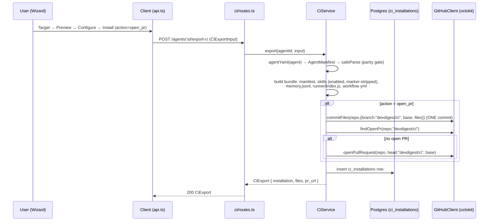
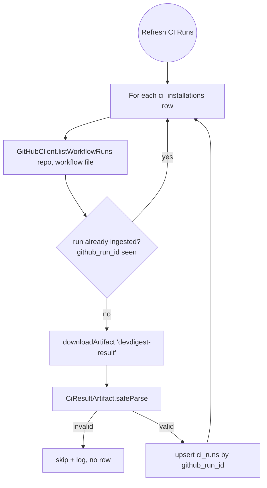

# Spec: Export to CI  |  Spec ID: SPEC-2026-07-13-export-to-ci  |  Status: approved

Module: cross-cutting (server `ci/` module + routes + adapter · client CI Runs page + agent CI tab · shared `eval-ci.ts` contracts · `agent-runner` consumed as a shipped dependency)

## Problem & why

A tuned reviewer agent in the studio (system prompt + model + linked skills + strategy + `ci_fail_on`)
can only be run *inside* dev-digest today: a human opens a PR in the studio and clicks review. There
is no way to make that same agent block a merge in the target repo's own CI, where the review actually
needs to gate code.

The pieces to do this are already **pre-staged but unwired**: the `AgentManifest` Zod contract shared
by studio and runner (`server/src/vendor/shared/contracts/eval-ci.ts`), the `agent-runner` package that
reads that manifest and runs the *same* `reviewer-core` pipeline in a target repo's GitHub Actions
(`agent-runner/`), the `ci_installations` + `ci_runs` tables (`server/src/db/schema/ci.ts`), and the
GitHub commit/PR adapter methods (`server/src/vendor/shared/adapters.ts`). What is missing is the studio
side that **serializes an agent into a manifest, bundles the runner + skills + workflow into one PR**,
persists the installation, and **ingests the CI results back** so runs are visible in the studio.

Export to CI wires those pieces: an Export Wizard produces a byte-for-byte manifest validated by the
*same* contract the runner validates on the other end (one contract, two consumers), commits it as one
reviewable PR to a `devdigest/ci` branch (never `main`), and pulls the runner's result artifacts back
into `ci_runs` so a CI Runs page and a per-agent CI tab can show verdicts, findings, cost and duration.

`specs/SPEC-2026-07-10-eval-pipeline.md` explicitly defers "CI-triggered runs / gating a merge on
eval results" to **this** spec.

## Goals / Non-goals

Goals
- An **Add to CI** button on an agent's CI tab opens a 4-step **Export Wizard**: Target → Preview →
  Configure → Install.
- Serialize an agent into an `AgentManifest` YAML at `.devdigest/agents/<slug>.yaml`, validated by the
  same `AgentManifest` contract the `agent-runner` validates — byte-for-byte round-trippable.
- Generate a **self-contained** `.github/workflows/devdigest-review.yml` that runs the *bundled* runner
  (`.devdigest/runner/index.js`) directly — it does **not** depend on an external marketplace action.
- Bundle everything that ships: manifest, enabled linked skills (marker-stripped), `.devdigest/memory.jsonl`,
  the runner bundle, and the editable workflow.
- Make **one atomic commit** to a `devdigest/ci` branch and open (or reuse) a PR — nothing lands on the
  base branch directly.
- Persist the installation (`ci_installations`) and expose read routes for installations + CI runs.
- **Pull-ingest** CI results on refresh via the GitHub Actions API and populate `ci_runs` (Decision D-2).
- A **CI Runs page** (PR · repo · agent · verdict · findings · cost · duration · link to the Actions job).
- An **agent CI tab**: per-repo installations (status + workflow version), CI-run history, and a
  "Fail CI on" selector persisted to `agents.ci_fail_on`.

Non-goals
- The **Multi-Agent Review** service and the PR feed — do not touch them.
- The `agent-runner` package internals — it is a shipped dependency, already built; this spec consumes
  its output shape (`CiResultArtifact`) and embeds its bundle, but does not modify its pipeline.
- A **GitHub App / webhook** ingest path — ingest is pull-based (Decision D-2). No webhook receiver,
  no App installation.
- A dev-digest-hosted marketplace action (`devdigest/review-action@v1` is a mock placeholder, not a real
  dependency — see Decision D-3).
- Storing CI runs in `agent_runs` with `source='ci'` — superseded by Decision D-1 (`ci_runs`).
- Any new `FEATURE_MODELS` entry — CI reuses the agent's own provider/model (no LLM registry change).
- Non-GitHub deploy of the review job for the CircleCI/Jenkins/CLI targets at full GHA fidelity — see
  `[NEEDS CLARIFICATION]`.

## Assumptions & dependencies

- **Pre-staged scaffold (present, unwired) — build against it, do not re-derive:**
  - Contracts in `server/src/vendor/shared/contracts/eval-ci.ts`: `AgentManifest`, `CiTarget`, `CiFile`,
    `CiExportInput`, `CiInstallation`, `CiExport`, `CiRunStatus`, `CiRun`, `CiResultArtifact` — already
    mirrored to `client/src/vendor/shared/contracts/eval-ci.ts`.
  - Tables `ci_installations` + `ci_runs` (`server/src/db/schema/ci.ts`).
  - `agents.ci_fail_on` column (`never|critical|warning|any`, default `critical`) already exists.
- **`agent-runner` package** (`agent-runner/`, already built, out of scope): `loadAgentManifest`
  (Zod-validates the on-disk manifest), `runCi` (same `reviewer-core` pipeline + deterministic gate
  from `countBlockers`/`gateTriggered` + `ci_fail_on`), `buildResultArtifact` (writes
  `devdigest-result.json` = `CiResultArtifact`). Per `agent-runner/CLAUDE.md` the ncc bundle ships as
  `.devdigest/runner/index.js` inside the exported PR.
- **GitHub adapter** (`server/src/vendor/shared/adapters.ts` + `server/src/adapters/github/octokit.ts`)
  already has `commitFiles(repo,{branch,base,message,files})` (one atomic Git-Data-API commit),
  `openPullRequest`, `findOpenPr(repo,branch)`, `postReview`. It does **not** have workflow-run listing
  or artifact download — those must be **added** to the `GitHubClient` interface + octokit impl + mock
  for pull-ingest (Decision D-2).
- The server `ci/` module does not exist yet (`server/src/modules/ci/` empty) — new module, Onion +
  Fastify plugin conventions, adapters reached only via the DI container (`server/CLAUDE.md`,
  `server-architecture`). The runner's `manifest.ts` comment already names the intended writer path
  `server/src/modules/ci/manifest.ts` / `CiService.agentYaml`.
- Skill bodies ship **marker-stripped** (`stripUntrustedMarkers`), only **enabled** linked skills
  (server INSIGHTS 2026-07-07 / 2026-07-01).
- Route to add: `POST /agents/:id/export-ci` (`CiExportInput` → `CiExport`), plus read/ingest routes
  for CI runs and installations.
- Depends on `specs/SPEC-2026-07-10-eval-pipeline.md`, which defers merge-gating to this spec.
- No multi-user auth today: all routes derive `workspaceId` from `getContext()` (server INSIGHTS
  2026-07-02) — installations and runs are workspace-scoped.

## User stories

- As a reviewer-tuner, I want an **Add to CI** button on my agent that walks me through Target → Preview
  → Configure → Install, so I can put the agent into a repo's CI without hand-writing YAML.
- As a reviewer-tuner, I want the wizard to open **one reviewable PR** on a `devdigest/ci` branch rather
  than pushing to `main`, so the CI config is reviewed like any other code change.
- As a reviewer-tuner, I want the generated workflow to be **self-contained** (run the bundled runner,
  not a third-party action I have to trust/host), so the review job has no hidden external dependency.
- As a reviewer, I want a **CI Runs** page showing each run's PR, repo, agent, verdict, findings, cost,
  duration and a link to the Actions job, so I can see how the agent performs in real CI.
- As a reviewer-tuner, I want an agent **CI tab** listing every repo it is installed in with status and
  workflow version, its CI-run history, and a "Fail CI on" selector, so I can manage and tune gating.
- As a security-conscious user, I want the wizard to only **display** the repo secrets it expects
  (`OPENROUTER_API_KEY`, `GITHUB_TOKEN`) and never ask me to enter or store a secret value, so no
  credential ever leaves my hands through dev-digest.

## Flows

### Export (Wizard → PR)

### Ingest (pull-based, on refresh — Decision D-2)

## Acceptance criteria (EARS)

### Capability 1 — Export bundle generation + manifest round-trip parity

- **AC-1** — WHEN `POST /agents/:id/export-ci` is called for an existing agent, the system shall build a
  file bundle (`CiFile[]`) containing, at minimum: the manifest `.devdigest/agents/<slug>.yaml`, one
  `.devdigest/skills/<slug>.md` per **enabled** linked skill, `.devdigest/memory.jsonl`, the runner
  bundle `.devdigest/runner/index.js`, and the workflow `.github/workflows/devdigest-review.yml`.
  - Verify: server integration test — export an agent with 2 enabled + 1 disabled skill → returned
    `files[].path` contains exactly the manifest, 2 skill files, `memory.jsonl`, `runner/index.js`, and
    the workflow; the disabled skill's file is absent.
- **AC-2** — WHEN the manifest file is generated, the system shall serialize the agent's `name`,
  `provider`, `model`, `system_prompt`, enabled skill slugs, `strategy`, and `ci_fail_on` such that
  parsing the emitted YAML with `AgentManifest.safeParse` succeeds AND the parsed object equals what the
  `agent-runner`'s `loadAgentManifest` would load from the same bytes.
  - Verify: server test — feed the generated YAML string through `AgentManifest.safeParse` (studio side)
    and through `agent-runner`'s `loadAgentManifest` (reader side) → both `success` and deep-equal; a
    round-trip `parse(serialize(agent))` is idempotent.
- **AC-3** — WHEN skill files are added to the bundle, the system shall include ONLY skills whose
  `agent_skills` link is `enabled=true`, and shall run each skill body through `stripUntrustedMarkers`
  before writing it, so no `UNTRUSTED_SKILL_START/END` marker reaches the shipped file.
  - Verify: server test — an enabled skill whose stored body contains the untrusted markers → the emitted
    `.devdigest/skills/<slug>.md` contains the body with markers removed; a disabled skill produces no file.
- **AC-4** — The generated `.github/workflows/devdigest-review.yml` shall be **self-contained**: it runs
  the bundled runner (`node .devdigest/runner/index.js`) as the review step and shall NOT contain a
  `uses:` reference to an external dev-digest marketplace action as the mechanism that performs the review.
  - Verify: server test — the workflow `CiFile.contents` invokes `.devdigest/runner/index.js` and contains
    no `uses: devdigest/review-action@` line in the review job (the placeholder from the mock is not emitted).
- **AC-5** — The exported bundle shall include the runner bundle at `.devdigest/runner/index.js`, and its
  `CiFile.editable` shall be `false` (it is a build artifact, not user-editable), WHILE the workflow
  file's `CiFile.editable` shall be `true`.
  - Verify: server test — `files.find(path==='.devdigest/runner/index.js').editable === false`;
    `files.find(path==='.github/workflows/devdigest-review.yml').editable === true`.
- **AC-6** — The exported bundle shall include a `.devdigest/memory.jsonl` file; WHERE the agent has no
  stored memory (the lab default), the system shall emit an empty file (zero bytes / no lines) rather
  than omitting it.
  - Verify: server test — export an agent with no memory → `files` contains `.devdigest/memory.jsonl`
    with empty contents.

### Capability 2 — Export Wizard step behavior (client)

- **AC-7** — WHEN the agent CI tab's **Add to CI** button is clicked, the system shall open the Export
  Wizard on step **Target**, offering GitHub Actions (marked recommended/default), CircleCI, Jenkins,
  and Generic CLI, mapping the selection to `CiExportInput.target` (`gha|circle|jenkins|cli`, default `gha`).
  - Verify: RTL test — click Add to CI → wizard renders 4 target options with GHA preselected;
    selecting Jenkins sets the target used by the eventual export call to `jenkins`.
- **AC-8** — WHILE on the **Preview** step, the system shall list every file that will ship (manifest,
  skills, `.devdigest/memory.jsonl`, workflow) and shall render the workflow file in an **editable** text
  area whose edits are carried into the export request; non-editable files (`editable=false`) shall be
  shown read-only.
  - Verify: RTL test — Preview shows the file list; editing the workflow textarea updates the value sent
    on Install; the runner bundle entry is read-only (no editable input).
- **AC-9** — WHILE on the **Configure** step, the system shall let the user choose PR triggers
  (`pull_request`: `opened`, `synchronize`, and optional `reopened`) mapped to `CiExportInput.triggers`,
  and a "Post results as" option (`github_review` — recommended, labelled as the only one that yields a
  blocking verdict; `pr_comment`; or `none` / exit-code only) mapped to `CiExportInput.post_as`.
  - Verify: RTL test — default triggers are `[opened, synchronize, reopened]`; unchecking reopened
    removes it; the `github_review` option carries the "only this yields a verdict" hint; selecting
    `pr_comment` sets `post_as='pr_comment'`.
- **AC-10** — WHILE on the **Configure** step, the system shall display the expected repo secrets
  (`OPENROUTER_API_KEY` — BYO, shown "not set"; `GITHUB_TOKEN` — shown "auto") as **display-only**
  information, and shall NOT render any input that accepts or transmits a secret value.
  - Verify: RTL test — Configure shows the two secret names with their status; there is no text input,
    password field, or form control bound to a secret value; no secret string is present in the export
    request payload.
- **AC-11** — WHILE on the **Install** step, the system shall offer "Open a PR with these files"
  (recommended → `action='open_pr'`) and "Copy files as a zip" (degraded → `action='files'`); WHEN the
  user confirms, the system shall call `POST /agents/:id/export-ci` with the accumulated
  `CiExportInput`, and WHEN `action='files'` it shall let the user download the returned `files` without
  requiring a PR.
  - Verify: RTL test — Install with open_pr fires the export mutation with `action='open_pr'`; with
    `files` the returned files are offered as a download and no PR URL is required to complete.
- **AC-12** — The Export Wizard dialog shall be an accessible modal: focus moves into the dialog on
  open, focus is trapped within it, `Escape` closes it, and it exposes `role="dialog"` with an
  accessible name; step controls are reachable and labelled for keyboard/screen-reader use.
  - Verify: RTL test — on open, focus is inside the dialog; `Escape` closes; the dialog has an
    accessible name and the Target radio group / Next button are keyboard-reachable.

### Capability 3 — Atomic commit + PR (never base) + open-PR reuse

- **AC-13** — WHEN `action='open_pr'`, the system shall write the entire bundle with a **single**
  `GitHubClient.commitFiles(repo, { branch: 'devdigest/ci', base, files })` call (one atomic commit),
  never multiple commits and never a per-file write.
  - Verify: server test with a mock `GitHubClient` — one export → exactly one `commitFiles` invocation
    whose `files` length equals the bundle size; `postReview`/`createReviewComment` are not called.
- **AC-14** — The system shall commit only to the `devdigest/ci` branch and shall NEVER commit the
  bundle directly to the base branch (`CiExportInput.base`, default `main`); the commit's `base` is used
  only as the fork point for `devdigest/ci`.
  - Verify: server test — the `commitFiles` payload has `branch==='devdigest/ci'` and
    `base===input.base`; no adapter call targets the base branch as its write `branch`.
- **AC-15** — WHEN `action='open_pr'`, the system shall call `findOpenPr(repo,'devdigest/ci')` and, IF an
  open PR for that head already exists, THEN it shall reuse that PR's URL (adding the new commit to it)
  instead of opening a duplicate PR; ELSE it shall call `openPullRequest` with head `devdigest/ci` and
  base `input.base`.
  - Verify: server test — first export opens a PR; a second export on the same repo (mock `findOpenPr`
    returns a URL) makes no second `openPullRequest` call and returns the existing `pr_url`.
- **AC-16** — WHEN `action='files'`, the system shall build and return the bundle in `CiExport.files`
  with `pr_url = null` and shall make no GitHub write call (`commitFiles`/`openPullRequest`).
  - Verify: server test — export with `action='files'` → `pr_url===null`, `files` populated, mock
    `GitHubClient` records zero write calls.

### Capability 4 — Installation persistence

- **AC-17** — WHEN an export completes (either action), the system shall persist a `ci_installations`
  row with `agentId`, `repo`, and `targetType` = the request `target`, scoped to the caller's workspace,
  and shall return it as `CiExport.installation`.
  - Verify: server integration test — after export, a `ci_installations` row exists with the right
    `agent_id`/`repo`/`target_type`; the returned `installation.id` matches the persisted row.
- **AC-18** — WHEN an export targets a `(agent, repo)` pair that is already installed, the system shall
  update/reuse the existing installation rather than creating a duplicate row for the same pair.
  - Verify: server test — two exports for the same agent+repo → a single `ci_installations` row for that
    pair (upsert), not two.

### Capability 5 — Pull-ingest → `ci_runs` (safeParse-skip + dedupe)

- **AC-19** — The `GitHubClient` interface shall gain a method to list a repo's workflow runs for the
  `devdigest-review` workflow and a method to download a run's `devdigest-result` artifact contents;
  both shall be implemented in the octokit adapter and the mock, and the interface edit shall be mirrored
  byte-for-byte into `client/src/vendor/shared/adapters.ts`.
  - Verify: `diff server/src/vendor/shared/adapters.ts client/src/vendor/shared/adapters.ts` exits 0
    after the change; the mock implements the new methods; server + client `pnpm typecheck` green.
- **AC-20** — WHEN a CI-runs refresh/ingest is invoked, the system shall, for each installation, list its
  repo's `devdigest-review` workflow runs, download each not-yet-ingested run's `devdigest-result`
  artifact, and `CiResultArtifact.safeParse` it before use.
  - Verify: server integration test with a mock adapter returning one valid artifact → one `ci_runs` row
    is created with `findingsCount`/`costUsd`/`prNumber` from the artifact and `githubUrl` set to the
    Actions job URL.
- **AC-21** — IF a downloaded artifact fails `CiResultArtifact.safeParse` (malformed or foreign JSON),
  THEN the system shall skip that run (write no `ci_runs` row) and log the skip, and shall continue
  ingesting the remaining runs rather than failing the whole refresh.
  - Verify: server test — a batch of [valid, invalid, valid] artifacts → exactly two `ci_runs` rows are
    written; the refresh returns success; a skip is logged for the invalid one.
- **AC-22** — The ingest shall be **idempotent** per GitHub workflow-run: re-ingesting a run that already
  produced a `ci_runs` row shall NOT create a duplicate row (dedupe keyed on the GitHub run id).
  - Verify: server integration test — ingest the same workflow run twice → a single `ci_runs` row for
    that run (upsert on the run-id key), unchanged findings/cost on the second pass.
- **AC-23** — WHEN a valid artifact is ingested, the system shall map its severity/verdict signal to a
  `ci_runs.status` in `CiRunStatus` (`succeeded|failed|no_findings|running`): a gate-triggered result →
  `failed`, a clean result with zero findings → `no_findings`, a completed non-blocking result →
  `succeeded`; a still-running workflow run (no artifact yet) shall not be recorded as a terminal status.
  - Verify: server test — artifacts representing (blocked / zero-findings / passing) ingest to
    `failed` / `no_findings` / `succeeded` respectively; an in-progress run yields no terminal row.
- **AC-24** — The ingest shall NOT read, store, or log any repo secret or GitHub token value from the
  workflow-run metadata or artifact; only the fields declared in `CiResultArtifact` (findings counts,
  cost, duration, agent, version, pr_number) plus the run's public URL/id shall be persisted.
  - Verify: server test — the persisted `ci_runs` row and any emitted log line contain none of
    `OPENROUTER_API_KEY`/`GITHUB_TOKEN` values; only `CiResultArtifact` fields + run id/URL are stored.

### Capability 6 — CI Runs page (client)

- **AC-25** — The CI Runs page shall list ingested runs with, per row: the PR (number), repo, agent,
  verdict/status, findings count, cost, duration, and a link to the GitHub Actions job
  (`ci_runs.githubUrl`); values sourced from the `CiRun` contract.
  - Verify: RTL test — a page fed two `CiRun` rows renders both with PR/repo/agent/status/findings/cost/
    duration and an anchor whose href equals each row's `github_url`.
- **AC-26** — WHERE no CI run has been ingested yet, the CI Runs page shall render an empty state
  prompting the user to add an agent to CI (linking to the wizard), rather than a zeroed table.
  - Verify: RTL test — page with zero runs shows the empty-state CTA, not a table of `$0.00`/`0` rows.
- **AC-27** — WHERE a `CiRun`'s `cost_usd` is `null` or `duration_s` is `null`, the page shall render an
  em-dash placeholder for that cell rather than `$0.00` / `0s`.
  - Verify: RTL test — a run with `cost_usd=null` shows "—" in the cost cell.

### Capability 7 — Agent CI tab (client)

- **AC-28** — The agent CI tab shall list every `ci_installations` row for the agent (per-repo), each
  showing the repo, install status, and the workflow version, sourced from the installations read route.
  - Verify: RTL test — an agent with two installations renders two rows with repo + status + version.
- **AC-29** — The agent CI tab shall show that agent's CI-run history (its `ci_runs`), and shall render a
  **"Fail CI on"** selector bound to `agents.ci_fail_on` (`never|critical|warning|any`); WHEN the user
  changes it, the system shall persist the new value via the agent update route.
  - Verify: RTL test — changing "Fail CI on" from `critical` to `warning` fires the update mutation with
    `ci_fail_on='warning'`; the run-history list renders the agent's `ci_runs`.
- **AC-30** — The "Fail CI on" selector's current value shall reflect the persisted `agents.ci_fail_on`
  (default `critical`), and this same value shall be the `ci_fail_on` serialized into the next exported
  manifest (AC-2), keeping the studio gate policy and the shipped manifest in agreement.
  - Verify: RTL test — selector defaults to the agent's stored `ci_fail_on`; server test — an export
    after changing it serializes the new value into the manifest YAML.

### Capability 8 — Secrets never leave the user (security)

- **AC-31** — The system shall never accept, persist, embed, or log a secret **value**: no secret value
  is written into the manifest, workflow, `memory.jsonl`, any `CiFile.contents`, the committed PR, the
  `ci_installations`/`ci_runs` rows, or any log line. Secrets are referenced by name only (e.g.
  `${{ secrets.OPENROUTER_API_KEY }}`) in the generated workflow.
  - Verify: server test — scan every generated `CiFile.contents` and every persisted row/log for the
    secret-name patterns' *values*: the workflow contains only `${{ secrets.* }}` references, never a
    literal key; no export/ingest code path reads `container.secrets.get('OPENROUTER_API_KEY')` into a
    shipped/persisted string.

### Capability 9 — Contract / architecture / parity invariants

- **AC-32** — Any change to a `server/src/vendor/shared/contracts/eval-ci.ts` `Ci*`/`AgentManifest`
  contract (or `adapters.ts`) shall be mirrored **byte-for-byte** into the same path under
  `client/src/vendor/shared/`, verified by a passing `diff`.
  - Verify: `diff server/src/vendor/shared/contracts/eval-ci.ts client/src/vendor/shared/contracts/eval-ci.ts`
    and `diff …/adapters.ts …/adapters.ts` both exit 0; client `pnpm typecheck` green.
- **AC-33** — The server `ci/` module shall respect the onion boundary: the route parses/validates
  (`CiExportInput`) and delegates; `CiService` orchestrates via `container.github` (and `container.db`
  where the module convention is direct-db reads) — never instantiating an adapter directly; the manifest
  serializer and bundle builder are pure functions of the agent config.
  - Verify: `architecture-reviewer` (or inspection) confirms route→service→adapter direction and that no
    adapter is constructed outside the DI container; `agentYaml`/bundle builder take data in and return
    strings/`CiFile[]` with no I/O.
- **AC-34** — The system shall not add or modify any `FEATURE_MODELS` entry
  (`server/src/vendor/shared/contracts/platform.ts` and its two mirrors) for CI export — CI reuses the
  agent's own `provider`/`model`.
  - Verify: `git diff` shows no change to `platform.ts` `FEATURE_MODELS`, its client vendored mirror, or
    `client/src/lib/feature-models.ts`.

## Edge cases

- **Disabled agent / no model:** exporting an agent that is disabled or has an empty model still
  serializes, but the manifest must satisfy `AgentManifest` (`model.min(1)`); an invalid config surfaces
  a 400 with the Zod issue, not a broken manifest.
- **Zero enabled skills:** manifest `skills: []`; no `.devdigest/skills/*` files; runner tolerates a
  null/empty `skills` (contract normalizes `nullish → []`).
- **Slug collision:** two agents whose names slugify identically must not overwrite each other's manifest
  path — the `<slug>` must be unique per agent (see `[NEEDS CLARIFICATION]` on slug derivation if names
  can collide within a repo bundle; the runner expects exactly one manifest under `agents/`).
- **Re-export (config drift):** re-running the wizard after editing the agent adds a new commit to the
  existing `devdigest/ci` PR (AC-15) rather than opening a second PR; the manifest reflects the current
  config.
- **Force-push / branch exists:** `commitFiles` fast-forwards `devdigest/ci` if it already exists (per
  adapter contract) — export must not fail because the branch is present from a prior export.
- **Ingest before first run:** a fresh installation with no workflow runs yet ingests nothing and shows
  an empty run history — not an error.
- **In-progress workflow run:** a run with no `devdigest-result` artifact yet is not written as a
  terminal `ci_runs` row (AC-23); it may optionally surface as `running`.
- **Malformed / foreign artifact:** skipped with a log, refresh continues (AC-21) — a repo could upload
  a `devdigest-result` artifact with arbitrary JSON; `safeParse` is the trust boundary.
- **Deleted installation / agent:** `ci_runs.ci_installation_id` is `onDelete: set null`, so historical
  runs survive an installation delete; the CI Runs page must tolerate a null installation (show the run
  without a live installation link).
- **Non-GHA target (`circle|jenkins|cli`):** the bundle still serializes the manifest + runner + skills,
  but the workflow file and its trigger semantics differ per target — fidelity/openness is a
  `[NEEDS CLARIFICATION]`; at minimum these targets support the `action='files'` (zip) path.
- **`post_as='none'`:** exit-code-only — no GitHub review/comment; the run still writes an artifact and
  ingests into `ci_runs`, and the status still reflects the gate (a blocked run is `failed` even with no
  posted review).
- **Block-merge without a GitHub App:** blocking a merge is achieved by the repo owner marking the
  `devdigest-review` check as a **required status check** in branch protection + the runner's non-zero
  exit on a triggered gate; dev-digest ships no App and cannot set branch protection itself — the
  Configure step's "block-merge hint" is guidance, not an action (Decision D-4).

## Non-functional

- **Security (secrets):** no secret value is ever accepted, embedded, committed, persisted, or logged
  (AC-31, AC-24); the workflow references secrets by name only. This is the feature's primary security
  invariant.
- **Security (untrusted inputs):** the on-disk manifest (read by the runner) and the ingested
  `devdigest-result` artifact (produced by a target repo's CI, i.e. foreign) are untrusted — both go
  through Zod (`AgentManifest.safeParse` on the runner side, `CiResultArtifact.safeParse` on ingest,
  AC-20/21). Skill bodies are marker-stripped and only enabled skills ship (AC-3). The generated workflow
  and manifest are written into a **PR** (reviewed by a human before it can run), not pushed to `main`.
- **Security (A01/A08):** export and ingest routes are workspace-scoped via `getContext()`; installations
  and runs never take `workspaceId` from user input. The export request body is Zod-validated
  (`CiExportInput`), so no mass-assignment of unexpected fields.
- **Performance:** bundle building is pure string work (negligible). Pull-ingest cost is bounded by the
  number of installations × recent workflow runs per refresh; dedupe (AC-22) prevents re-downloading
  already-ingested artifacts, and artifact download should be capped to recent/not-yet-seen runs to keep
  a refresh bounded.
- **a11y:** the Export Wizard modal traps focus, is Escape-dismissible, exposes `role="dialog"` + an
  accessible name (AC-12); status/verdict indicators on the CI Runs page and CI tab must carry text
  labels, not color alone.

## Observability

- Log one structured line per export:
  `{ agentId, repo, target, action, prUrl, fileCount }` (no secret values).
- Log one structured line per ingest refresh:
  `{ installationId, repo, runsListed, ingested, skipped }`, plus a per-skip line with the failing
  run id and the `safeParse` issue summary (AC-21).
- The `ci_runs` rows ARE the audit trail (verdict, findings, cost, duration, PR, Actions URL per run);
  the CI Runs page trend is the signal to watch for gate regressions.

## Rollout / migration / back-compat

- **Additive DB only** — generate via `pnpm db:generate`, never hand-write (server INSIGHTS 2026-07-02
  warns about the interactive rename prompt: keep the migration purely additive). The scaffold tables
  are empty, so nothing to backfill. The idempotency key (recommended `ci_runs.github_run_id`, see
  `[NEEDS CLARIFICATION]`) and any `ci_installations.workflow_version` column are the only additive
  schema changes this feature needs.
- **Contract-mirror step is mandatory** — every edit to `eval-ci.ts` contracts and to `adapters.ts`
  (the new workflow-run/artifact methods, AC-19) must be copied byte-for-byte to
  `client/src/vendor/shared/` (repo INSIGHTS 2026-06-29 / 2026-07-06); `tsc` does not catch a missed
  mirror. This is an explicit planner task.
- **No `FEATURE_MODELS` change** (AC-34) — no 3-copy registry edit.
- **No feature flag** — net-new surfaces (CI tab, CI Runs page, wizard); the agent CI tab's Add-to-CI
  button is the entry point.
- **Runner bundle provenance:** the `.devdigest/runner/index.js` shipped in the PR is the `agent-runner`
  ncc build output; the export must embed the current bundle (the mock omits it — the real export must
  include it, AC-5). How the server obtains the built bundle (checked-in artifact vs build step) is a
  planner concern, not a contract change.

## Inputs (provenance)

- Agent config (name, provider, model, system prompt, strategy, `ci_fail_on`, enabled skill slugs +
  bodies) — [reused: existing `agents` / `agent_skills` / `skills` rows].
- Manifest, workflow, `memory.jsonl`, skill files — [deterministic: pure serialization of the agent config].
- Runner bundle — [deterministic: `agent-runner` build artifact embedded verbatim].
- Commit + PR — [deterministic: GitHub adapter calls; no model].
- Ingested `ci_runs` — [deterministic: parsed from the target repo's `devdigest-result` artifact via
  `CiResultArtifact.safeParse`; no model].
- **No new LLM call anywhere in export or ingest** — the only model calls happen later, inside the
  target repo's CI when the runner executes `reviewer-core` (out of scope here).

## Untrusted inputs

- **On-disk manifest** (read by the runner in the target repo) — untrusted by the time it reaches CI;
  validated by `AgentManifest.safeParse` before any field is used (agent-runner, AC-2). The studio
  writes it, but the file lives in a foreign repo and could be edited.
- **Ingested `devdigest-result` artifact** — produced by a *target repo's* GitHub Actions (foreign,
  attacker-influencable). Treated as **data, not instructions**: `CiResultArtifact.safeParse` gates it;
  invalid artifacts are skipped (AC-21); only declared numeric/string fields are persisted, and none are
  interpolated into a shell/SQL/LLM context.
- **Skill bodies** shipped in the bundle — imported/pasted content; marker-stripped and enabled-only
  (AC-3), consistent with the review path's trust boundary.
- **Repo/PR content reviewed by the runner** — wrapped via `reviewer-core`'s `wrapUntrusted` inside the
  runner (out of scope, but the invariant is preserved by not modifying the runner).

## Decisions (resolved)

- **D-1 — CI runs are stored in `ci_runs`, not `agent_runs` with `source='ci'`.** The user's earlier
  verbal "agent_runs source='ci'" is overridden. Rationale: `ci_runs` + the `CiRun` contract +
  `CiResultArtifact` ("ingested back … to populate `ci_runs`") are the pre-staged design; reuse them
  rather than overloading `agent_runs`.
- **D-2 — Ingest is pull-based on refresh via the GitHub Actions API**, not a webhook. The server lists
  installed repos' `devdigest-review` workflow runs and downloads the `devdigest-result` artifact on
  refresh/poll. Rationale: no GitHub App / webhook receiver to host; refresh-driven ingest fits the
  studio's existing polling model. (Background poll cadence is an open item — see `[NEEDS CLARIFICATION]`.)
- **D-3 — The generated workflow is self-contained and does NOT depend on a dev-digest marketplace
  action.** The mock's `uses: devdigest/review-action@v1` line is an indicative placeholder, not a
  literal requirement; the workflow runs the bundled `.devdigest/runner/index.js` directly, and that
  `uses:` field (if shown) is editable. Rationale: the runner ships in the same PR — there is no external
  action to publish or trust.
- **D-4 — Block-merge = a required status check + the runner's non-zero exit, with NO GitHub App.**
  dev-digest cannot set branch protection; the Configure step surfaces a hint telling the user to mark
  the `devdigest-review` check as required. Rationale: keeps the feature App-free (Non-goal); only
  `post_as='github_review'` produces a blocking REQUEST_CHANGES verdict, which the wizard already flags.

## [NEEDS CLARIFICATION]

- **Non-GHA target fidelity** (`circle|jenkins|cli`): GitHub Actions is fully supported (self-contained
  workflow + open-PR + ingest). For CircleCI/Jenkins/Generic CLI, do we generate a real, runnable config
  for that system in this iteration, or ship the manifest+runner+skills bundle with a best-effort
  template and restrict the open-PR/ingest paths to `gha`? Recommendation: **GHA end-to-end now; non-GHA
  emits a template bundle (files/zip path) and defers first-class ingest** — the CI Runs ingest (D-2) is
  GitHub-Actions-API specific.
- **`ci_runs` idempotency key:** `ci_runs` has no unique key for pull-ingest dedupe (AC-22). Recommendation:
  add an additive `github_run_id` (text) column (unique per installation) via `pnpm db:generate` and
  upsert on it. Confirm this is the desired dedupe key vs `(ci_installation_id, pr_number, ran_at)`.
- **Workflow-version source:** the CI tab shows a per-installation "workflow version" (AC-28), but
  `ci_installations` has no `workflow_version` column and the runner embeds only `RUNNER_VERSION='1'`
  (`agent-runner/src/artifact.ts`), surfaced via `CiResultArtifact.version` / `CiRun` on ingest. Options:
  (a) display the ingested runner `version` from the latest `ci_run`; (b) add an additive
  `ci_installations.workflow_version` set at export time. Recommendation: **(a) for now** (no schema
  change), fall back to "—" when the install has no ingested run yet; add the column only if a stable
  per-install version independent of runs is required.
- **Ingest scheduling:** on-refresh is confirmed (D-2). Should there also be a **background poll** (the
  server already has a `polling` module) to keep `ci_runs` fresh without a manual refresh, and if so at
  what cadence? Recommendation: on-refresh in v1; reuse the `polling` module for a periodic ingest as a
  fast follow.
